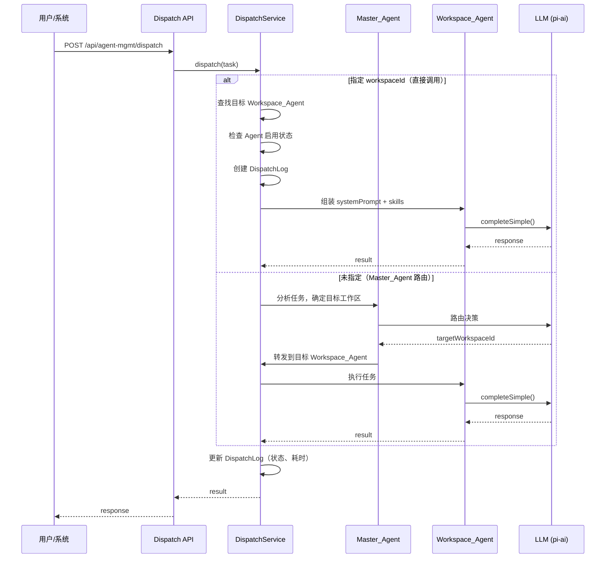
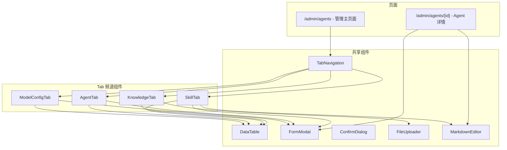
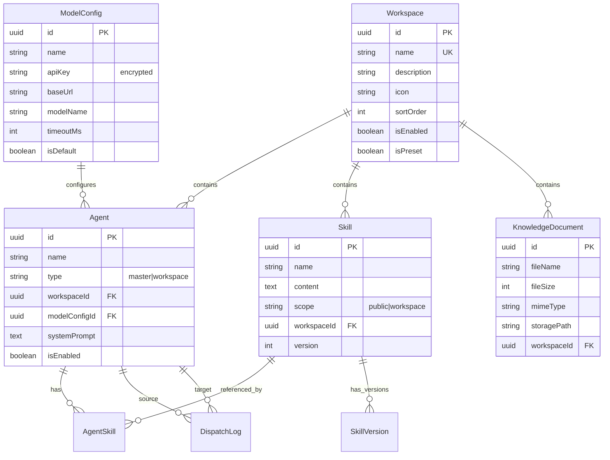

# 设计文档：Agent 管理系统

## 概述

Agent 管理系统是一个基于现有 Pi Agent 框架（`@earendil-works/pi-ai`、`@earendil-works/pi-coding-agent`）构建的多层级 Agent 管理平台。系统采用 Master_Agent + Workspace_Agent 的架构，通过统一的管理界面实现 Model 配置、Agent、Skill、Knowledge 四个维度的资源管理。

### 设计目标

1. **可扩展性**：支持动态添加工作区和 Agent，不需要修改核心调度逻辑
2. **安全性**：API Key 等敏感信息加密存储，接口层面做好权限控制
3. **与现有系统集成**：复用现有的 `PiAgentService` 调用模式，在其基础上增加多 Agent 调度能力
4. **前后端一致性**：前端使用 Next.js App Router + TanStack Query，后端使用 Prisma ORM，与现有项目风格保持一致

### 技术选型决策

| 决策项 | 选择 | 理由 |
|--------|------|------|
| 加密方案 | AES-256-GCM | Node.js 原生 crypto 支持，无需额外依赖 |
| 文件存储 | 本地文件系统 + DB 元数据 | 当前规模无需对象存储，后续可迁移 |
| 调度模式 | 异步事件驱动 | 支持并发调度，不阻塞主 Agent |
| 前端状态 | TanStack Query | 与现有项目一致，自动缓存和失效 |

---

## 架构

### 高层架构图

```mermaid
graph TB
    subgraph Frontend["前端 (Next.js App Router)"]
        UI[管理界面 /admin/agents]
        GenPage[生成页面 /projects/id/generate]
        ReviewPage[审校页面 /projects/id/review]
    end

    subgraph API["API 层 (Next.js Route Handlers)"]
        ModelAPI[/api/agent-mgmt/models]
        AgentAPI[/api/agent-mgmt/agents]
        SkillAPI[/api/agent-mgmt/skills]
        KnowledgeAPI[/api/agent-mgmt/knowledge]
        WorkspaceAPI[/api/agent-mgmt/workspaces]
        DispatchAPI[/api/agent-mgmt/dispatch]
    end

    subgraph Service["服务层"]
        ModelService[ModelConfigService]
        AgentService[AgentManagementService]
        SkillService[SkillManagementService]
        KnowledgeService[KnowledgeService]
        DispatchService[DispatchService]
        CryptoUtil[CryptoUtil]
    end

    subgraph Data["数据层"]
        Prisma[Prisma ORM]
        PG[(PostgreSQL)]
        FS[文件系统 /uploads/knowledge]
    end

    subgraph External["外部依赖"]
        PiAI[@earendil-works/pi-ai]
        PiAgent[@earendil-works/pi-coding-agent]
    end

    UI --> ModelAPI & AgentAPI & SkillAPI & KnowledgeAPI
    GenPage & ReviewPage --> UI
    ModelAPI --> ModelService
    AgentAPI --> AgentService
    SkillAPI --> SkillService
    KnowledgeAPI --> KnowledgeService
    DispatchAPI --> DispatchService
    ModelService & AgentService & SkillService & KnowledgeService --> Prisma
    ModelService --> CryptoUtil
    DispatchService --> AgentService & PiAI
    Prisma --> PG
    KnowledgeService --> FS
```

### Agent 调度流程



---

## 组件与接口

### 后端服务层

#### 1. ModelConfigService

负责 LLM 模型配置的 CRUD 和加密管理。

```typescript
interface ModelConfigService {
  create(data: CreateModelConfigInput): Promise<ModelConfig>;
  update(id: string, data: UpdateModelConfigInput): Promise<ModelConfig>;
  delete(id: string): Promise<void>; // 检查引用关系
  findById(id: string): Promise<ModelConfig | null>;
  findAll(): Promise<ModelConfigListItem[]>; // API Key 脱敏
  setDefault(id: string): Promise<void>;
  getDefault(): Promise<ModelConfig | null>;
}

interface CreateModelConfigInput {
  name: string;
  apiKey: string;       // 明文传入，服务层加密存储
  baseUrl: string;      // 需验证 URL 格式
  modelName: string;
  timeoutMs?: number;   // 默认 30000
  maxRetries?: number;  // 默认 2
  isDefault?: boolean;
}
```

#### 2. AgentManagementService

负责 Agent 的生命周期管理。

```typescript
interface AgentManagementService {
  initMasterAgent(): Promise<Agent>;  // 系统启动时调用
  createWorkspaceAgent(data: CreateAgentInput): Promise<Agent>;
  update(id: string, data: UpdateAgentInput): Promise<Agent>;
  delete(id: string): Promise<void>;
  findById(id: string): Promise<AgentDetail | null>;
  findAll(): Promise<Agent[]>;
  findByWorkspace(workspaceId: string): Promise<Agent[]>;
  toggleEnabled(id: string, enabled: boolean): Promise<Agent>;
  attachSkill(agentId: string, skillId: string): Promise<void>;
  detachSkill(agentId: string, skillId: string): Promise<void>;
  buildSystemPrompt(agentId: string): Promise<string>; // 组装提示词 + Skills
}

interface CreateAgentInput {
  name: string;
  description?: string;
  workspaceId: string;
  modelConfigId?: string;  // 不指定则使用默认
  systemPrompt?: string;
  skillIds?: string[];
}
```

#### 3. SkillManagementService

```typescript
interface SkillManagementService {
  create(data: CreateSkillInput): Promise<Skill>;
  update(id: string, data: UpdateSkillInput): Promise<SkillVersion>;
  delete(id: string): Promise<void>; // 检查引用关系
  findById(id: string): Promise<Skill | null>;
  findAll(filter?: { scope?: 'public' | 'workspace'; workspaceId?: string }): Promise<Skill[]>;
  getVersionHistory(id: string): Promise<SkillVersion[]>;
  getAvailableForAgent(agentId: string): Promise<Skill[]>; // 公用 + 所属工作区
}

interface CreateSkillInput {
  name: string;
  description: string;
  content: string;        // Markdown 格式
  scope: 'public' | 'workspace';
  workspaceId?: string;   // scope=workspace 时必填
}
```

#### 4. KnowledgeService

```typescript
interface KnowledgeService {
  upload(file: File, workspaceId: string | null): Promise<KnowledgeDocument>;
  delete(id: string): Promise<void>;
  findByWorkspace(workspaceId: string | null): Promise<KnowledgeDocument[]>;
  findAll(filter?: { workspaceId?: string }): Promise<KnowledgeDocument[]>;
  validateFile(file: File): ValidationResult;
}

// 支持的文件格式
const ALLOWED_FORMATS = ['application/pdf', 'application/vnd.openxmlformats-officedocument.wordprocessingml.document', 'text/markdown', 'text/plain'];
const MAX_FILE_SIZE = 20 * 1024 * 1024; // 20MB
```

#### 5. DispatchService

```typescript
interface DispatchService {
  dispatch(request: DispatchRequest): Promise<DispatchResult>;
  getLog(id: string): Promise<DispatchLog | null>;
  getLogs(filter?: { agentId?: string; status?: string }): Promise<DispatchLog[]>;
}

interface DispatchRequest {
  taskContent: string;
  workspaceId?: string;    // 指定则直接调用，不指定则 Master 路由
  targetAgentId?: string;  // 可直接指定 Agent
  metadata?: Record<string, unknown>;
}

interface DispatchResult {
  logId: string;
  status: 'success' | 'error';
  response: string;
  agentId: string;
  durationMs: number;
}
```

#### 6. CryptoUtil

```typescript
// 使用 AES-256-GCM 加密
interface CryptoUtil {
  encrypt(plaintext: string): string;   // 返回 iv:authTag:ciphertext (base64)
  decrypt(encrypted: string): string;
  mask(plaintext: string): string;      // 返回 "sk-****xxxx" 格式
}
```

### API 端点设计

#### Model 配置

| 方法 | 路径 | 描述 |
|------|------|------|
| GET | `/api/agent-mgmt/models` | 获取所有模型配置（API Key 脱敏） |
| POST | `/api/agent-mgmt/models` | 创建模型配置 |
| GET | `/api/agent-mgmt/models/[id]` | 获取单个模型配置详情 |
| PUT | `/api/agent-mgmt/models/[id]` | 更新模型配置 |
| DELETE | `/api/agent-mgmt/models/[id]` | 删除模型配置（检查引用） |
| POST | `/api/agent-mgmt/models/[id]/set-default` | 设为默认配置 |

#### Agent 管理

| 方法 | 路径 | 描述 |
|------|------|------|
| GET | `/api/agent-mgmt/agents` | 获取所有 Agent（支持 workspaceId 筛选） |
| POST | `/api/agent-mgmt/agents` | 创建 Workspace Agent |
| GET | `/api/agent-mgmt/agents/[id]` | 获取 Agent 详情（含关联 Skill） |
| PUT | `/api/agent-mgmt/agents/[id]` | 更新 Agent 属性 |
| DELETE | `/api/agent-mgmt/agents/[id]` | 删除 Agent |
| POST | `/api/agent-mgmt/agents/[id]/toggle` | 启用/禁用 Agent |
| POST | `/api/agent-mgmt/agents/[id]/skills` | 关联 Skill |
| DELETE | `/api/agent-mgmt/agents/[id]/skills/[skillId]` | 取消关联 Skill |

#### Skill 管理

| 方法 | 路径 | 描述 |
|------|------|------|
| GET | `/api/agent-mgmt/skills` | 获取所有 Skill（支持 scope/workspaceId 筛选） |
| POST | `/api/agent-mgmt/skills` | 创建 Skill |
| GET | `/api/agent-mgmt/skills/[id]` | 获取 Skill 详情 |
| PUT | `/api/agent-mgmt/skills/[id]` | 更新 Skill（创建新版本） |
| DELETE | `/api/agent-mgmt/skills/[id]` | 删除 Skill（检查引用） |
| GET | `/api/agent-mgmt/skills/[id]/versions` | 获取版本历史 |

#### Knowledge 知识库

| 方法 | 路径 | 描述 |
|------|------|------|
| GET | `/api/agent-mgmt/knowledge` | 获取文档列表（支持 workspaceId 筛选） |
| POST | `/api/agent-mgmt/knowledge/upload` | 上传文档 |
| DELETE | `/api/agent-mgmt/knowledge/[id]` | 删除文档 |

#### 工作区

| 方法 | 路径 | 描述 |
|------|------|------|
| GET | `/api/agent-mgmt/workspaces` | 获取所有工作区 |
| POST | `/api/agent-mgmt/workspaces` | 创建自定义工作区 |
| PUT | `/api/agent-mgmt/workspaces/[id]` | 更新工作区 |
| DELETE | `/api/agent-mgmt/workspaces/[id]` | 删除工作区（检查关联资源） |

#### 调度

| 方法 | 路径 | 描述 |
|------|------|------|
| POST | `/api/agent-mgmt/dispatch` | 发起任务调度 |
| GET | `/api/agent-mgmt/dispatch/logs` | 获取调度日志 |

### 前端组件架构



#### 页面路由结构

```
ppp/web/src/app/admin/agents/
├── page.tsx                    # 管理主页面（四 Tab）
├── [id]/
│   └── page.tsx               # Agent 详情编辑页
└── components/
    ├── model-config-tab.tsx   # Model 配置频道
    ├── agent-tab.tsx          # Agent 频道
    ├── skill-tab.tsx          # Skill 频道
    ├── knowledge-tab.tsx      # Knowledge 频道
    ├── agent-form-modal.tsx   # Agent 创建/编辑弹窗
    ├── model-form-modal.tsx   # Model 配置弹窗
    ├── skill-form-modal.tsx   # Skill 创建/编辑弹窗
    └── workspace-selector.tsx # 工作区选择器
```

---

## 数据模型

### Prisma Schema 新增模型

```prisma
// ===== Agent 管理系统数据模型 =====

// 工作区
model Workspace {
  id          String   @id @default(dbgenerated("gen_random_uuid()")) @db.Uuid
  name        String   @unique @db.VarChar(100)
  description String?  @db.VarChar(500)
  icon        String?  @db.VarChar(50)    // lucide icon 名称
  sortOrder   Int      @default(0) @map("sort_order")
  isEnabled   Boolean  @default(true) @map("is_enabled")
  isPreset    Boolean  @default(false) @map("is_preset")  // 预置工作区不可删除
  createdAt   DateTime @default(now()) @map("created_at") @db.Timestamptz()
  updatedAt   DateTime @default(now()) @updatedAt @map("updated_at") @db.Timestamptz()

  // Relations
  agents             Agent[]
  skills             Skill[]
  knowledgeDocuments KnowledgeDocument[]

  @@map("workspaces")
}

// 模型配置
model ModelConfig {
  id           String   @id @default(dbgenerated("gen_random_uuid()")) @db.Uuid
  name         String   @db.VarChar(100)
  apiKey       String   @map("api_key") @db.Text       // AES-256-GCM 加密存储
  baseUrl      String   @map("base_url") @db.VarChar(500)
  modelName    String   @map("model_name") @db.VarChar(200)
  timeoutMs    Int      @default(30000) @map("timeout_ms")
  maxRetries   Int      @default(2) @map("max_retries")
  isDefault    Boolean  @default(false) @map("is_default")
  createdAt    DateTime @default(now()) @map("created_at") @db.Timestamptz()
  updatedAt    DateTime @default(now()) @updatedAt @map("updated_at") @db.Timestamptz()

  // Relations
  agents Agent[]

  @@map("model_configs")
}

// Agent
model Agent {
  id            String   @id @default(dbgenerated("gen_random_uuid()")) @db.Uuid
  name          String   @db.VarChar(100)
  description   String?  @db.VarChar(500)
  type          String   @db.VarChar(20)   // "master" | "workspace"
  workspaceId   String?  @map("workspace_id") @db.Uuid  // null = Master_Agent
  modelConfigId String?  @map("model_config_id") @db.Uuid
  systemPrompt  String?  @map("system_prompt") @db.Text
  isEnabled     Boolean  @default(true) @map("is_enabled")
  createdAt     DateTime @default(now()) @map("created_at") @db.Timestamptz()
  updatedAt     DateTime @default(now()) @updatedAt @map("updated_at") @db.Timestamptz()

  // Relations
  workspace   Workspace?   @relation(fields: [workspaceId], references: [id])
  modelConfig ModelConfig? @relation(fields: [modelConfigId], references: [id])
  agentSkills AgentSkill[]
  dispatchLogsAsSource DispatchLog[] @relation("SourceAgent")
  dispatchLogsAsTarget DispatchLog[] @relation("TargetAgent")

  @@map("agents")
}

// Skill
model Skill {
  id          String   @id @default(dbgenerated("gen_random_uuid()")) @db.Uuid
  name        String   @db.VarChar(100)
  description String?  @db.VarChar(500)
  content     String   @db.Text           // Markdown 格式
  scope       String   @db.VarChar(20)    // "public" | "workspace"
  workspaceId String?  @map("workspace_id") @db.Uuid  // scope=workspace 时关联
  version     Int      @default(1)
  createdAt   DateTime @default(now()) @map("created_at") @db.Timestamptz()
  updatedAt   DateTime @default(now()) @updatedAt @map("updated_at") @db.Timestamptz()

  // Relations
  workspace    Workspace?    @relation(fields: [workspaceId], references: [id])
  agentSkills  AgentSkill[]
  versions     SkillVersion[]

  @@map("skills")
}

// Skill 版本历史
model SkillVersion {
  id        String   @id @default(dbgenerated("gen_random_uuid()")) @db.Uuid
  skillId   String   @map("skill_id") @db.Uuid
  version   Int
  content   String   @db.Text
  createdAt DateTime @default(now()) @map("created_at") @db.Timestamptz()

  // Relations
  skill Skill @relation(fields: [skillId], references: [id], onDelete: Cascade)

  @@unique([skillId, version])
  @@map("skill_versions")
}

// Agent-Skill 多对多关联
model AgentSkill {
  id        String   @id @default(dbgenerated("gen_random_uuid()")) @db.Uuid
  agentId   String   @map("agent_id") @db.Uuid
  skillId   String   @map("skill_id") @db.Uuid
  createdAt DateTime @default(now()) @map("created_at") @db.Timestamptz()

  // Relations
  agent Agent @relation(fields: [agentId], references: [id], onDelete: Cascade)
  skill Skill @relation(fields: [skillId], references: [id], onDelete: Cascade)

  @@unique([agentId, skillId])
  @@map("agent_skills")
}

// 知识库文档
model KnowledgeDocument {
  id           String   @id @default(dbgenerated("gen_random_uuid()")) @db.Uuid
  fileName     String   @map("file_name") @db.VarChar(500)
  fileSize     Int      @map("file_size")              // bytes
  mimeType     String   @map("mime_type") @db.VarChar(100)
  storagePath  String   @map("storage_path") @db.VarChar(1000)  // 文件系统路径
  workspaceId  String?  @map("workspace_id") @db.Uuid  // null = Public_Workspace
  uploadedBy   String?  @map("uploaded_by") @db.VarChar(100)
  createdAt    DateTime @default(now()) @map("created_at") @db.Timestamptz()
  updatedAt    DateTime @default(now()) @updatedAt @map("updated_at") @db.Timestamptz()

  // Relations
  workspace Workspace? @relation(fields: [workspaceId], references: [id])

  @@index([workspaceId])
  @@map("knowledge_documents")
}

// 原生工具定义
model NativeTool {
  id          String   @id @default(dbgenerated("gen_random_uuid()")) @db.Uuid
  name        String   @unique @db.VarChar(100)
  description String   @db.VarChar(500)
  inputSchema Json     @map("input_schema")    // JSON Schema
  outputFormat String? @map("output_format") @db.VarChar(100)
  isBuiltin   Boolean  @default(true) @map("is_builtin")
  createdAt   DateTime @default(now()) @map("created_at") @db.Timestamptz()

  @@map("native_tools")
}

// 调度日志
model DispatchLog {
  id            String   @id @default(dbgenerated("gen_random_uuid()")) @db.Uuid
  sourceAgentId String?  @map("source_agent_id") @db.Uuid  // 发起方（Master 或 null=用户直接调用）
  targetAgentId String   @map("target_agent_id") @db.Uuid
  taskSummary   String   @map("task_summary") @db.VarChar(1000)
  status        String   @db.VarChar(20)   // "pending" | "running" | "success" | "error"
  response      String?  @db.Text
  errorMessage  String?  @map("error_message") @db.Text
  durationMs    Int?     @map("duration_ms")
  metadata      Json?
  createdAt     DateTime @default(now()) @map("created_at") @db.Timestamptz()
  completedAt   DateTime? @map("completed_at") @db.Timestamptz()

  // Relations
  sourceAgent Agent? @relation("SourceAgent", fields: [sourceAgentId], references: [id])
  targetAgent Agent  @relation("TargetAgent", fields: [targetAgentId], references: [id])

  @@index([targetAgentId])
  @@index([status])
  @@index([createdAt])
  @@map("dispatch_logs")
}
```

### 实体关系图



### 预置数据

系统首次启动时自动 seed 以下数据：

**预置工作区：**
| 名称 | icon | sortOrder |
|------|------|-----------|
| 复盘文档生成 | file-bar-chart | 1 |
| 复盘内容审校 | eye | 2 |
| 舆情系统 | trending-up | 3 |
| 派芽知识库 | book-open | 4 |
| 策划系统 | lightbulb | 5 |

**预置原生工具：**
| 名称 | 描述 |
|------|------|
| web_search | Web 搜索，获取互联网信息 |
| file_read | 读取指定路径的文件内容 |
| file_write | 写入内容到指定路径 |
| http_request | 发送 HTTP 请求到指定 URL |

---


## 正确性属性 (Correctness Properties)

*属性（Property）是指在系统所有有效执行中都应保持为真的特征或行为——本质上是对系统应做什么的形式化陈述。属性是人类可读规范与机器可验证正确性保证之间的桥梁。*

### Property 1: API Key 加密往返一致性

*For any* 有效的 API Key 字符串，对其执行加密后再解密，应当得到与原始字符串完全相同的值；且加密后的密文不应包含原始明文。

**Validates: Requirements 1.4**

### Property 2: API Key 脱敏不暴露完整密钥

*For any* API Key 字符串（长度 ≥ 8），对其执行 mask 操作后，返回的脱敏字符串不应包含原始 API Key 的完整内容，且应保留末尾部分字符用于辨识。

**Validates: Requirements 1.4**

### Property 3: Model 配置必填字段校验

*For any* Model 配置输入，若 API Key、Base URL、模型名称中任一字段为空或缺失，则创建操作应返回校验错误，且不应在数据库中创建记录。

**Validates: Requirements 1.5**

### Property 4: Base URL 格式校验

*For any* 字符串作为 Base URL 输入，若该字符串不是合法的 HTTP/HTTPS URL 格式，则更新操作应被拒绝并返回格式错误信息。

**Validates: Requirements 1.3**

### Property 5: 默认 Model 配置唯一性

*For any* Model 配置集合，在任意时刻最多只有一个配置的 isDefault 为 true。当设置新的默认配置时，原默认配置应自动取消默认标记。

**Validates: Requirements 1.6**

### Property 6: 引用完整性阻止删除

*For any* 被 Agent 引用的 ModelConfig、被 Agent 引用的 Skill、或包含 Agent/文档的 Workspace，删除操作应被阻止并返回引用该资源的关联实体列表。

**Validates: Requirements 1.7, 4.6, 7.5**

### Property 7: Master Agent 单例不变量

*For any* 次数的系统初始化调用，数据库中 type="master" 的 Agent 记录数量应始终为 1。

**Validates: Requirements 2.1**

### Property 8: Agent 创建持久化往返

*For any* 有效的 Agent 创建输入（包含名称、描述、工作区、Model 配置、系统提示词），创建后通过 ID 查询应返回与输入一致的所有属性。

**Validates: Requirements 2.2, 2.3**

### Property 9: 禁用 Agent 拒绝调度

*For any* 处于禁用状态（isEnabled=false）的 Workspace_Agent，向其发送的调度请求应返回不可用错误，且不应创建成功状态的调度日志。

**Validates: Requirements 2.5, 3.4**

### Property 10: 任务路由正确性

*For any* 带有工作区标识的任务请求，Master_Agent 应将其路由到该工作区下已启用的 Workspace_Agent，调度日志中的 targetAgentId 应属于指定工作区。

**Validates: Requirements 3.1**

### Property 11: 直接调度绕过 Master

*For any* 指定了 targetAgentId 的调度请求，调度日志中的 sourceAgentId 应为 null（表示用户直接调用），不经过 Master_Agent 路由。

**Validates: Requirements 3.2**

### Property 12: 调度日志完整性

*For any* 调度操作（无论成功或失败），系统应创建一条调度日志，包含非空的 targetAgentId、taskSummary、status 和 createdAt 字段。

**Validates: Requirements 3.3**

### Property 13: Skill 作用域访问控制

*For any* scope="public" 的 Skill，任何 Agent 都应能成功关联该 Skill；*For any* scope="workspace" 的 Skill，仅该工作区下的 Agent 能成功关联，其他工作区的 Agent 关联应被拒绝。

**Validates: Requirements 4.2, 4.3**

### Property 14: Skill 注入系统提示词

*For any* Agent 关联的 Skill 集合，调用 buildSystemPrompt 生成的系统提示词应包含每个关联 Skill 的 content 内容。

**Validates: Requirements 4.4**

### Property 15: Skill 版本历史保留

*For any* Skill 经过 N 次内容更新后，其版本历史应包含 N 条记录，每条记录的 content 与对应更新时的输入一致，且 version 号递增。

**Validates: Requirements 4.5**

### Property 16: 文件格式与大小校验

*For any* 文件上传请求，若文件 MIME 类型不在 [PDF, Word, Markdown, TXT] 中或文件大小超过 20MB，则 validateFile 应返回失败结果；若格式和大小均合法，则应返回成功。

**Validates: Requirements 5.2, 5.7**

### Property 17: 文档可见性按工作区隔离

*For any* workspaceId 为 null 的文档（公共文档），所有工作区的查询应能看到该文档；*For any* workspaceId 为特定值的文档，仅该工作区的查询应能看到，其他工作区查询不应包含该文档。

**Validates: Requirements 5.4, 5.5**

### Property 18: 工作区初始化幂等性

*For any* 次数的工作区初始化调用，预置工作区的数量应始终为 5，不应产生重复记录。

**Validates: Requirements 7.3**

### Property 19: 资源按工作区分组正确性

*For any* Agent/Skill/Document 集合，按工作区分组查询时，每个实体应出现在且仅出现在其所属工作区的分组中（公共资源出现在公共分组中）。

**Validates: Requirements 8.2, 8.3, 8.4**

### Property 20: 时间戳自动填充

*For any* 新创建的数据记录（ModelConfig、Agent、Skill、Workspace、KnowledgeDocument、DispatchLog），createdAt 和 updatedAt 字段应自动填充为有效的时间戳且 createdAt ≤ updatedAt。

**Validates: Requirements 10.6**

---

## 错误处理

### 错误分类与响应格式

```typescript
interface ApiErrorResponse {
  error: string;           // 错误类型标识
  message: string;         // 人类可读的错误描述
  details?: Record<string, string>;  // 字段级错误详情
  references?: string[];   // 引用关系列表（删除受阻时）
}
```

### 错误处理策略

| 场景 | HTTP 状态码 | 错误类型 | 处理方式 |
|------|-------------|----------|----------|
| 必填字段缺失 | 400 | VALIDATION_ERROR | 返回缺失字段列表 |
| URL 格式非法 | 400 | VALIDATION_ERROR | 返回格式要求说明 |
| 文件格式不支持 | 400 | FILE_FORMAT_ERROR | 返回支持的格式列表 |
| 文件大小超限 | 400 | FILE_SIZE_ERROR | 返回大小限制说明 |
| 资源不存在 | 404 | NOT_FOUND | 返回资源类型和 ID |
| 删除受引用阻止 | 409 | REFERENCE_CONFLICT | 返回引用该资源的实体列表 |
| Agent 禁用 | 422 | AGENT_DISABLED | 返回 Agent 名称和状态 |
| Tool 不存在 | 404 | TOOL_NOT_FOUND | 返回可用 Tool 列表 |
| LLM 调用失败 | 502 | LLM_ERROR | 记录日志，返回降级响应 |
| LLM 超时 | 504 | LLM_TIMEOUT | 记录日志，返回超时提示 |
| 数据库错误 | 500 | INTERNAL_ERROR | 记录详细日志，返回通用错误 |

### LLM 调用容错

```typescript
// 调度服务中的 LLM 调用容错策略
const dispatchWithRetry = async (request: DispatchRequest): Promise<DispatchResult> => {
  const maxRetries = agent.modelConfig?.maxRetries ?? 2;
  const timeoutMs = agent.modelConfig?.timeoutMs ?? 30000;
  
  for (let attempt = 0; attempt <= maxRetries; attempt++) {
    try {
      const result = await completeSimple(model, messages, { 
        apiKey, timeoutMs, maxRetries: 0 // 单次不重试，外层控制
      });
      return { status: 'success', response: extractText(result) };
    } catch (err) {
      if (attempt === maxRetries) {
        return { status: 'error', errorMessage: err.message };
      }
      await sleep(1000 * (attempt + 1)); // 指数退避
    }
  }
};
```

---

## 测试策略

### 测试方法

本功能采用双轨测试策略：

1. **属性测试（Property-Based Testing）**：使用 `fast-check` 库验证核心业务逻辑的通用属性
2. **单元测试（Example-Based）**：验证具体场景、边界条件和集成点
3. **集成测试**：验证 API 端点、数据库交互和文件操作

### 属性测试配置

- **库**：fast-check（已在 devDependencies 中）
- **最小迭代次数**：100 次/属性
- **标签格式**：`Feature: agent-management, Property {N}: {property_text}`

### 属性测试覆盖范围

| 属性 | 测试目标 | 生成器 |
|------|----------|--------|
| Property 1 | CryptoUtil.encrypt/decrypt | 随机字符串（含特殊字符、Unicode） |
| Property 2 | CryptoUtil.mask | 随机 API Key 字符串（长度 8-200） |
| Property 3 | ModelConfigService.create 校验 | 随机缺失字段组合 |
| Property 4 | URL 校验函数 | 随机字符串（含合法/非法 URL） |
| Property 5 | ModelConfigService.setDefault | 随机 Model 配置序列 |
| Property 6 | 各 Service.delete | 随机引用关系图 |
| Property 7 | AgentManagementService.initMasterAgent | 随机调用次数 |
| Property 13 | SkillManagementService.attachSkill | 随机 scope/workspace 组合 |
| Property 14 | AgentManagementService.buildSystemPrompt | 随机 Skill 内容集合 |
| Property 15 | SkillManagementService.update | 随机更新序列 |
| Property 16 | KnowledgeService.validateFile | 随机 MIME 类型和文件大小 |

### 单元测试覆盖范围

- Agent 创建/更新/删除的具体场景
- 调度流程的成功/失败路径
- 工作区初始化 seed 逻辑
- 原生 Tool 注册和查找
- 前端组件渲染（Tab 切换、表单提交）

### 集成测试覆盖范围

- API 端点的完整请求/响应周期
- 文件上传和存储
- 并发调度场景
- 数据库事务和约束

### 测试文件结构

```
ppp/tests/agent-management/
├── crypto-util.test.ts          # Property 1, 2
├── model-config.test.ts         # Property 3, 4, 5
├── referential-integrity.test.ts # Property 6
├── agent-management.test.ts     # Property 7, 8, 9
├── dispatch.test.ts             # Property 10, 11, 12
├── skill-management.test.ts     # Property 13, 14, 15
├── knowledge.test.ts            # Property 16, 17
├── workspace.test.ts            # Property 18, 19
└── integration/
    ├── api-models.test.ts
    ├── api-agents.test.ts
    ├── api-skills.test.ts
    ├── api-knowledge.test.ts
    └── api-dispatch.test.ts
```
