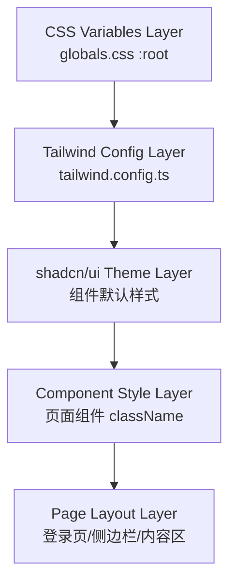
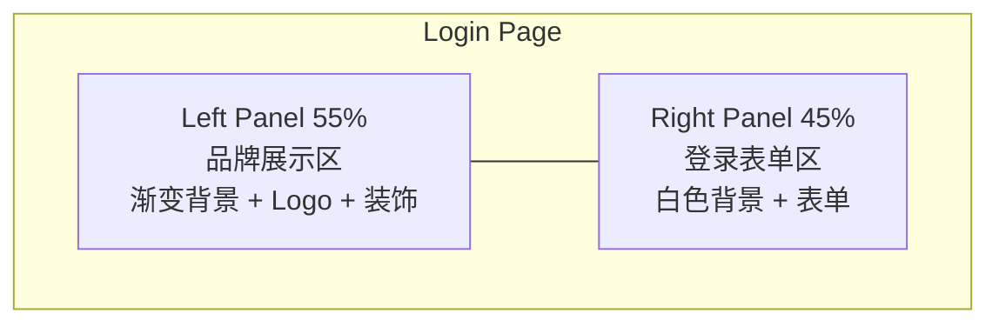

# Design Document: Frontend Style Redesign

## Overview

本设计文档描述"派盘盘"AI数字营销平台前端视觉风格重构的技术实现方案。重构将现有的深色科技风格（slate-900/blue 色调）替换为橙黄色暖色调现代扁平化设计，同时保持所有功能逻辑和后端 API 不变。

### 设计目标

- 通过 CSS 变量和 Tailwind 配置实现全局色彩切换
- 最小化组件逻辑代码改动，主要修改样式类名
- 保持 shadcn/ui 组件体系，仅覆盖主题变量
- 确保响应式布局在新设计下正常工作

### 技术栈约束

| 技术 | 版本 | 角色 |
|------|------|------|
| Next.js (App Router) | 14.x | 框架 |
| Tailwind CSS | 3.4.x | 样式系统 |
| shadcn/ui (Radix UI) | - | 组件库 |
| Recharts | 3.8.x | 图表 |
| TipTap | 3.23.x | 富文本编辑器 |
| Lucide React | 1.14.x | 图标 |

---

## Architecture

### 样式架构分层



### 改动范围

改动集中在以下层级：

1. **CSS 变量层** — 修改 `globals.css` 中的 `:root` 变量定义
2. **Tailwind 配置层** — 扩展 `tailwind.config.ts` 添加品牌色和字体
3. **组件样式层** — 修改各组件的 Tailwind 类名（不改逻辑）
4. **页面布局层** — 重构登录页布局结构，调整侧边栏样式

### 不改动范围

- 所有 API 路由 (`web/src/app/api/`)
- Redux store 和状态管理逻辑
- 数据获取逻辑 (React Query hooks)
- 组件 props 接口和事件处理逻辑

---

## Components and Interfaces

### 1. 设计系统基础层 (Design Tokens)

#### 1.1 CSS 变量定义 (`globals.css`)

```css
@layer base {
  :root {
    /* 品牌主色 - 橙黄色 */
    --primary: 36 80% 55%;           /* #F5A623 */
    --primary-foreground: 0 0% 100%; /* white */

    /* 背景 */
    --background: 0 0% 100%;         /* #FFFFFF */
    --foreground: 220 13% 18%;       /* #1F2937 */

    /* 卡片 */
    --card: 0 0% 100%;
    --card-foreground: 220 13% 18%;

    /* 次要色 */
    --secondary: 220 14% 96%;        /* #F3F4F6 */
    --secondary-foreground: 220 13% 18%;

    /* 静音色 */
    --muted: 220 14% 96%;
    --muted-foreground: 220 9% 46%;  /* #6B7280 */

    /* 强调色 */
    --accent: 36 80% 55%;
    --accent-foreground: 0 0% 100%;

    /* 边框 */
    --border: 220 13% 91%;           /* #E5E7EB */
    --input: 220 13% 91%;
    --ring: 36 80% 55%;              /* orange ring */

    /* 破坏性 */
    --destructive: 0 84% 60%;        /* #EF4444 */
    --destructive-foreground: 0 0% 100%;

    /* 圆角 */
    --radius: 0.5rem;                /* 8px */

    /* 扩展品牌色 */
    --brand-success: 160 84% 39%;    /* #10B981 */
    --brand-warning: 36 80% 55%;     /* #F5A623 */
    --brand-orange-light: 45 100% 94%; /* #FFF8E1 */
  }
}
```

#### 1.2 Tailwind 配置扩展 (`tailwind.config.ts`)

新增配置项：

```typescript
theme: {
  extend: {
    colors: {
      brand: {
        DEFAULT: '#F5A623',
        50: '#FFF8E1',
        100: '#FFECB3',
        200: '#FFD54F',
        300: '#FFCA28',
        400: '#FFC107',
        500: '#F5A623',
        600: '#E09000',
        700: '#CC7A00',
        800: '#B36800',
        900: '#995700',
      },
      success: '#10B981',
    },
    fontFamily: {
      sans: ['"PingFang SC"', '"Microsoft YaHei"', '"Helvetica Neue"', 'Arial', 'sans-serif'],
    },
    fontSize: {
      xs: ['12px', { lineHeight: '1.5' }],
      sm: ['14px', { lineHeight: '1.5' }],
      base: ['14px', { lineHeight: '1.5' }],
      lg: ['16px', { lineHeight: '1.5' }],
      xl: ['20px', { lineHeight: '1.4' }],
    },
    borderRadius: {
      lg: '8px',
      md: '6px',
      sm: '4px',
    },
  },
}
```

### 2. 登录页组件 (`Login_Page`)

#### 结构变更

从单卡片居中布局改为左右分栏布局：



#### 组件接口（不变）

登录页的 props 和状态管理逻辑保持不变，仅修改 JSX 结构和 className。

#### 关键样式映射

| 元素 | 旧样式 | 新样式 |
|------|--------|--------|
| 容器 | `bg-gradient-to-br from-slate-900` | `flex min-h-screen` (左右分栏) |
| 左面板 | 无 | `w-[55%] bg-gradient-to-br from-[#FFF8E1] to-[#FFECB3]` |
| 右面板 | 无 | `w-[45%] bg-white flex items-center justify-center` |
| 表单卡片 | `border-white/10 bg-white/5 backdrop-blur` | 移除卡片容器，直接在右面板内 |
| 标题 | `text-white` | `text-gray-900` |
| 输入框 | `border-white/10 bg-white/5 text-white` | `border-gray-300 bg-white text-gray-900` |
| 按钮 | `bg-blue-600` | `bg-brand rounded-md` (橙黄色) |
| 链接 | `text-blue-300` | `text-brand` |

### 3. 侧边栏组件 (`Sidebar`)

#### 关键样式映射

| 元素 | 旧样式 | 新样式 |
|------|--------|--------|
| 容器 | `bg-slate-900` | `bg-white border-r border-gray-200` |
| 品牌文字 | `text-white` | `text-gray-900` + 橙色图标 |
| 导航项(默认) | `text-slate-300 hover:bg-white/5` | `text-gray-700 hover:bg-gray-50` |
| 导航项(激活) | `bg-white/10 text-white` | `text-brand border-l-3 border-brand bg-brand-50` |
| 分隔线 | `border-slate-700` | `border-gray-200` |
| 折叠按钮 | `text-slate-400 hover:text-white` | `text-gray-400 hover:text-gray-600` |

#### 宽度规格

- 展开状态: `w-[220px]`（从 `w-56` = 224px 微调）
- 折叠状态: `w-16` = 64px（保持不变）

### 4. 数据表格组件 (`Data_Table`)

#### 样式规范

```
┌─────────────────────────────────────────────────┐
│  表头行: bg-gray-50, text-gray-600, font-medium │
├─────────────────────────────────────────────────┤
│  数据行: bg-white, text-gray-900, border-b      │
│  hover: bg-gray-50                              │
│  操作链接: text-brand, hover:underline          │
├─────────────────────────────────────────────────┤
│  数据行 ...                                     │
└─────────────────────────────────────────────────┘
容器: bg-white, rounded-lg, border border-gray-200
```

### 5. 按钮组件 (`Button_Component`)

#### 变体定义

| 变体 | 背景 | 文字 | 边框 | 圆角 | 高度 |
|------|------|------|------|------|------|
| primary | `bg-brand` | white | none | 6px | 40px |
| secondary | `bg-white` | gray-700 | 1px gray-300 | 6px | 40px |
| text-link | transparent | brand | none | - | auto |
| success | `bg-success` | white | none | 6px | 40px |
| submit | `bg-brand` | white | none | 6px | 44px |

### 6. 表单组件 (`Form_Component`)

#### 输入框规格

- 高度: 40px
- 边框: 1px solid #D1D5DB
- 圆角: 4px
- 内边距: 0 12px
- Focus 状态: border-brand + ring-2 ring-brand/20

### 7. 筛选栏组件 (`Filter_Bar`)

- 水平排列，gap-4 (16px)
- 查询按钮: primary 变体
- 重置按钮: secondary 变体
- 标签: text-xs text-gray-500, 位于控件上方

### 8. 分页器组件 (`Pagination`)

- 页码按钮: 32px × 32px, rounded-sm
- 激活态: bg-brand text-white
- 非激活态: bg-white border border-gray-300
- 信息文字: text-sm text-gray-500, 左对齐

### 9. 文件上传区域 (`Upload_Zone`)

- 容器: border-2 border-dashed border-gray-300, rounded-lg
- 拖拽悬停: border-brand bg-brand-50
- 进度条: bg-brand
- 成功: 绿色图标 + 文件名
- 失败: 红色图标 + 错误信息

---

## Data Models

本次重构不涉及数据模型变更。所有数据结构、API 接口、Redux store 结构保持不变。

唯一的"数据"变更是设计 token 的值：

```typescript
// 设计 Token 类型定义（概念性，实际通过 CSS 变量实现）
interface DesignTokens {
  colors: {
    primary: string;        // '#F5A623'
    background: string;     // '#FFFFFF'
    foreground: string;     // '#1F2937'
    border: string;         // '#E5E7EB'
    muted: string;          // '#6B7280'
    success: string;        // '#10B981'
    destructive: string;    // '#EF4444'
    brandLight: string;     // '#FFF8E1'
  };
  typography: {
    fontFamily: string;     // 'PingFang SC, Microsoft YaHei, ...'
    baseFontSize: string;   // '14px'
    lineHeight: string;     // '1.5'
    headingWeight: number;  // 600
  };
  spacing: {
    borderRadius: {
      card: string;         // '8px'
      button: string;       // '6px'
      input: string;        // '4px'
    };
  };
}
```

---

## Error Handling

本次重构不涉及错误处理逻辑变更。现有的错误处理机制（API 错误提示、表单验证、加载状态）保持不变。

样式层面的错误状态调整：

| 错误场景 | 旧样式 | 新样式 |
|----------|--------|--------|
| 表单验证错误 | `border-red-500/20 text-red-300` | `border-red-300 bg-red-50 text-red-600` |
| API 错误提示 | `border-rose-200 bg-rose-50` | 保持不变（已是浅色风格） |
| 上传失败 | - | `text-red-500` + 红色图标 |
| 禁用状态 | `disabled:opacity-60` | `disabled:opacity-50 disabled:cursor-not-allowed` |

---

## Testing Strategy

### 测试方法

由于本次重构是纯视觉样式变更（CSS/className），不涉及业务逻辑改动，**不适用属性基测试（Property-Based Testing）**。原因：

- 改动对象是 UI 渲染和布局，不是纯函数
- 没有可量化的输入/输出关系
- 视觉正确性需要人工审查或视觉回归测试

### 推荐测试策略

#### 1. 视觉回归测试（手动）

- 逐页对比设计稿与实现效果
- 检查所有交互状态（hover、focus、active、disabled）
- 验证响应式断点（1280px、768px）下的布局

#### 2. 构建验证

- 确保 `next build` 无错误通过
- 确保无 TypeScript 类型错误
- 确保无 Tailwind 未识别类名警告

#### 3. 功能回归测试（手动）

- 登录流程正常工作
- 侧边栏导航正常跳转
- 表单提交功能正常
- 数据表格加载和分页正常
- 文件上传功能正常

#### 4. 浏览器兼容性

- Chrome 90+
- Firefox 90+
- Safari 15+
- Edge 90+

### 迁移策略

采用**一次性全量替换**策略，而非渐进式迁移：

1. **Phase 1**: 修改 `globals.css` CSS 变量 + `tailwind.config.ts` 配置
2. **Phase 2**: 重构登录页布局（结构性改动最大）
3. **Phase 3**: 修改侧边栏样式
4. **Phase 4**: 批量替换页面组件中的颜色类名（slate→gray, blue→brand）
5. **Phase 5**: 调整表格、表单、按钮等通用组件样式
6. **Phase 6**: 清理 `globals.css` 中的旧样式（report-editor-content 等）

选择一次性替换而非渐进式的原因：
- 色彩系统是全局性的，CSS 变量修改会立即影响所有使用变量的组件
- 避免新旧风格混合导致的视觉不一致
- 改动范围明确（仅 className），回滚简单（git revert）
