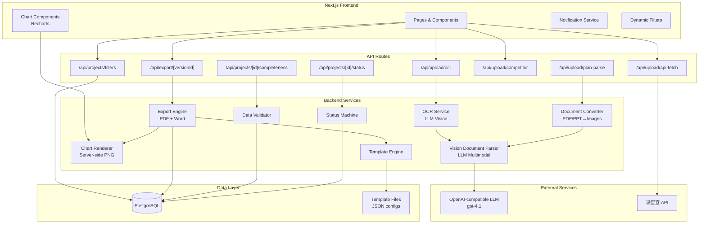
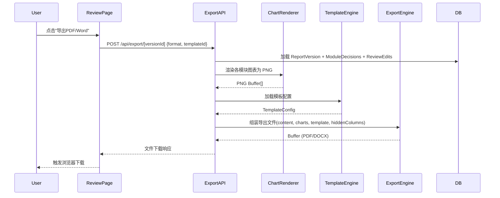
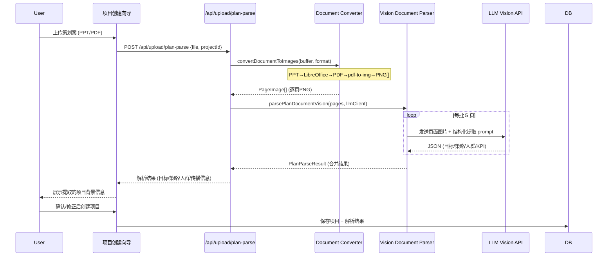

# Design Document — MVP 功能差距分析

## Overview

本设计文档覆盖 MVP 功能清单中 13 项待补齐功能的架构与实现方案。这些功能横跨报告导出、数据采集、前端交互、状态管理等多个层面，需要在现有架构基础上进行扩展而非重构。

核心设计原则：
- **渐进增强**：在现有 `src/report/exporter.ts`、`src/ingestion/` 等模块上扩展，不破坏已有功能
- **服务端渲染图表**：使用 `@napi-rs/canvas` + Recharts SSR 方案将图表渲染为 PNG，供 PDF/Word 嵌入
- **模板驱动导出**：引入模板配置层，统一 Word 和 PDF 的排版样式
- **状态机自动化**：在 API 层拦截关键操作，自动推进项目状态

## Architecture

### 高层架构图



### 数据流 — 报告导出



### 数据流 — 策划案多模态解析



## Components and Interfaces

### 1. Export Engine（报告导出引擎）

**文件位置**: `src/export/`

```typescript
// src/export/types.ts
interface ExportOptions {
  format: 'pdf' | 'docx';
  templateId?: string;          // 模板ID，不传则使用默认
  versionId: string;
  hiddenColumns?: Record<string, string[]>; // moduleId -> hidden column keys
}

interface ExportResult {
  buffer: Buffer;
  filename: string;
  mimeType: string;
}

interface TemplateConfig {
  id: string;
  name: string;
  fonts: { heading: string; body: string; };
  colors: { primary: string; secondary: string; accent: string; };
  spacing: { lineHeight: number; paragraphSpacing: number; };
  margins: { top: number; bottom: number; left: number; right: number; };
  logo?: { url: string; position: 'header-left' | 'header-right'; };
  headerFooter: { header?: string; footer?: string; };
}

// src/export/pdf-exporter.ts
async function exportToPDF(
  content: ReportContent,
  charts: ChartImage[],
  template: TemplateConfig,
  options: { hiddenColumns?: Record<string, string[]> }
): Promise<Buffer>;

// src/export/word-exporter.ts
async function exportToWord(
  content: ReportContent,
  charts: ChartImage[],
  template: TemplateConfig,
  options: { hiddenColumns?: Record<string, string[]> }
): Promise<Buffer>;
```

### 2. Chart Renderer（图表渲染器）

**文件位置**: `src/export/chart-renderer.ts`

使用 `@napi-rs/canvas` 在 Node.js 端渲染 Recharts 图表为 PNG。

```typescript
interface ChartImage {
  moduleId: string;
  chartType: 'pie' | 'bar' | 'line' | 'radar' | 'funnel';
  buffer: Buffer;               // PNG buffer
  width: number;                // pixels
  height: number;               // pixels
}

interface ChartRenderOptions {
  width?: number;               // 默认 600px
  height?: number;              // 默认 400px
  dpi?: number;                 // 默认 150
  scale?: number;               // 默认 2 (retina)
}

async function renderChartToImage(
  chartType: string,
  data: Record<string, unknown>,
  options?: ChartRenderOptions
): Promise<ChartImage>;

async function renderModuleCharts(
  moduleId: string,
  moduleData: Record<string, unknown>
): Promise<ChartImage[]>;
```

### 3. Template Engine（模板引擎）

**文件位置**: `src/export/template-engine.ts`

```typescript
// 模板存储为 JSON 文件在 src/export/templates/ 目录
async function loadTemplate(templateId?: string): Promise<TemplateConfig>;
async function listTemplates(): Promise<Array<{ id: string; name: string; preview?: string }>>;
```

### 4. Document-to-Image Converter（文档转图片转换器）

**文件位置**: `src/ingestion/document-converter.ts`

策划案等文档通常为图文混排的 PPT/PDF 格式，纯文本提取会丢失品牌视觉、策略框架图、人群画像等关键信息。采用"文档→逐页图片→LLM Vision 多模态理解"的管线。

**技术方案**：
- **PDF → 图片**：使用 `pdf-to-img`（基于 pdfium，纯 Node.js，无需系统依赖）将每页渲染为 PNG
- **PPT → 图片**：先通过 LibreOffice headless 模式将 PPT/PPTX 转为 PDF，再走 PDF→图片管线
- **Word → 图片**：同上，LibreOffice headless 转 PDF 后逐页渲染
- **分页策略**：策划案通常 20-50 页，支持全量处理或智能选页（封面、策略页、KPI页）

```typescript
// src/ingestion/document-converter.ts

type SupportedFormat = 'pdf' | 'pptx' | 'ppt' | 'docx' | 'doc';

interface PageImage {
  pageNumber: number;
  buffer: Buffer;               // PNG buffer
  width: number;
  height: number;
  mimeType: 'image/png';
}

interface ConversionOptions {
  dpi?: number;                 // 默认 150，平衡清晰度与文件大小
  maxPages?: number;            // 最大处理页数，默认 50
  pageSelection?: 'all' | 'smart'; // 'smart' 模式跳过空白页和重复模板页
}

interface ConversionResult {
  pages: PageImage[];
  totalPages: number;
  processedPages: number;
  format: SupportedFormat;
}

/**
 * 将文档文件转换为逐页 PNG 图片。
 * PDF 直接渲染；PPT/Word 先转 PDF 再渲染。
 */
async function convertDocumentToImages(
  fileBuffer: Buffer,
  format: SupportedFormat,
  options?: ConversionOptions
): Promise<ConversionResult>;

/**
 * 将 PPT/PPTX/DOC/DOCX 通过 LibreOffice headless 转换为 PDF。
 * 需要系统安装 LibreOffice（Docker 部署时在镜像中预装）。
 */
async function convertToPdfViaLibreOffice(
  fileBuffer: Buffer,
  inputFormat: 'pptx' | 'ppt' | 'docx' | 'doc'
): Promise<Buffer>;

/**
 * 将 PDF 逐页渲染为 PNG 图片。
 * 使用 pdf-to-img 库（基于 pdfium）。
 */
async function renderPdfToImages(
  pdfBuffer: Buffer,
  options?: { dpi?: number; maxPages?: number }
): Promise<PageImage[]>;
```

### 5. Vision Document Parser（多模态文档解析器）

**文件位置**: `src/ingestion/vision-document-parser.ts`

基于 LLM Vision API 的多模态文档理解服务。将文档页面图片发送给 gpt-4.1 Vision，提取结构化信息。同时复用于策划案解析和灵犀截图 OCR。

```typescript
// src/ingestion/vision-document-parser.ts

interface PlanParseResult {
  projectObjective?: string;      // 传播目的
  strategy?: string;              // 策略回顾
  targetAudience?: string;        // 目标人群
  coreMessage?: string;           // 核心传播信息
  kpiTargets?: Record<string, number>; // 从策划案中提取的 KPI 目标
  confidence: number;             // 整体置信度 0-100
  pagesSummary: Array<{           // 每页提取摘要
    pageNumber: number;
    summary: string;
    extractedFields: string[];
  }>;
}

interface VisionParseOptions {
  mode: 'plan_document' | 'lingxi_screenshot';
  batchSize?: number;             // 每批发送页数，默认 5（控制 token 消耗）
  systemPrompt?: string;          // 自定义系统提示词
}

/**
 * 使用 LLM Vision API 解析策划案文档。
 * 流程：文档→图片→分批发送 LLM→合并提取结果
 */
async function parsePlanDocumentVision(
  pages: PageImage[],
  llmClient: LLMClient,
  options?: { batchSize?: number }
): Promise<PlanParseResult>;

/**
 * 使用 LLM Vision API 识别灵犀平台截图。
 * 复用同一 Vision 管线，仅切换 prompt。
 */
async function recognizeLingxiScreenshot(
  imageBuffer: Buffer,
  mimeType: 'image/png' | 'image/jpeg',
  llmClient: LLMClient
): Promise<OCRResult>;
```

### 6. OCR Service（OCR 数据采集服务）

**文件位置**: `src/ingestion/ocr-service.ts`

利用 Vision Document Parser 进行 OCR 识别，统一使用 LLM Vision API。

```typescript
interface OCRResult {
  dataType: 'aips' | 'brand_ranking' | 'soc_sov' | 'spu_ranking';
  data: Record<string, unknown>;
  confidence: number;           // 0-100
  rawText?: string;
}

interface OCRField {
  key: string;
  value: string | number;
  confidence: number;
}

// 委托给 vision-document-parser.ts 的 recognizeLingxiScreenshot
```

### 7. Data Validator（数据完整性校验器）

**文件位置**: `src/validation/data-completeness.ts`

```typescript
interface DataSourceStatus {
  source: string;               // 'execution' | 'ad_spend' | 'external' | 'kpi' | 'benchmark'
  label: string;                // 中文标签
  status: 'uploaded' | 'not_uploaded' | 'partial';
  recordCount?: number;
  uploadPath: string;           // 跳转路径
}

interface CompletenessResult {
  sources: DataSourceStatus[];
  percentage: number;           // 0-100
  canGenerate: boolean;         // percentage >= 50
}

async function checkDataCompleteness(projectId: string): Promise<CompletenessResult>;
```

### 8. Status Machine（项目状态机）

**文件位置**: `src/project/status-machine.ts`

```typescript
type ProjectStatus = 'draft' | 'uploading' | 'generating' | 'reviewing' | 'finalized';

interface StatusTransition {
  from: ProjectStatus;
  to: ProjectStatus;
  trigger: string;
}

const VALID_TRANSITIONS: StatusTransition[] = [
  { from: 'draft', to: 'uploading', trigger: 'first_upload' },
  { from: 'uploading', to: 'generating', trigger: 'generate_triggered' },
  { from: 'generating', to: 'reviewing', trigger: 'generation_complete' },
  { from: 'reviewing', to: 'finalized', trigger: 'finalize' },
];

async function transitionStatus(
  projectId: string,
  trigger: string
): Promise<{ success: boolean; newStatus?: ProjectStatus; error?: string }>;
```

### 9. Notification Service（通知服务）

**文件位置**: `web/src/lib/notification.ts`（前端）

```typescript
interface NotificationOptions {
  type: 'success' | 'error' | 'info';
  title: string;
  message: string;
  duration?: number;            // ms, 默认 5000
}

// 浏览器桌面通知
function sendDesktopNotification(title: string, body: string): void;

// 页面内 Toast 通知
function showToast(options: NotificationOptions): void;

// 标签页标题闪烁
function flashTabTitle(message: string, originalTitle: string): () => void;
```

### 10. Filter Service（动态筛选服务）

**API 路由**: `web/src/app/api/projects/filters/route.ts`

```typescript
// GET /api/projects/filters
interface FiltersResponse {
  brands: string[];             // 去重 + 排序
  categories: string[];         // 去重 + 排序
}
```

### 11. Note ID Parser（笔记 ID 解析器）

**文件位置**: `web/src/lib/note-id-parser.ts`

```typescript
function parseNoteIds(input: string): string[];
// 支持逗号分隔、换行分隔、混合分隔
// 去除空白、去重
```

## Data Models

### 新增 Prisma Schema 变更

```prisma
// 在 Project 模型中添加 status 字段（当前前端已使用但 schema 中未定义）
model Project {
  // ... existing fields ...
  status String @default("draft") @db.VarChar(20)
}

// 模板配置表（可选，初期使用 JSON 文件即可）
// 如果需要动态管理模板，后续可添加：
// model ReportTemplate {
//   id          String @id @default(dbgenerated("gen_random_uuid()")) @db.Uuid
//   name        String @db.VarChar(100)
//   config      Json
//   isDefault   Boolean @default(false)
//   createdAt   DateTime @default(now()) @db.Timestamptz()
// }
```

### 模板配置文件结构

```json
// src/export/templates/default.json
{
  "id": "default",
  "name": "默认模板",
  "fonts": {
    "heading": "Microsoft YaHei",
    "body": "Microsoft YaHei"
  },
  "colors": {
    "primary": "#1a1a2e",
    "secondary": "#16213e",
    "accent": "#e94560"
  },
  "spacing": {
    "lineHeight": 1.6,
    "paragraphSpacing": 12
  },
  "margins": {
    "top": 72,
    "bottom": 72,
    "left": 72,
    "right": 72
  },
  "headerFooter": {
    "footer": "{{projectName}} - {{brand}} | 第{{page}}页"
  }
}
```

### 数据完整性检查逻辑

```typescript
// 5个数据源的检查规则
const DATA_SOURCES = [
  { source: 'execution', table: 'notes', label: '执行底表' },
  { source: 'ad_spend', table: 'juguangData', label: '广告投放底表' },
  { source: 'external', table: 'lingxiData', label: '外部平台数据' },
  { source: 'kpi', table: 'kpiTargets', label: 'KPI目标值' },
  { source: 'benchmark', table: 'manualInputs', filter: { inputType: 'benchmark' }, label: 'Benchmark数据' },
];
```

## Correctness Properties

*A property is a characteristic or behavior that should hold true across all valid executions of a system — essentially, a formal statement about what the system should do. Properties serve as the bridge between human-readable specifications and machine-verifiable correctness guarantees.*

### Property 1: PDF export produces valid output containing project metadata

*For any* valid report content and project metadata (name, brand, category, type), exporting to PDF SHALL produce a non-empty buffer that contains all project metadata strings in its text content.

**Validates: Requirements 1.1, 1.4**

### Property 2: Hidden modules excluded from export

*For any* set of module decisions where some modules have status "hide", the exported document (PDF or Word) SHALL NOT contain any content from hidden modules.

**Validates: Requirements 2.4**

### Property 3: Degraded modules annotated in export

*For any* set of module decisions where some modules have status "degraded", the exported document SHALL contain a data-incomplete annotation for each degraded module.

**Validates: Requirements 2.5**

### Property 4: Filter service returns complete, deduplicated, sorted options

*For any* set of projects in the database, the filter service SHALL return all distinct brand names and all distinct category names, with no duplicates, sorted in ascending order.

**Validates: Requirements 4.1, 4.2, 4.6**

### Property 5: Filter correctly restricts results

*For any* brand or category filter value, all projects returned by the filtered query SHALL have a matching brand or category field equal to the filter value.

**Validates: Requirements 4.3, 4.4**

### Property 6: OCR low-confidence field highlighting

*For any* OCR result containing fields with confidence scores, all fields with confidence below 80% SHALL be marked as low-confidence in the response.

**Validates: Requirements 5.5**

### Property 7: Chart rendering respects dimension and DPI constraints

*For any* rendered chart image, the width SHALL NOT exceed the page available width (default 456px at 150 DPI for A4), and the effective DPI SHALL be at least 150.

**Validates: Requirements 6.4, 6.5**

### Property 8: Chart rendering skips modules without chart data

*For any* module that contains no chart-eligible data, the chart renderer SHALL produce zero chart images for that module.

**Validates: Requirements 6.6**

### Property 9: Data completeness percentage calculation

*For any* combination of data source presence (5 boolean flags), the completeness percentage SHALL equal the count of present sources divided by 5, multiplied by 100.

**Validates: Requirements 7.1, 7.4**

### Property 10: Column visibility round-trip

*For any* table column, hiding it and then re-showing it SHALL restore the column to its original visible state in the preview.

**Validates: Requirements 9.3, 9.6**

### Property 11: Column hide persisted as ReviewEdit

*For any* column hide operation, the system SHALL create a ReviewEdit record with editType='column_hide' containing the module ID and column key.

**Validates: Requirements 9.4**

### Property 12: Hidden columns excluded from export

*For any* set of hidden columns recorded in ReviewEdits, the exported document SHALL NOT contain those columns in the corresponding module's table.

**Validates: Requirements 9.5**

### Property 13: Note ID batch parsing

*For any* input string containing note IDs separated by commas, newlines, or a mix of both, the parser SHALL produce an array of trimmed, non-empty, deduplicated note ID strings.

**Validates: Requirements 10.2**

### Property 14: Failed note IDs reported

*For any* set of note IDs where some fail during API fetch, the result SHALL list all failed note IDs with their corresponding error reasons, and the count of failures SHALL match the number of listed IDs.

**Validates: Requirements 10.6**

### Property 15: Project status machine transitions

*For any* valid trigger event (first_upload, generate_triggered, generation_complete, finalize), the project status SHALL transition from the expected source state to the expected target state, and invalid transitions SHALL be rejected.

**Validates: Requirements 12.2, 12.3, 12.4, 12.5**

### Property 16: Competitor data persistence

*For any* valid competitor data submission (1 to N competitors with name and metrics), all submitted records SHALL be persisted to the CompetitorData table with matching field values.

**Validates: Requirements 13.3, 13.4**

### Property 17: Competitor S/A rating triggers M6 visibility

*For any* set of competitor metric ratings, the M6 (竞品洞察) module SHALL be visible if and only if at least one competitor rating is S or A.

**Validates: Requirements 13.6**

## Error Handling

### Export Engine Errors

| 错误场景 | 处理方式 | 用户提示 |
|---------|---------|---------|
| 图表渲染失败 | 跳过该图表，继续导出 | 导出成功但部分图表缺失 |
| 模板加载失败 | 回退到默认模板 | 静默处理 |
| PDF 生成超时 (>30s) | 中断并返回错误 | "PDF生成超时，请重试" (retryable=true) |
| Word 生成失败 | 返回错误 | "Word生成失败：{reason}" (retryable=true) |
| 版本数据不存在 | 返回 404 | "报告版本不存在" |

### OCR Service Errors

| 错误场景 | 处理方式 | 用户提示 |
|---------|---------|---------|
| 图片格式不支持 | 拒绝上传 | "仅支持 PNG/JPG 格式" |
| LLM Vision API 超时 | 返回错误 | "OCR识别超时，请重试" |
| 识别结果无法解析 | 返回空结果 | "无法识别截图内容，请确认截图来源" |
| 整体置信度 < 50% | 返回结果但标记 | "识别结果置信度较低，请仔细核验" |

### Status Machine Errors

| 错误场景 | 处理方式 | 用户提示 |
|---------|---------|---------|
| 无效状态转换 | 拒绝操作 | 静默（不改变状态） |
| 并发状态更新 | 乐观锁重试 | 静默重试 |

### API Fetch Errors

| 错误场景 | 处理方式 | 用户提示 |
|---------|---------|---------|
| 部分笔记 ID 无效 | 跳过无效 ID，继续拉取 | 列出失败 ID 和原因 |
| 派查查 API 不可用 | 返回错误 | "派查查服务暂时不可用，请稍后重试" |
| 网络超时 | 重试 1 次后返回错误 | "网络超时，请检查网络后重试" |

## Testing Strategy

### 测试框架选择

- **单元测试**: Vitest（已在项目中使用）
- **属性测试**: fast-check（与 Vitest 集成）
- **集成测试**: Vitest + Prisma test utilities
- **E2E 测试**: Playwright（前端交互流程）

### Property-Based Testing 配置

每个属性测试运行最少 100 次迭代。使用 fast-check 库生成随机输入。

```typescript
// 标签格式示例
// Feature: mvp-gap-analysis, Property 15: Project status machine transitions
```

### 测试分层

| 层级 | 覆盖范围 | 工具 |
|------|---------|------|
| Property Tests | 纯函数逻辑（状态机、解析器、计算器、筛选器） | fast-check + Vitest |
| Unit Tests | 组件接口、错误处理、边界条件 | Vitest |
| Integration Tests | API 路由、数据库交互、LLM 调用 | Vitest + Prisma |
| E2E Tests | 完整用户流程（导出、上传、筛选） | Playwright |

### 各需求测试策略

| 需求 | Property Tests | Unit Tests | Integration Tests |
|------|---------------|------------|-------------------|
| R1 PDF导出 | P1 (metadata in output) | 错误处理、超时 | 完整导出流程 |
| R2 Word增强 | P2, P3 (hidden/degraded) | 表格渲染、样式 | 完整导出流程 |
| R3 策划案解析 | — | 解析结果结构 | LLM调用、文件上传 |
| R4 动态筛选 | P4, P5 (filter correctness) | — | API路由 |
| R5 OCR采集 | P6 (confidence marking) | — | LLM Vision调用 |
| R6 图表渲染 | P7, P8 (dimensions, skip) | — | 渲染管线 |
| R7 数据完整性 | P9 (percentage calc) | — | API路由 |
| R8 通知 | — | — | E2E (Playwright) |
| R9 列管理 | P10, P11, P12 (round-trip, persist, export) | — | API路由 |
| R10 API拉取 | P13, P14 (parsing, error report) | — | 派查查API mock |
| R11 模板管理 | — | 模板加载、默认回退 | — |
| R12 状态流转 | P15 (state machine) | — | API拦截器 |
| R13 竞品数据 | P16, P17 (persistence, M6 visibility) | 表单验证 | API路由 |

### Property Test 实现要点

- 每个 property test 必须引用设计文档中的属性编号
- 使用 `fc.assert(fc.property(...), { numRuns: 100 })` 确保最少 100 次迭代
- 生成器需覆盖边界情况（空字符串、特殊字符、极大/极小数值）
- 状态机测试使用 `fc.commands` 模型进行状态序列测试
