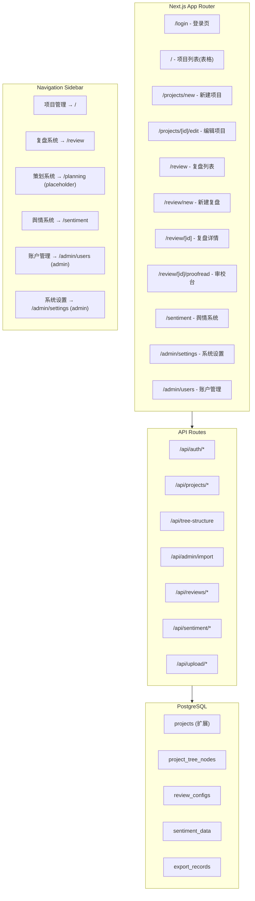
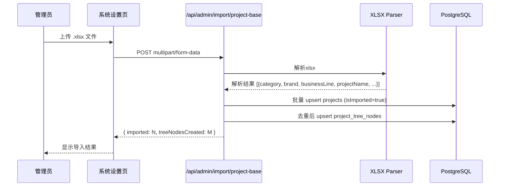
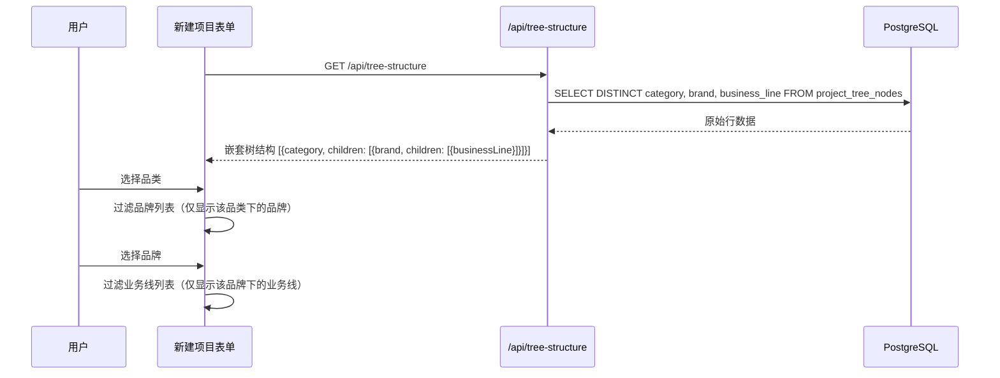
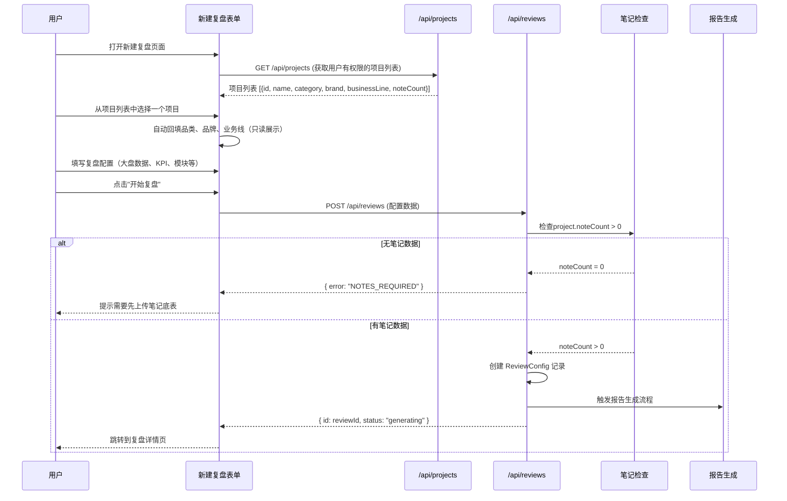

# Design Document: 页面改版V2 (page-redesign-v2)

## Overview

本设计文档描述"派盘盘"数字营销AI交付与资产沉淀平台的页面改版V2技术方案。改版涵盖登录页品牌升级、全局导航重构、项目列表表格化、系统设置（底表导入）、新建项目（级联选择器+笔记底表）、复盘系统（列表/新建/查看）、审校台（三栏富文本编辑）、舆情系统（图表+导出）等核心模块。

### 设计目标

1. **品牌一致性**：统一"派盘盘"品牌标识，深蓝色导航主题
2. **数据驱动**：通过项目底表导入建立品类→品牌→业务线的级联数据源
3. **流程完整性**：覆盖从项目创建、复盘配置、报告生成到舆情分析的完整业务链路
4. **可扩展性**：预留策划系统入口，模块化设计支持后续功能扩展

### 技术栈（不变）

- **Frontend**: Next.js 14 (App Router), React 18, TypeScript, Tailwind CSS, TanStack React Query, Recharts, lucide-react
- **Backend**: Next.js API Routes, Prisma ORM, PostgreSQL
- **Auth**: JWT (jose) + httpOnly cookie (`ppp_token`)
- **File Processing**: xlsx (SheetJS)

## Architecture

### 系统架构变更



### 路由结构变更

| 路由 | 用途 | 权限 |
|------|------|------|
| `/login` | 登录页（品牌升级） | public |
| `/` | 项目列表（表格布局） | authenticated |
| `/projects/new` | 新建项目（级联+笔记底表） | authenticated |
| `/projects/[id]/edit` | 编辑项目 | authenticated |
| `/review` | 复盘列表 | authenticated |
| `/review/new` | 新建复盘 | authenticated |
| `/review/[id]` | 复盘详情 | authenticated |
| `/review/[id]/proofread` | 审校台 | authenticated |
| `/sentiment` | 舆情系统 | authenticated |
| `/planning` | 策划系统（占位） | authenticated |
| `/admin/settings` | 系统设置 | admin |
| `/admin/users` | 账户管理 | admin |

## Components and Interfaces

### 1. 全局导航组件 (Sidebar)

**变更**：白色背景 → 深蓝色背景，导航项重构

```typescript
// web/src/components/layout/sidebar.tsx
interface NavItem {
  href: string;
  label: string;
  icon: LucideIcon;
  adminOnly?: boolean;
}

const navItems: NavItem[] = [
  { href: '/', label: '项目管理', icon: FolderKanban },
  { href: '/review', label: '复盘系统', icon: BarChart3 },
  { href: '/planning', label: '策划系统', icon: Lightbulb },
  { href: '/sentiment', label: '舆情系统', icon: MessageCircle },
  { href: '/admin/users', label: '账户管理', icon: Users, adminOnly: true },
  { href: '/admin/settings', label: '系统设置', icon: Settings, adminOnly: true },
];
```

**样式变更**：
- 背景：`bg-white` → `bg-slate-900`（深蓝/深色）
- 文字：`text-gray-600` → `text-slate-300`
- 高亮：`bg-primary/10 text-primary` → `bg-white/10 text-white`
- Logo区域：显示"派盘盘"品牌名

### 2. 级联选择器组件 (CascadeSelector)

**新增组件**：三级联动选择器

```typescript
// web/src/components/form/cascade-selector.tsx
interface TreeNode {
  id: string;
  label: string;
  children?: TreeNode[];
}

interface CascadeSelectorProps {
  treeData: TreeNode[];          // 品类→品牌→业务线树结构
  value: {
    category: string;
    brand: string;
    businessLine: string;
  };
  onChange: (value: { category: string; brand: string; businessLine: string }) => void;
  disabled?: boolean;
}

// 行为：
// 1. 选择品类 → 过滤品牌列表
// 2. 选择品牌 → 过滤业务线列表
// 3. 上级变更 → 清空下级选择
```

### 3. 笔记底表上传组件 (NoteBaseUploader)

```typescript
// web/src/components/form/note-base-uploader.tsx
interface NoteBaseUploaderProps {
  projectId?: string;            // 已有项目时传入
  onUploadSuccess: (count: number) => void;
  onUploadError: (error: string) => void;
}

// 行为：
// 1. 仅接受 .xlsx 文件
// 2. 上传后解析40+字段
// 3. 全量覆盖策略（先删后写）
// 4. 显示解析结果（成功数量/失败原因）
```

### 4. 复盘表单组件 (ReviewForm)

```typescript
// web/src/components/review/review-form.tsx
interface ReviewFormState {
  // 项目信息（从已有项目列表中选择，选择后自动回填品类/品牌/业务线，只读展示）
  projectId: string;
  // 以下字段由选择项目后自动填充，不可手动编辑
  category: string;       // 只读回填
  brand: string;          // 只读回填
  businessLine: string;   // 只读回填

  // 大盘数据
  benchmark: {
    ctr: number | null;
    cpm: number | null;
    cpc: number | null;
    cpe: number | null;
    engagementRate: number | null;
  };

  // 达人层级
  influencerTiers: Array<{
    id: string;
    name: string;
    fanRangeMin: number;
    fanRangeMax: number;
  }>;

  // KPI目标
  kpiTargets: {
    totalImpression: number | null;
    totalRead: number | null;
    totalEngagement: number | null;
    viralPosts1k: number | null;
    viralPosts10k: number | null;
    cpm: number | null;
    cpc: number | null;
    cpe: number | null;
    ctr: number | null;
    searchIndex: number | null;
    socSov: number | null;
    audienceBrandTotal: number | null;
    audienceSpuTotal: number | null;
    audienceBrandTi: number | null;
    audienceSpuTi: number | null;
  };

  // 统计口径
  engagementMetric: 'exclude_follow' | 'include_follow';
  viralMetric: 'like_comment_share' | 'like_only';

  // 报告模块
  modules: Record<string, boolean>;

  // 投流周期
  launchPhases: Array<{
    id: string;
    name: string;
    startDate: string;
    endDate: string;
  }>;

  // 策划方案
  planFileId: string | null;
  planFileName: string | null;
}
```

### 5. 审校台组件 (ProofreadingPlatform)

```typescript
// web/src/components/proofread/proofread-layout.tsx
interface ProofreadLayoutProps {
  reviewId: string;
  versionId: string;
}

// 三栏布局：
// Left: ChapterTree - 章节目录导航
// Center: RichTextEditor - 富文本编辑器
// Right: AiAssistantPanel - AI助手面板
```

### 6. 舆情系统组件

```typescript
// web/src/components/sentiment/sentiment-dashboard.tsx
interface SentimentDashboardProps {
  projectId: string;
}

// 子组件：
// - SentimentPieChart: 情感分布饼图
// - CommentTrendChart: 评论趋势折线图
// - KeywordCloud: 关键词词云
// - KeywordTable: 关键词频次表
// - NegativeCommentList: 负向评论列表
```

## Data Models

### 数据库Schema变更

#### 1. Project 表扩展

```prisma
model Project {
  // ... 现有字段保持不变 ...

  // 新增字段
  businessLine    String?   @map("business_line") @db.VarChar(200)
  createdBy       String?   @map("created_by") @db.Uuid
  participants    String[]  @default([]) @map("participants")  // User ID 数组
  isImported      Boolean   @default(false) @map("is_imported") // 底表导入标记
  noteCount       Int       @default(0) @map("note_count")      // 笔记数量缓存

  // 新增关系
  reviewConfigs   ReviewConfig[]
}
```

#### 1.5. User 表扩展（角色体系）

现有 User 表的 `role` 字段从 `"admin" | "user"` 扩展为 `"admin" | "组长" | "AD" | "AM" | "投手" | "执行"`。

```prisma
model User {
  // role 字段值域扩展：admin | 组长 | AD | AM | 投手 | 执行
  // 其他字段不变
}
```

**数据权限过滤逻辑**：
- admin 角色：查询不加过滤条件，可见所有项目
- 其他角色：查询条件 `WHERE createdBy = userId OR userId = ANY(participants)`

#### 2. 新增 ProjectTreeNode 表（级联选择器数据源）

```prisma
model ProjectTreeNode {
  id            String   @id @default(dbgenerated("gen_random_uuid()")) @db.Uuid
  category      String   @db.VarChar(200)
  brand         String   @db.VarChar(200)
  businessLine  String   @map("business_line") @db.VarChar(200)
  importBatchId String?  @map("import_batch_id") @db.Uuid
  createdAt     DateTime @default(now()) @map("created_at") @db.Timestamptz()

  @@unique([category, brand, businessLine])
  @@index([category])
  @@index([category, brand])
  @@map("project_tree_nodes")
}
```

#### 3. 新增 ReviewConfig 表（复盘配置）

```prisma
model ReviewConfig {
  id              String   @id @default(dbgenerated("gen_random_uuid()")) @db.Uuid
  projectId       String   @map("project_id") @db.Uuid
  createdBy       String   @map("created_by") @db.Uuid
  status          String   @default("draft") @db.VarChar(20) // draft | generating | completed

  // 大盘数据
  benchmark       Json     @default("{}")

  // 达人层级
  influencerTiers Json     @default("[]") @map("influencer_tiers")

  // KPI目标
  kpiTargets      Json     @default("{}") @map("kpi_targets")

  // 统计口径
  engagementMetric String  @default("exclude_follow") @map("engagement_metric") @db.VarChar(30)
  viralMetric      String  @default("like_comment_share") @map("viral_metric") @db.VarChar(30)

  // 报告模块开关
  modules         Json     @default("{}")

  // 投流周期
  launchPhases    Json     @default("[]") @map("launch_phases")

  // 策划方案
  planFileUrl     String?  @map("plan_file_url")
  planFileName    String?  @map("plan_file_name") @db.VarChar(500)

  // 报告内容（生成后填充）
  reportContent   Json?    @map("report_content")

  createdAt       DateTime @default(now()) @map("created_at") @db.Timestamptz()
  updatedAt       DateTime @default(now()) @map("updated_at") @db.Timestamptz()

  // Relations
  project         Project  @relation(fields: [projectId], references: [id])

  @@index([projectId])
  @@index([createdBy])
  @@map("review_configs")
}
```

#### 4. 新增 SentimentData 表（舆情数据）

```prisma
model SentimentData {
  id            String   @id @default(dbgenerated("gen_random_uuid()")) @db.Uuid
  projectId     String   @map("project_id") @db.Uuid
  dataType      String   @map("data_type") @db.VarChar(50) // sentiment_distribution | trend | keywords | negative_comments
  dataContent   Json     @map("data_content")
  periodStart   DateTime? @map("period_start") @db.Date
  periodEnd     DateTime? @map("period_end") @db.Date
  createdAt     DateTime @default(now()) @map("created_at") @db.Timestamptz()

  @@index([projectId])
  @@index([projectId, dataType])
  @@map("sentiment_data")
}
```

#### 5. 新增 ExportRecord 表（导出记录）

```prisma
model ExportRecord {
  id          String   @id @default(dbgenerated("gen_random_uuid()")) @db.Uuid
  projectId   String   @map("project_id") @db.Uuid
  exportType  String   @map("export_type") @db.VarChar(50) // sentiment | report
  fileName    String   @map("file_name") @db.VarChar(500)
  fileUrl     String?  @map("file_url")
  exportedBy  String   @map("exported_by") @db.Uuid
  createdAt   DateTime @default(now()) @map("created_at") @db.Timestamptz()

  @@index([projectId])
  @@index([exportedBy])
  @@map("export_records")
}
```

### API 路由设计

#### 项目底表导入

```
POST /api/admin/import/project-base
  - Body: multipart/form-data (xlsx file)
  - Response: { imported: number, treeNodesCreated: number, errors: string[] }
  - 逻辑：解析xlsx → 写入projects表 → 去重生成tree_nodes → 增量合并
```

#### 树结构查询

```
GET /api/tree-structure
  - Response: TreeNode[] (嵌套结构: category → brand → businessLine)
  - 用于级联选择器数据源
```

#### 项目列表（扩展）

```
GET /api/projects
  - 新增查询参数: businessLine, dateFrom, dateTo, createdBy
  - 新增返回字段: businessLine, createdBy(displayName), noteCount, participants
```

#### 笔记底表上传

```
POST /api/upload/note-base/[projectId]
  - Body: multipart/form-data (xlsx file)
  - Response: { success: true, noteCount: number }
  - 逻辑：删除该项目所有notes → 解析xlsx → 批量写入 → 更新project.noteCount
```

#### 复盘系统

```
GET    /api/reviews                    - 复盘列表
POST   /api/reviews                    - 创建复盘
GET    /api/reviews/[id]               - 复盘详情
PUT    /api/reviews/[id]               - 更新复盘配置
POST   /api/reviews/[id]/generate      - 触发报告生成
GET    /api/reviews/[id]/report        - 获取报告内容
PUT    /api/reviews/[id]/report        - 保存编辑后的报告
POST   /api/reviews/[id]/plan-upload   - 上传策划方案
```

#### 舆情系统

```
GET    /api/sentiment/[projectId]              - 获取舆情数据
POST   /api/sentiment/[projectId]/export       - 导出舆情报告
GET    /api/sentiment/export-records           - 导出记录列表
```

#### 用户批量导入

```
POST /api/admin/import/users
  - Body: multipart/form-data (xlsx file)
  - Excel字段：用户名、显示名、角色（组长/AD/AM/投手/执行）
  - 逻辑：解析xlsx → 为每个用户生成初始密码 → 批量创建User记录（mustChangePassword=true）
  - Response: { imported: number, errors: string[] }
```

#### 数据权限中间件

```
所有项目相关API（/api/projects, /api/reviews, /api/sentiment）在查询时：
- 从JWT token中获取 userId 和 role
- if role === 'admin': 不加过滤
- else: 添加 WHERE (createdBy = userId OR userId = ANY(participants))
```

### 关键数据流

#### 1. 项目底表导入流程



#### 2. 级联选择器数据流



#### 3. 复盘创建流程



## Correctness Properties

*A property is a characteristic or behavior that should hold true across all valid executions of a system—essentially, a formal statement about what the system should do. Properties serve as the bridge between human-readable specifications and machine-verifiable correctness guarantees.*

### Property 1: Role-based sidebar visibility

*For any* user with a given role, the sidebar navigation items should include admin-only items (账户管理, 系统设置) if and only if the user's role is "admin". For any user with role "user", those items must not appear.

**Validates: Requirements 3.2, 3.3**

### Property 2: Cascade selector parent-child filtering

*For any* tree structure data and any selected category, the brand options shown should be exactly those brands that exist under that category in the tree. Similarly, for any selected brand, the business line options should be exactly those that exist under that brand. Selecting a parent should clear child selections.

**Validates: Requirements 7.1**

### Property 3: Tree structure generation from project base table

*For any* set of project rows with (category, brand, businessLine) tuples, the generated tree structure should contain exactly the unique combinations organized hierarchically. When merged with existing tree data, the result should be the union of both sets without duplicates.

**Validates: Requirements 5.3, 5.4, 5.6**

### Property 4: Note base table full overwrite

*For any* project with N existing notes, uploading a new note base table with M rows should result in exactly M notes in the database for that project. No notes from the previous upload should remain.

**Validates: Requirements 8.3**

### Property 5: Project list filter correctness

*For any* set of projects and any combination of filter criteria (category, brand, businessLine, date range), all displayed projects should match every applied filter. No project that fails any filter criterion should appear in the results.

**Validates: Requirements 4.5**

### Property 6: Report module toggle independence

*For any* report module toggle action, only the toggled module's enabled/disabled state should change. All other modules should retain their previous state. The form state should correctly reflect the exact set of enabled modules.

**Validates: Requirements 12.1, 12.2**

### Property 7: File type validation for project base table

*For any* file with an extension other than `.xlsx`, the project base table upload should reject the file and return an error. Only files with `.xlsx` extension should be accepted for processing.

**Validates: Requirements 5.1, 5.7**

### Property 8: Note base table parsing completeness

*For any* valid xlsx file conforming to the note base table schema, parsing should extract all 40+ specified fields (序号, 博主昵称, 博主粉丝量, 笔记链接, 笔记id, 合作形式, 是否报备, 内容方向, 达人类型, 对应SPU, 内容实际消耗金额, etc.) and persist them correctly to the notes table with no data loss.

**Validates: Requirements 8.2**

## Error Handling

### 前端错误处理策略

| 场景 | 处理方式 |
|------|----------|
| API 401 | 清除token，重定向到登录页 |
| API 403 | 显示"无权限"提示，不重定向 |
| 文件格式错误 | 在上传区域下方显示红色错误提示 |
| 文件解析失败 | 显示具体错误原因（行号、字段名） |
| 网络超时 | 显示重试按钮 |
| 表单验证失败 | 在对应字段下方显示错误信息 |
| 复盘提交缺少笔记 | 弹窗提示+跳转链接 |

### 后端错误处理

```typescript
// 统一错误响应格式
interface ApiError {
  error: string;           // 用户可读的错误信息
  code?: string;           // 机器可读的错误码
  fields?: Record<string, string>;  // 字段级错误
  details?: string;        // 开发调试信息（仅开发环境）
}

// 错误码定义
const ERROR_CODES = {
  INVALID_FILE_FORMAT: '文件格式不支持',
  PARSE_FAILED: '文件解析失败',
  NOTES_REQUIRED: '请先上传笔记底表',
  PROJECT_NOT_FOUND: '项目不存在',
  REVIEW_NOT_FOUND: '复盘记录不存在',
  UNAUTHORIZED: '未登录',
  FORBIDDEN: '无权限',
} as const;
```

### 文件上传错误处理

- **项目底表**：逐行解析，跳过无效行，返回成功/跳过/失败的行数统计
- **笔记底表**：事务性操作，解析失败则整体回滚，不影响现有数据
- **策划方案**：文件大小限制（50MB），格式白名单校验

## Testing Strategy

### 测试框架

- **Unit Tests**: Vitest + React Testing Library
- **Property Tests**: fast-check (配合 Vitest)
- **Integration Tests**: Vitest + MSW (Mock Service Worker)
- **E2E Tests**: Playwright (关键流程)

### 单元测试覆盖

| 模块 | 测试重点 |
|------|----------|
| CascadeSelector | 父子过滤逻辑、清空下级、空数据处理 |
| NoteBaseUploader | 文件类型校验、解析结果展示 |
| Sidebar | 角色权限渲染、高亮状态 |
| ReviewForm | 表单状态管理、模块开关、动态列表增删 |
| TreeStructure API | 去重逻辑、合并逻辑、嵌套构建 |
| NoteParser | 字段映射、类型转换、错误行处理 |
| ProjectFilter | 多条件组合过滤 |

### Property-Based Testing

使用 `fast-check` 库，每个属性测试最少运行 100 次迭代。

```typescript
// 示例：Property 3 - Tree structure generation
// Feature: page-redesign-v2, Property 3: Tree structure generation from project base table
import * as fc from 'fast-check';

describe('TreeStructure generation', () => {
  it('should produce unique hierarchical nodes from any set of project rows', () => {
    fc.assert(
      fc.property(
        fc.array(fc.record({
          category: fc.string({ minLength: 1, maxLength: 50 }),
          brand: fc.string({ minLength: 1, maxLength: 50 }),
          businessLine: fc.string({ minLength: 1, maxLength: 50 }),
        }), { minLength: 1, maxLength: 100 }),
        (rows) => {
          const tree = buildTreeStructure(rows);
          const uniqueTuples = new Set(rows.map(r => `${r.category}|${r.brand}|${r.businessLine}`));
          // Tree should contain exactly the unique combinations
          const treeLeaves = flattenTreeToTuples(tree);
          expect(treeLeaves.size).toBe(uniqueTuples.size);
        }
      ),
      { numRuns: 100 }
    );
  });
});
```

### 集成测试

- 登录流程（正确/错误凭据、自动登录）
- 底表导入完整流程（上传→解析→写入→查询树结构）
- 复盘创建流程（配置→检查笔记→提交）
- 舆情数据加载和导出

### E2E 测试（关键路径）

1. 管理员导入项目底表 → 新建项目使用级联选择器
2. 上传笔记底表 → 创建复盘 → 查看复盘详情
3. 审校台编辑 → 保存 → 导出
