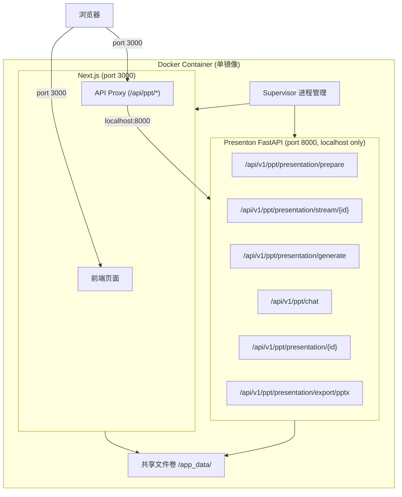
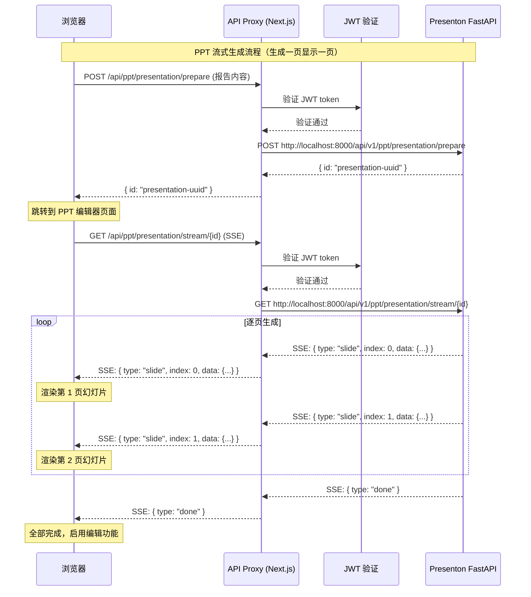
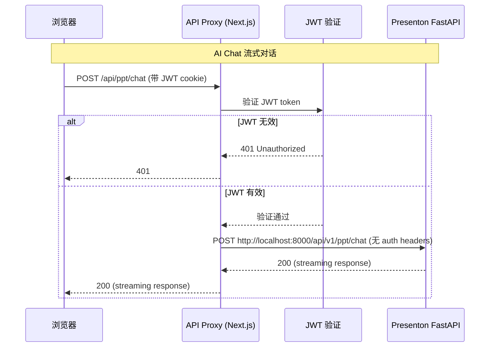

# Design Document: Presenton 深度集成 (presenton-integration)

## Overview

本设计文档描述将 Presenton AI 演示文稿生成器深度集成到"派盘盘"(PPP) 数字营销平台的技术方案。集成后，用户可在审校台使用 TipTap 富文本编辑器编辑报告，通过 AI 助手优化内容，一键生成 PPT 并在内嵌编辑器中进行 AI 对话式修改。

### 设计目标

1. **服务内聚**：Presenton FastAPI 作为内部服务嵌入同一 Docker 容器，消除外部网络依赖
2. **编辑体验升级**：textarea → TipTap 富文本编辑器，支持 Markdown 快捷键和格式化
3. **AI 驱动编辑**：审校台 AI 助手接入 Presenton Chat API，支持上下文感知的内容优化
4. **PPT 全流程**：从报告生成 → PPT 生成 → AI 对话编辑 → 导出 PPTX 的完整闭环
5. **统一认证**：移除 Presenton 独立认证，PPP JWT 为唯一鉴权层

### 技术栈

**PPP 平台（不变）：**
- Next.js 14 (App Router), React 18, TypeScript, Tailwind CSS
- TanStack React Query, Recharts, lucide-react
- Prisma ORM, PostgreSQL
- JWT (jose) + httpOnly cookie

**新增依赖：**
- TipTap 编辑器 (`@tiptap/react`, `@tiptap/starter-kit`, `@tiptap/extension-table` 等)
- Presenton FastAPI (Python 3.11, SQLAlchemy, Uvicorn)
- Supervisor 进程管理器

## Architecture

### 系统架构



### 请求流转





### 路由结构新增

| 路由 | 用途 | 权限 |
|------|------|------|
| `/review/[id]/proofread` | 审校台（升级为 TipTap） | authenticated |
| `/review/[id]/ppt-editor/[presentationId]` | PPT 编辑器 | authenticated |
| `/api/ppt/presentation/prepare` | PPT 准备（创建记录，返回 ID） | authenticated |
| `/api/ppt/presentation/stream/[id]` | PPT 流式生成（SSE，逐页返回） | authenticated |
| `/api/ppt/generate` | PPT 同步生成代理（保留兼容） | authenticated |
| `/api/ppt/chat` | AI Chat 代理（streaming） | authenticated |
| `/api/ppt/[presentationId]` | 获取/编辑演示文稿 | authenticated |
| `/api/ppt/[presentationId]/export` | 导出 PPTX | authenticated |
| `/api/ppt/health` | Presenton 健康检查 | authenticated |

## Components and Interfaces

### 1. Presenton FastAPI 内部服务 (`presenton-api/`)

从 Presenton 源码复制 FastAPI 后端代码，移除认证中间件。

```python
# presenton-api/main.py
from fastapi import FastAPI
from fastapi.middleware.cors import CORSMiddleware

app = FastAPI(title="Presenton Internal API")

# 仅允许 localhost 访问
app.add_middleware(
    CORSMiddleware,
    allow_origins=["http://localhost:3000"],
    allow_methods=["*"],
    allow_headers=["*"],
)

# 无认证中间件 - 由 Next.js API Proxy 层统一鉴权
# 移除: app.add_middleware(AuthMiddleware)
# 移除: app.add_middleware(APIKeyMiddleware)
```

**关键端点：**
- `POST /api/v1/ppt/presentation/prepare` - 准备演示文稿（创建记录，返回 ID）
- `GET /api/v1/ppt/presentation/stream/{id}` - 流式生成（SSE，逐页返回幻灯片）
- `POST /api/v1/ppt/presentation/generate` - 同步生成演示文稿（保留兼容）
- `GET /api/v1/ppt/presentation/{id}` - 获取演示文稿详情
- `POST /api/v1/ppt/chat` - AI 对话编辑（streaming）
- `POST /api/v1/ppt/presentation/export/pptx` - 导出 PPTX
- `GET /api/v1/health` - 健康检查

### 2. API Proxy 层

升级现有 `presenton-client.ts`，新增 Chat 代理路由。

```typescript
// web/src/app/api/ppt/chat/route.ts
import { NextRequest } from 'next/server';
import { verifyAuth } from '@/lib/auth';

const PRESENTON_INTERNAL_URL = 'http://localhost:8000';

export async function POST(request: NextRequest) {
  // 1. JWT 验证
  const auth = await verifyAuth(request);
  if (!auth) return new Response('Unauthorized', { status: 401 });

  // 2. 转发到 Presenton（不带 auth headers）
  const body = await request.json();
  const response = await fetch(`${PRESENTON_INTERNAL_URL}/api/v1/ppt/chat`, {
    method: 'POST',
    headers: { 'Content-Type': 'application/json' },
    body: JSON.stringify(body),
  });

  // 3. Streaming 透传
  return new Response(response.body, {
    status: response.status,
    headers: { 'Content-Type': 'text/event-stream' },
  });
}
```

### 3. TipTap 富文本编辑器组件

```typescript
// web/src/components/proofread/tiptap-editor.tsx
import { useEditor, EditorContent } from '@tiptap/react';
import StarterKit from '@tiptap/starter-kit';
import Table from '@tiptap/extension-table';
import TableRow from '@tiptap/extension-table-row';
import TableCell from '@tiptap/extension-table-cell';
import TableHeader from '@tiptap/extension-table-header';
import Placeholder from '@tiptap/extension-placeholder';

interface TipTapEditorProps {
  content: string;              // HTML 或 JSON 格式的内容
  onChange: (content: string) => void;
  placeholder?: string;
  editable?: boolean;
}

// 扩展配置：
// - StarterKit: 标题(h1-h3)、加粗、斜体、列表、引用、代码块
// - Table: 表格支持（表头、单元格、行）
// - Placeholder: 空内容占位提示
// - History: 撤销/重做（maxDepth: 100）
// - Markdown shortcuts: # → heading, ** → bold, - → list
```

**工具栏组件：**

```typescript
// web/src/components/proofread/editor-toolbar.tsx
interface EditorToolbarProps {
  editor: Editor | null;
  onGeneratePPT: () => void;
  onSave: () => void;
  isSaving: boolean;
  isGenerating: boolean;
}

// 工具栏按钮：
// 格式化: H1, H2, H3, Bold, Italic, BulletList, OrderedList, Table, Blockquote
// 操作: 保存, 导出PDF, 导出Word, 生成PPT
```

### 4. AI 助手面板组件

```typescript
// web/src/components/proofread/ai-assistant-panel.tsx
interface AiAssistantPanelProps {
  reviewId: string;
  chapterTitle: string;
  chapterContent: string;        // 当前章节的 HTML 内容
  onApplySuggestion: (content: string) => void;  // 将 AI 建议应用到编辑器
}

interface ChatMessage {
  id: string;
  role: 'user' | 'assistant';
  content: string;
  isStreaming?: boolean;
  suggestion?: string;           // AI 建议的修改内容（可应用到编辑器）
}

// 预设命令按钮：
// - 优化表达
// - 补充数据
// - 调整结构
// - 润色文本
```

### 5. PPT 编辑器页面

```typescript
// web/src/app/review/[id]/ppt-editor/[presentationId]/page.tsx
interface PPTEditorPageProps {
  params: { id: string; presentationId: string };
}

// 三栏布局：
// Left: SlidePanel - 幻灯片缩略图列表（支持拖拽排序、添加、删除）
// Center: SlideCanvas - 当前幻灯片 TipTap 编辑区
// Right: PPTChatPanel - AI 对话面板（调用 /api/ppt/chat）
```

**幻灯片面板：**

```typescript
// web/src/components/ppt-editor/slide-panel.tsx
interface SlidePanelProps {
  slides: PresentationSlide[];
  activeIndex: number;
  onSelectSlide: (index: number) => void;
  onReorderSlides: (fromIndex: number, toIndex: number) => void;
  onDeleteSlide: (index: number) => void;
  onAddSlide: (atIndex: number) => void;
}
```

**幻灯片画布：**

```typescript
// web/src/components/ppt-editor/slide-canvas.tsx
interface SlideCanvasProps {
  slide: PresentationSlide;
  onContentChange: (content: Record<string, unknown>) => void;
}
// 使用 TipTap 编辑幻灯片文本内容
// 图片区域显示为不可编辑的占位块
```

### 6. Supervisor 配置

```ini
# presenton-api/supervisord.conf
[supervisord]
nodaemon=true
logfile=/var/log/supervisord.log

[program:nextjs]
command=npx next start -p 3000
directory=/app/web
autostart=true
autorestart=true
startsecs=5
stderr_logfile=/var/log/nextjs.err.log
stdout_logfile=/var/log/nextjs.out.log

[program:presenton]
command=uvicorn main:app --host 127.0.0.1 --port 8000
directory=/app/presenton-api
autostart=true
autorestart=true
startsecs=5
stderr_logfile=/var/log/presenton.err.log
stdout_logfile=/var/log/presenton.out.log
```

### 7. presenton-client.ts 升级

```typescript
// web/src/lib/presenton-client.ts (升级)
// 变更：PRESENTON_BASE_URL 从 localhost:5000 改为 localhost:8000
// 变更：移除 Basic Auth（内部服务无需认证）
// 新增：preparePresentation() 方法
// 新增：streamPresentation() 方法（SSE 连接）
// 新增：chatStream() 方法支持 streaming
// 新增：健康检查使用 /api/v1/health 端点

const PRESENTON_BASE_URL = process.env.PRESENTON_INTERNAL_URL || 'http://localhost:8000';

class PresentonClient {
  // 移除 authHeader

  // PPT 流式生成（两步）
  async preparePresentation(payload: PreparePPTRequest): Promise<{ id: string }> { ... }
  getStreamUrl(presentationId: string): string {
    return `${PRESENTON_BASE_URL}/api/v1/ppt/presentation/stream/${presentationId}`;
  }

  // AI Chat streaming
  async chatStream(payload: ChatRequest): Promise<ReadableStream> { ... }
}
```

## Data Models

### 数据库变更

本次集成**不修改**现有 PostgreSQL 数据库 schema。Presenton 使用独立的 SQLite 数据库存储演示文稿数据，位于共享卷 `/app_data/presenton.db`。

### Presenton 内部数据模型（SQLite）

```python
# presenton-api/models/presentation.py
class Presentation:
    id: str              # UUID
    title: str
    slides: List[Slide]  # JSON 序列化
    theme: dict
    created_at: datetime
    updated_at: datetime

class Slide:
    index: int
    type: str            # "title" | "content" | "two_column" | "image" | "table"
    content: dict        # 幻灯片内容（标题、正文、图片URL等）
    layout: str
```

### API 请求/响应模型

**Chat API 请求：**

```typescript
interface ChatRequest {
  message: string;                    // 用户消息
  context?: {
    chapterTitle?: string;            // 当前章节标题
    chapterContent?: string;          // 当前章节内容（HTML）
    projectName?: string;             // 项目名称
    brand?: string;                   // 品牌
    category?: string;                // 品类
  };
  conversationHistory?: ChatMessage[]; // 对话历史
  presentationId?: string;            // PPT 编辑模式下的演示文稿 ID
}
```

**Chat API 响应（streaming）：**

```typescript
// Server-Sent Events 格式
// data: {"type": "text", "content": "AI 回复内容片段"}
// data: {"type": "suggestion", "content": "<p>建议的修改内容</p>"}
// data: {"type": "slide_update", "slideIndex": 2, "content": {...}}
// data: {"type": "done"}
```

**PPT 流式生成请求/响应（prepare + stream）：**

```typescript
// Step 1: 准备演示文稿（POST /api/ppt/presentation/prepare）
interface PreparePPTRequest {
  projectName: string;
  brand: string;
  category: string;
  content: string;                         // Markdown 格式的报告内容
  modules: Record<string, ReportModule>;   // 报告模块数据
  n_slides?: number;                       // 默认 15
  language?: string;                       // 默认 '中文'
  tone?: 'professional' | 'default';       // 默认 'professional'
}

interface PreparePPTResponse {
  id: string;                              // presentation UUID，用于后续 stream
}

// Step 2: 流式生成（GET /api/ppt/presentation/stream/{id}，SSE）
// Server-Sent Events 格式，逐页返回：
// data: {"type": "slide", "index": 0, "data": {"type": "title", "content": {...}, "layout": "..."}}
// data: {"type": "slide", "index": 1, "data": {"type": "content", "content": {...}, "layout": "..."}}
// data: {"type": "slide_assets_ready", "index": 0}  // 图片等资源就绪
// data: {"type": "progress", "current": 5, "total": 15}
// data: {"type": "done", "presentation": {...}}  // 全部完成

interface ReportModule {
  status: 'show' | 'hide';
  paragraphs?: Array<{ content: string }>;
  tables?: Array<{
    title?: string;
    headers: string[];
    rows: string[][];
  }>;
}
```

**PPT 同步生成请求（保留兼容，POST /api/ppt/generate）：**

```typescript
interface GeneratePPTRequest {
  projectName: string;
  brand: string;
  category: string;
  modules: Record<string, ReportModule>;
  n_slides?: number;
  language?: string;
  tone?: 'professional' | 'default';
}
```

### 内容格式转换

报告模块数据 → Markdown 格式的转换规则：

```typescript
// web/src/lib/content-converter.ts
interface ConversionResult {
  markdown: string;
  includedModules: string[];   // 实际包含的模块 key 列表
}

function convertModulesToMarkdown(
  modules: Record<string, ReportModule>,
  metadata: { projectName: string; brand: string; category: string }
): ConversionResult {
  // 规则：
  // 1. status === 'hide' 的模块不包含在输出中
  // 2. 数值数据原样保留，不做四舍五入
  // 3. 表格转为 Markdown table 格式（| header | ... |）
  // 4. 段落内容直接输出
}
```

## Correctness Properties

*A property is a characteristic or behavior that should hold true across all valid executions of a system—essentially, a formal statement about what the system should do. Properties serve as the bridge between human-readable specifications and machine-verifiable correctness guarantees.*

### Property 1: JWT 验证网关

*For any* HTTP 请求发送到 `/api/ppt/*` 路径，如果请求不包含有效的 PPP JWT token，则 API Proxy 应返回 HTTP 401 且不将请求转发到 Presenton API。如果包含有效 JWT，则请求应被转发。

**Validates: Requirements 2.3, 2.4**

### Property 2: TipTap 内容序列化往返

*For any* 有效的富文本内容（包含标题、加粗、斜体、列表、表格、引用），将其序列化为存储格式后再反序列化回来，应产生与原始内容等价的结果。

**Validates: Requirements 3.3**

### Property 3: 章节切换内容保持

*For any* 包含 N 个章节的报告，以及任意章节切换序列，每次切换回某个章节时，该章节的内容应与上次离开时的内容完全一致（包括用户的编辑修改）。

**Validates: Requirements 3.4**

### Property 4: 模块过滤正确性

*For any* 报告模块集合（每个模块有 show/hide 状态），生成 PPT 内容时应仅包含 status 为 "show" 的模块。输出中不应出现任何 status 为 "hide" 的模块内容。

**Validates: Requirements 5.6, 12.5**

### Property 5: API Proxy 透明转发

*For any* 经过 JWT 验证的请求发送到 `/api/ppt/{subpath}`，Proxy 应将其转发到 `http://localhost:8000/api/v1/ppt/{subpath}`（路径正确映射），转发请求不应包含 PPP 认证相关 headers（Authorization, Cookie），且 Presenton 返回的响应体和状态码应原样传递给客户端。

**Validates: Requirements 7.1, 7.2, 7.3**

### Property 6: 对话历史累积

*For any* AI 助手会话中的消息序列 [m1, m2, ..., mn]，发送第 n+1 条消息时，请求 payload 中的 conversationHistory 应包含所有前 n 条消息（用户消息和 AI 回复），保持时间顺序。

**Validates: Requirements 10.4**

### Property 7: 幻灯片列表操作正确性

*For any* 包含 N 张幻灯片的演示文稿：
- 在位置 P 添加新幻灯片后，结果应有 N+1 张幻灯片，新幻灯片位于位置 P
- 删除位置 P 的幻灯片后，结果应有 N-1 张幻灯片，其余幻灯片保持相对顺序
- 将位置 A 的幻灯片移动到位置 B 后，结果仍有 N 张幻灯片，且顺序符合移动操作的语义

**Validates: Requirements 11.3, 11.4, 11.5**

### Property 8: 报告数据 Markdown 往返转换

*For any* 有效的报告模块数据（包含 KPI 表格、内容分析表格、投流分析表格），将其转换为 Markdown 格式后再解析回结构化数据，所有数值字段应保持精确相等，表格的行数和列数应保持不变。

**Validates: Requirements 12.1, 12.2, 12.3, 12.4**

## Error Handling

### 前端错误处理

| 场景 | 处理方式 |
|------|----------|
| JWT 过期/无效 | API Proxy 返回 401 → 前端清除 token，重定向登录页 |
| Presenton API 不可用 | 显示"AI 服务暂时不可用"提示，禁用 AI 相关按钮 |
| PPT 生成超时（>300s） | 显示超时错误 + 重试按钮 |
| AI Chat 流式响应中断 | 显示已接收内容 + "回复中断，请重试"提示 |
| AI Chat 30s 无数据 | 显示超时警告 + 重试选项 |
| TipTap 内容保存失败 | 本地缓存 + 错误提示 + 重试按钮 |
| 幻灯片操作失败 | 回滚本地状态 + 错误提示 |
| PPTX 导出失败 | 错误提示 + 重试按钮 |

### 后端错误处理

```typescript
// API Proxy 错误处理
interface ProxyError {
  error: string;
  code: 'PRESENTON_UNAVAILABLE' | 'PRESENTON_TIMEOUT' | 'PROXY_ERROR' | 'AUTH_FAILED';
  details?: string;
}

// 超时配置
const PROXY_TIMEOUTS = {
  generate: 300_000,   // PPT 生成: 5 分钟
  chat: 60_000,        // AI Chat: 60 秒
  export: 120_000,     // PPTX 导出: 2 分钟
  default: 30_000,     // 其他请求: 30 秒
};
```

### Presenton 服务恢复

- Supervisor 监控 FastAPI 进程，崩溃后 5 秒内自动重启
- API Proxy 在 Presenton 不可用时返回 503，前端显示服务恢复中
- 健康检查端点 `/api/ppt/health` 供前端轮询服务状态

## Testing Strategy

### 测试框架

- **Unit Tests**: Vitest + React Testing Library
- **Property Tests**: fast-check (配合 Vitest)，每个属性测试最少 100 次迭代
- **Integration Tests**: Vitest + MSW (Mock Service Worker)
- **E2E Tests**: Playwright（关键流程）

### Property-Based Testing

使用 `fast-check` 库实现正确性属性验证。

```typescript
// Feature: presenton-integration, Property 1: JWT 验证网关
describe('API Proxy JWT validation', () => {
  it('should reject all requests without valid JWT', () => {
    fc.assert(
      fc.property(
        fc.constantFrom('/api/ppt/chat', '/api/ppt/generate', '/api/ppt/abc123'),
        fc.oneof(fc.constant(undefined), fc.string()),  // invalid tokens
        (path, invalidToken) => {
          // 发送请求到 proxy，验证返回 401
        }
      ),
      { numRuns: 100 }
    );
  });
});

// Feature: presenton-integration, Property 8: 报告数据 Markdown 往返转换
describe('Content conversion round-trip', () => {
  it('should preserve all data through Markdown conversion', () => {
    fc.assert(
      fc.property(
        arbitraryReportModules(),  // 生成随机报告模块数据
        (modules) => {
          const markdown = convertModulesToMarkdown(modules, metadata);
          const parsed = parseMarkdownToModules(markdown);
          // 验证数值精确相等、行列数不变
        }
      ),
      { numRuns: 100 }
    );
  });
});
```

### 单元测试覆盖

| 模块 | 测试重点 |
|------|----------|
| `content-converter.ts` | 模块过滤、Markdown 格式化、数值保留、表格对齐 |
| `tiptap-editor.tsx` | 内容加载、Markdown 快捷键、保存序列化 |
| `ai-assistant-panel.tsx` | 消息发送、流式接收、建议应用、错误处理 |
| `slide-panel.tsx` | 拖拽排序、添加/删除、缩略图渲染 |
| `ppt-chat-proxy route` | JWT 验证、请求转发、streaming 透传、超时处理 |
| `presenton-client.ts` | URL 构建、请求格式、错误处理 |

### 集成测试

- 审校台完整流程：加载报告 → TipTap 编辑 → 保存 → 切换章节 → 验证内容
- AI 助手流程：发送消息 → 接收流式回复 → 应用建议到编辑器
- PPT 生成流程：点击生成 → 等待完成 → 跳转编辑器
- PPT 编辑流程：选择幻灯片 → 编辑内容 → AI 修改 → 导出

### E2E 测试（关键路径）

1. 审校台编辑 → AI 助手优化 → 保存
2. 审校台 → 生成 PPT → PPT 编辑器 → AI 修改幻灯片 → 导出 PPTX
3. PPT 编辑器幻灯片管理：添加、删除、重排序
