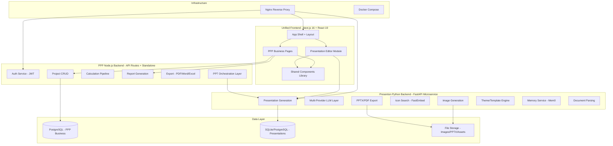
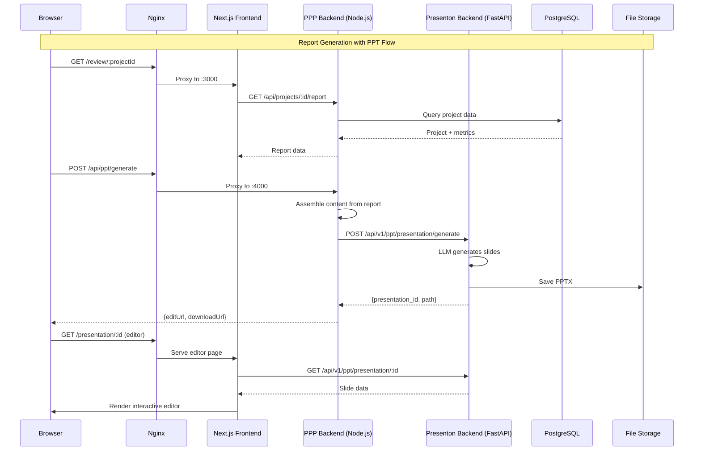

# Design Document: Project Merge Restructure (Presenton + PPP_PI_New)

## Overview

This design document describes the technical approach for merging two projects into a unified platform:

1. **Presenton** - An AI presentation generator with Next.js 16 frontend, FastAPI Python backend, and Electron desktop wrapper
2. **PPP_PI_New** - A marketing review/report system with Next.js 14 frontend, Node.js/TypeScript backend, and Prisma/PostgreSQL

The merged system adopts a microservices architecture: a unified Next.js 16 frontend (following Presenton's component patterns, removing Electron), an independent Python FastAPI backend (Presenton's AI/PPT engine as a standalone service), and a Node.js/TypeScript backend (PPP's business logic). All services are orchestrated via Docker Compose with Nginx as the unified reverse proxy.

Core objectives:
1. **Unified Frontend**: Upgrade PPP frontend to Next.js 16 + React 19, adopting Presenton's component patterns and Redux Toolkit state management
2. **Independent Python Backend**: Extract Presenton's FastAPI backend as a standalone microservice providing AI/PPT generation APIs
3. **Preserve Business Backend**: Keep PPP's Node.js/TypeScript backend for project management, data calculation, and report generation
4. **Remove Electron**: Pure web application with no desktop dependencies
5. **Unified Deployment**: Docker Compose orchestrating all services

## Architecture

### Target System Architecture



### Service Communication Flow



## Components and Interfaces

### Component 1: Unified Frontend (Next.js 16)

**Purpose**: Single web application serving both PPP business pages and Presenton editor functionality.

**Interface**:
```typescript
// App routing structure
interface AppRoutes {
  // PPP Business Routes
  '/': DashboardPage
  '/projects': ProjectListPage
  '/projects/[id]': ProjectDetailPage
  '/review/[id]': ReviewReportPage
  '/review/[id]/ppt': PresentationEditorPage
  '/planning': PlanningPage
  '/sentiment': SentimentPage
  '/admin': AdminPage
  
  // Presentation Routes (from Presenton)
  '/presentation': PresentationGeneratorPage
  '/presentation/[id]': PresentationEditorPage
  '/presentation/templates': TemplateGalleryPage
}

// Shared state store structure
interface RootState {
  auth: AuthState
  projects: ProjectState
  report: ReportState
  presentation: PresentationState  // From Presenton's Redux store
  editor: EditorState              // Slide editor state
  theme: ThemeState
}
```

**Responsibilities**:
- Serve all UI pages for both PPP and Presenton functionality
- Manage client-side state via Redux Toolkit
- Communicate with both backends via API calls
- Provide presentation editor as an embedded module (not iframe)

### Component 2: PPP Node.js Backend

**Purpose**: Handle business logic for marketing review system - project management, data ingestion, calculation pipeline, report generation, and export.

**Interface**:
```typescript
// PPP Backend API surface
interface PPPBackendAPI {
  // Auth
  'POST /api/auth/login': (credentials: LoginRequest) => AuthResponse
  'POST /api/auth/refresh': (token: string) => AuthResponse
  
  // Projects
  'GET /api/projects': () => Project[]
  'POST /api/projects': (data: CreateProjectRequest) => Project
  'GET /api/projects/:id': (id: string) => ProjectDetail
  'PUT /api/projects/:id': (id: string, data: UpdateProjectRequest) => Project
  
  // Data Ingestion
  'POST /api/projects/:id/upload': (id: string, files: File[]) => IngestionResult
  'POST /api/projects/:id/calculate': (id: string) => CalculationResult
  
  // Report
  'GET /api/projects/:id/report': (id: string) => ReportData
  'POST /api/projects/:id/report/generate': (id: string) => ReportResult
  
  // Export
  'POST /api/projects/:id/export/pdf': (id: string) => ExportResult
  'POST /api/projects/:id/export/word': (id: string) => ExportResult
  'POST /api/projects/:id/export/ppt': (id: string, options: PPTOptions) => PPTResult
  
  // PPT Orchestration (calls Presenton backend)
  'POST /api/ppt/generate': (content: PPTGenerateRequest) => PPTGenerateResponse
  'GET /api/ppt/:id': (id: string) => PresentationDetail
}
```

**Responsibilities**:
- User authentication and authorization (JWT)
- Project CRUD and lifecycle management
- Data ingestion from spreadsheets and documents
- Metrics calculation pipeline (KPI, content analysis, traffic analysis)
- Report narrative generation via LLM
- Export to PDF/Word/Excel
- Orchestrate PPT generation by calling Presenton backend

### Component 3: Presenton Python Backend (FastAPI)

**Purpose**: Standalone AI-powered presentation generation microservice. Provides REST API for creating, editing, and exporting presentations.

**Interface**:
```python
# Presenton FastAPI endpoints (existing, preserved as-is)
class PresentonAPI:
    # Presentation lifecycle
    POST   /api/v1/ppt/presentation/generate     -> PresentationResponse
    GET    /api/v1/ppt/presentation/{id}          -> PresentationDetail
    POST   /api/v1/ppt/presentation/edit          -> PresentationResponse
    POST   /api/v1/ppt/presentation/derive        -> PresentationResponse
    DELETE /api/v1/ppt/presentation/{id}          -> None
    
    # Export
    POST   /api/v1/ppt/presentation/export/pptx   -> ExportResponse
    POST   /api/v1/ppt/presentation/export/pdf    -> ExportResponse
    
    # Resources
    GET    /api/v1/ppt/presentation/templates      -> List[Template]
    GET    /api/v1/ppt/fonts                       -> List[Font]
    POST   /api/v1/ppt/images/generate            -> ImageResponse
    GET    /api/v1/ppt/icons/search               -> List[Icon]
    GET    /api/v1/ppt/themes                      -> List[Theme]
    
    # Chat / AI
    POST   /api/v1/ppt/chat                        -> ChatResponse
    POST   /api/v1/ppt/outline/generate           -> OutlineResponse
    
    # Auth (internal)
    POST   /api/v1/auth/login                      -> SessionResponse
    GET    /api/v1/auth/verify                     -> VerifyResponse
    
    # Webhooks
    POST   /api/v1/webhook/codex/callback          -> None
```

**Responsibilities**:
- AI-powered slide content generation (multi-provider LLM)
- Image generation and icon search
- PPTX/PDF export with template system
- Presentation memory (Mem0) for learning user preferences
- Document parsing (OCR, PDF extraction)
- Theme and template management
- Authentication for direct API access

## Data Models

### PPP Business Models (PostgreSQL via Prisma)

```typescript
// Core PPP data models (existing, preserved)
interface Project {
  id: string
  name: string
  brand: string
  category: string
  platform: string
  startDate: Date
  endDate: Date
  status: ProjectStatus
  createdAt: Date
  updatedAt: Date
}

interface ReportData {
  projectId: string
  modules: Record<ModuleKey, ModuleData>
  metrics: CalculatedMetrics
  narrative: NarrativeContent
  generatedAt: Date
}

interface ModuleData {
  status: 'show' | 'hide'
  paragraphs: Paragraph[]
  tables: TableData[]
  charts: ChartConfig[]
}

type ModuleKey = 'M1' | 'M2' | 'M3' | 'M4' | 'M5' | 'M6' | 'M7' | 'M8'
```

### Presenton Models (SQLAlchemy)

```python
# Presenton data models (existing, preserved)
class Presentation:
    id: str  # UUID
    title: str
    slides: List[Slide]
    theme: ThemeConfig
    template: str
    created_at: datetime
    updated_at: datetime

class Slide:
    index: int
    type: SlideType  # title, content, chart, table, image, etc.
    content: Dict[str, Any]
    layout: str
    notes: Optional[str]

class ThemeConfig:
    primary_color: str
    secondary_color: str
    font_family: str
    background: str
```

**Validation Rules**:
- Project name must be non-empty, max 200 characters
- Module keys must be valid (M1-M8)
- Presentation slides must have valid type and non-empty content
- Theme colors must be valid hex codes

## Algorithmic Pseudocode

### PPT Generation Orchestration Algorithm

```typescript
/**
 * Orchestrates PPT generation from a marketing review report.
 * Called by PPP backend, delegates AI work to Presenton backend.
 */
async function orchestratePPTGeneration(
  projectId: string,
  options: PPTGenerateOptions
): Promise<PPTGenerateResult> {
  // Step 1: Load project report data
  const project = await db.project.findUnique({ where: { id: projectId } })
  assert(project !== null, 'Project must exist')
  
  const reportData = await getReportData(projectId)
  assert(reportData.modules !== undefined, 'Report must have modules')
  
  // Step 2: Assemble content for Presenton
  const content = assemblePrestonContent(project, reportData)
  assert(content.length > 0, 'Assembled content must be non-empty')
  
  // Step 3: Build generation instructions
  const instructions = buildInstructions(project.brand, project.category)
  
  // Step 4: Call Presenton API
  const presentonResult = await presentonClient.generatePresentation({
    content,
    n_slides: options.slideCount ?? 15,
    language: options.language ?? 'zh',
    template: options.template ?? 'general',
    tone: 'professional',
    verbosity: 'standard',
    instructions,
    include_title_slide: true,
    export_as: 'pptx'
  })
  
  assert(presentonResult.presentation_id !== undefined)
  
  // Step 5: Return result with URLs
  return {
    presentationId: presentonResult.presentation_id,
    editUrl: `/presentation/${presentonResult.presentation_id}`,
    downloadUrl: presentonClient.getDownloadUrl(presentonResult.path)
  }
}
```

**Preconditions:**
- `projectId` references an existing project with completed report data
- Presenton backend service is healthy and reachable
- Report modules contain sufficient data for PPT generation

**Postconditions:**
- Returns valid presentation ID and accessible URLs
- PPTX file is persisted in Presenton's file storage
- No mutations to the source report data

### Frontend Route Migration Algorithm

```typescript
/**
 * Determines how to map existing PPP and Presenton routes
 * into the unified frontend application.
 */
function resolveUnifiedRoute(
  originalRoute: string,
  sourceProject: 'ppp' | 'presenton'
): UnifiedRoute {
  // PPP routes map directly (already under /projects, /review, etc.)
  if (sourceProject === 'ppp') {
    return { path: originalRoute, layout: 'business' }
  }
  
  // Presenton routes get namespaced under /presentation
  if (sourceProject === 'presenton') {
    const presentonRouteMap: Record<string, string> = {
      '/': '/presentation',
      '/presentation': '/presentation/new',
      '/presentation-templates': '/presentation/templates'
    }
    const mapped = presentonRouteMap[originalRoute] ?? `/presentation${originalRoute}`
    return { path: mapped, layout: 'editor' }
  }
  
  throw new Error(`Unknown source project: ${sourceProject}`)
}
```

**Preconditions:**
- `originalRoute` is a valid route string from either project
- `sourceProject` correctly identifies the route's origin

**Postconditions:**
- Returns a valid unified route with appropriate layout designation
- No route collisions between PPP and Presenton paths
- All original functionality remains accessible

## Key Functions with Formal Specifications

### Function 1: assemblePrestonContent()

```typescript
function assemblePrestonContent(
  project: Project,
  reportData: ReportData
): string
```

**Preconditions:**
- `project` is non-null with valid `name`, `brand`, `category` fields
- `reportData` contains at least one module with status 'show'
- Module data (paragraphs/tables) is well-formed

**Postconditions:**
- Returns non-empty markdown string suitable for Presenton API
- Content includes project metadata header
- All 'show' modules are represented in output
- Tables are formatted as valid markdown tables
- No sensitive data (credentials, internal IDs) is included

**Loop Invariants:**
- For module iteration: all previously processed modules produced valid markdown sections

### Function 2: migrateReduxStore()

```typescript
function migrateReduxStore(
  pppState: PPPLegacyState,
  presentonState: PresentonReduxState
): UnifiedRootState
```

**Preconditions:**
- Both state objects are valid (non-null, correct shape)
- No namespace collisions between state slice keys

**Postconditions:**
- Returns unified state containing all slices from both sources
- PPP state accessible under original keys
- Presenton state accessible under `presentation.*` namespace
- Middleware chains from both stores are preserved

### Function 3: createNginxConfig()

```typescript
function createNginxConfig(services: ServiceConfig[]): NginxConfig
```

**Preconditions:**
- `services` array is non-empty
- Each service has unique `name`, valid `port`, and non-empty `routes`
- No route prefix conflicts between services

**Postconditions:**
- Generated config routes all paths to correct upstream services
- Frontend (port 3000) is the default upstream
- PPP backend (port 4000) handles `/api/*` except `/api/v1/ppt/*`
- Presenton backend (port 8000) handles `/api/v1/*`
- Static assets have appropriate cache headers
- WebSocket upgrade headers are included for frontend

## Example Usage

### Docker Compose Configuration

```yaml
# docker-compose.yml - Unified deployment
services:
  nginx:
    image: nginx:alpine
    ports:
      - "80:80"
    volumes:
      - ./nginx.conf:/etc/nginx/nginx.conf:ro
    depends_on:
      - frontend
      - ppp-backend
      - presenton-backend

  frontend:
    build:
      context: ./frontend
      dockerfile: Dockerfile
    environment:
      - PPP_BACKEND_URL=http://ppp-backend:4000
      - PRESENTON_BACKEND_URL=http://presenton-backend:8000
    expose:
      - "3000"

  ppp-backend:
    build:
      context: ./backend
      dockerfile: Dockerfile
    environment:
      - DATABASE_URL=postgresql://user:pass@db:5432/ppp
      - PRESENTON_API_URL=http://presenton-backend:8000
    expose:
      - "4000"
    depends_on:
      - db

  presenton-backend:
    build:
      context: ./presenton
      dockerfile: Dockerfile
    environment:
      - APP_DATA_DIRECTORY=/app_data
      - LLM=${LLM}
      - OPENAI_API_KEY=${OPENAI_API_KEY}
    volumes:
      - presenton_data:/app_data
    expose:
      - "8000"

  db:
    image: postgres:16-alpine
    environment:
      - POSTGRES_DB=ppp
      - POSTGRES_USER=user
      - POSTGRES_PASSWORD=pass
    volumes:
      - pg_data:/var/lib/postgresql/data

volumes:
  presenton_data:
  pg_data:
```

### Nginx Routing Configuration

```nginx
# nginx.conf - Unified reverse proxy
http {
  upstream frontend { server frontend:3000; }
  upstream ppp_backend { server ppp-backend:4000; }
  upstream presenton_backend { server presenton-backend:8000; }

  server {
    listen 80;

    # Presenton API (must be before generic /api)
    location /api/v1/ {
      proxy_pass http://presenton_backend;
      proxy_read_timeout 30m;
      proxy_send_timeout 30m;
    }

    # PPP Backend API
    location /api/ {
      proxy_pass http://ppp_backend;
      proxy_read_timeout 60s;
    }

    # Static assets from Presenton
    location /app_data/ {
      proxy_pass http://presenton_backend;
      expires 1y;
    }

    # Frontend (default)
    location / {
      proxy_pass http://frontend;
      proxy_http_version 1.1;
      proxy_set_header Upgrade $http_upgrade;
      proxy_set_header Connection "upgrade";
    }
  }
}
```

### Presenton Client (Updated for Internal Service Communication)

```typescript
// lib/presenton-client.ts - Updated for service mesh
class PresentonClient {
  private baseUrl: string
  private apiKey: string

  constructor() {
    // In unified deployment, use internal Docker network URL
    this.baseUrl = process.env.PRESENTON_API_URL || 'http://presenton-backend:8000'
    this.apiKey = process.env.PRESENTON_API_KEY || ''
  }

  async generatePresentation(req: GenerateRequest): Promise<PresentationResponse> {
    const res = await fetch(`${this.baseUrl}/api/v1/ppt/presentation/generate`, {
      method: 'POST',
      headers: {
        'Content-Type': 'application/json',
        'X-API-Key': this.apiKey,  // Service-to-service auth
      },
      body: JSON.stringify(req),
    })
    if (!res.ok) throw new Error(`Presenton API error: ${res.status}`)
    return res.json()
  }

  async getPresentation(id: string): Promise<PresentationDetail> {
    const res = await fetch(`${this.baseUrl}/api/v1/ppt/presentation/${id}`, {
      headers: { 'X-API-Key': this.apiKey },
    })
    if (!res.ok) throw new Error(`Presenton API error: ${res.status}`)
    return res.json()
  }
}

export const presentonClient = new PresentonClient()
```

## Correctness Properties

*A property is a characteristic or behavior that should hold true across all valid executions of a system — essentially, a formal statement about what the system should do. Properties serve as the bridge between human-readable specifications and machine-verifiable correctness guarantees.*

### Property 1: Request Routing Correctness

*For any* HTTP request with a given path, the Nginx proxy SHALL route it to exactly one upstream service: paths starting with `/api/v1/` go to Presenton_Backend (port 8000), paths starting with `/api/` (but not `/api/v1/`) go to PPP_Backend (port 4000), paths starting with `/app_data/` go to Presenton_Backend, and all other paths go to Unified_Frontend (port 3000). No request SHALL be routed to more than one service or dropped.

**Validates: Requirements 2.1, 2.2, 2.3, 2.4**

### Property 2: Content Assembly Completeness

*For any* valid project with report data containing modules with mixed "show"/"hide" status, the PPT_Orchestration_Layer's content assembly SHALL produce a non-empty string that includes project metadata and contains content from exactly the modules with status "show", with all tables formatted as valid markdown.

**Validates: Requirements 4.2, 4.4**

### Property 3: Content Assembly Immutability

*For any* report data input, after the PPT_Orchestration_Layer assembles content for Presenton_Backend, the original report data object SHALL be identical to its state before assembly (no mutations).

**Validates: Requirement 4.5**

### Property 4: Orchestration Response Mapping

*For any* successful Presenton_Backend generation response containing a presentation_id and file path, the PPT_Orchestration_Layer SHALL produce a result containing a valid presentation ID, an edit URL of the form `/presentation/{id}`, and a download URL derived from the file path.

**Validates: Requirement 4.3**

### Property 5: Project Name Validation

*For any* string provided as a project name, the PPP_Backend SHALL reject it if it is empty or exceeds 200 characters, and accept it otherwise. The validation result SHALL be deterministic for the same input.

**Validates: Requirement 3.6**

### Property 6: JWT Authentication Enforcement

*For any* API request to PPP_Backend that lacks a valid JWT token, the PPP_Backend SHALL return HTTP 401 Unauthorized regardless of the endpoint or request payload.

**Validates: Requirements 6.1, 6.5**

### Property 7: API Key Authentication Enforcement

*For any* request to Presenton_Backend that lacks a valid API key in the X-API-Key header, the Presenton_Backend SHALL return HTTP 401 Unauthorized regardless of the endpoint or request payload.

**Validates: Requirements 6.2, 6.6, 13.4**

### Property 8: Service Degradation Isolation

*For any* request to PPP_Backend while Presenton_Backend is unavailable: if the request targets a PPT-related endpoint, the response SHALL be HTTP 503; if the request targets any non-PPT endpoint (projects, reports, exports), the response SHALL succeed normally as if Presenton_Backend were healthy.

**Validates: Requirements 7.1, 7.2**

### Property 9: Retry with Exponential Backoff

*For any* failed call from PPP_Backend to Presenton_Backend, the PPP_Backend SHALL retry up to 3 times with exponentially increasing delays before returning an error to the client.

**Validates: Requirement 7.3**

### Property 10: Data Preservation During Migration

*For any* existing PPP project record or Presenton presentation record, after the migration process completes, the record SHALL be byte-for-byte identical to its pre-migration state.

**Validates: Requirements 9.1, 9.2**

### Property 11: Redux State Namespace Isolation

*For any* Presenton-originated state slice registered in the Redux_Store, its key SHALL be prefixed with `presentation`. No Presenton state key SHALL collide with any PPP state key.

**Validates: Requirement 10.1**

### Property 12: Async PPT Generation Response

*For any* PPT generation request, the PPP_Backend SHALL return immediately with a job ID for polling rather than blocking until generation completes. The response time SHALL not depend on the duration of the actual generation process.

**Validates: Requirement 12.3**

### Property 13: Frontend Route Resolution

*For any* valid route from the original PPP application or the original Presenton web UI, the Unified_Frontend's router SHALL resolve it to the correct page component without collisions between PPP and Presenton routes.

**Validates: Requirements 1.2, 1.3**

## Error Handling

### Error Scenario 1: Presenton Backend Unavailable

**Condition**: PPP backend attempts to call Presenton API but the service is down or unreachable.
**Response**: Return HTTP 503 to the client with message indicating PPT generation is temporarily unavailable. All non-PPT features continue working normally.
**Recovery**: Implement health check endpoint. PPP backend polls Presenton health every 30s. UI shows service status indicator. Retry with exponential backoff (max 3 attempts).

### Error Scenario 2: PPT Generation Timeout

**Condition**: Presenton takes longer than 5 minutes to generate a presentation (LLM latency, complex content).
**Response**: Return HTTP 504 with partial result if available. Log timeout event with request details.
**Recovery**: Frontend shows progress indicator during generation. Implement async generation with polling: POST returns job ID, client polls for completion. Allow user to cancel and retry.

### Error Scenario 3: Database Migration Conflicts

**Condition**: During merge, Prisma migrations conflict with existing Presenton Alembic migrations.
**Response**: Each database remains independent - no cross-database migrations needed.
**Recovery**: PPP uses Prisma for its PostgreSQL. Presenton uses Alembic for its SQLite/PostgreSQL. No shared tables or foreign keys between the two databases.

### Error Scenario 4: Frontend State Conflicts

**Condition**: Redux store slices from PPP and Presenton have naming conflicts or middleware incompatibilities.
**Response**: Namespace all Presenton state under `presentation` prefix. Use separate middleware chains.
**Recovery**: Implement state isolation via Redux Toolkit's `combineSlices`. Each domain (ppp, presentation) has its own slice creators and selectors.

## Testing Strategy

### Unit Testing Approach

- **Frontend**: Vitest + React Testing Library for component tests. Test each page and shared component in isolation.
- **PPP Backend**: Vitest for service layer tests. Mock Prisma client and Presenton API calls.
- **Presenton Backend**: pytest (existing test suite preserved). Mock LLM providers and file system.
- **Coverage Goal**: 80% line coverage for business logic, 60% for UI components.

### Property-Based Testing Approach

**Property Test Library**: fast-check (TypeScript), Hypothesis (Python)

Key properties to test:
- Route resolution never produces collisions (fast-check)
- Content assembly always produces valid markdown regardless of module combinations (fast-check)
- Nginx config generation always produces valid config for any valid service list (fast-check)
- Presenton API responses always deserialize correctly (Hypothesis)

### Integration Testing Approach

- Docker Compose test environment with all services running
- End-to-end flow: create project -> upload data -> generate report -> generate PPT -> download PPTX
- Service communication tests: verify PPP backend can reach Presenton backend
- Nginx routing tests: verify all paths reach correct upstream

## Performance Considerations

- **PPT Generation**: Async with job queue. Generation takes 2-5 minutes; don't block HTTP connections.
- **Frontend Bundle**: Code-split by route. Presenton editor components lazy-loaded only when user navigates to presentation pages.
- **Image Assets**: Presenton's image/icon assets served with 1-year cache headers via Nginx.
- **Database**: PPP and Presenton databases are separate; no cross-service joins. Each service optimizes its own queries.
- **Docker Networking**: Services communicate over Docker internal network (no external hops).

## Security Considerations

- **Service-to-Service Auth**: PPP backend authenticates to Presenton via API key (not user credentials). Key rotated via environment variable.
- **User Auth**: Single JWT-based auth at PPP backend level. Frontend includes JWT in all API calls. Presenton endpoints accessed through PPP's auth proxy.
- **Network Isolation**: Presenton backend not directly exposed to internet. Only accessible via Nginx (which requires auth) or internal Docker network.
- **Secrets Management**: All API keys, database credentials, LLM keys stored as environment variables. Never committed to source control.
- **CORS**: Nginx handles CORS headers. Backend services only accept requests from internal network.

## Dependencies

### Frontend (Unified)
- Next.js 16.2.6, React 19.2.6
- Redux Toolkit + React-Redux (state management)
- TanStack Query (server state for PPP data)
- Radix UI (shared component primitives)
- TipTap (rich text editing in presentation editor)
- Recharts (data visualization)
- Tailwind CSS + tailwind-merge
- Zod (runtime validation)

### PPP Backend
- Node.js 20 LTS
- Prisma 6.x (PostgreSQL ORM)
- OpenAI SDK (narrative generation)
- jose (JWT handling)
- docx, @react-pdf/renderer, xlsx (export)

### Presenton Backend
- Python 3.11
- FastAPI + Uvicorn
- SQLAlchemy + Alembic
- Multi-provider LLM (OpenAI, Anthropic, Google, Azure, Ollama)
- Mem0 (presentation memory)
- FastEmbed (icon search)
- Sharp (image processing, via Node.js sidecar)
- spaCy (NLP for memory)

### Infrastructure
- Docker + Docker Compose
- Nginx (reverse proxy)
- PostgreSQL 16 (PPP data)
- SQLite or PostgreSQL (Presenton data)

## Migration Strategy

### Phase 1: Repository Restructure
```
project-root/
├── frontend/          # Unified Next.js 16 app (merged from both)
│   ├── app/           # App router pages
│   ├── components/    # Shared + domain components
│   ├── lib/           # Utilities, API clients
│   ├── store/         # Redux store (unified)
│   └── package.json
├── backend/           # PPP Node.js backend
│   ├── src/           # Business logic (from ppp_pi_new/src)
│   ├── prisma/        # Database schema
│   └── package.json
├── presenton/         # Presenton FastAPI (extracted)
│   ├── api/           # FastAPI routes
│   ├── services/      # Business logic
│   ├── models/        # SQLAlchemy models
│   └── pyproject.toml
├── docker-compose.yml
├── nginx.conf
└── README.md
```

### Phase 2: Frontend Merge Steps
1. Create new Next.js 16 project with React 19
2. Port PPP pages (projects, review, admin) with upgraded dependencies
3. Port Presenton editor components (slides, themes, TipTap)
4. Unify shared components (buttons, dialogs, forms) using Radix UI
5. Merge state management: Redux for editor state, TanStack Query for server state
6. Remove all Electron-specific code and IPC calls

### Phase 3: Backend Extraction
1. Copy `presenton/servers/fastapi/` as standalone service
2. Remove Nginx/start.js orchestration (handled by Docker Compose now)
3. Add API key authentication for service-to-service calls
4. Update PPP's presenton-client to use internal Docker URL
5. Verify all Presenton API endpoints work independently

### Phase 4: Integration & Deployment
1. Write unified Docker Compose with all services
2. Configure Nginx routing rules
3. Run integration tests across all services
4. Migrate existing data (if any) to new structure
5. Update CI/CD pipeline for monorepo build
