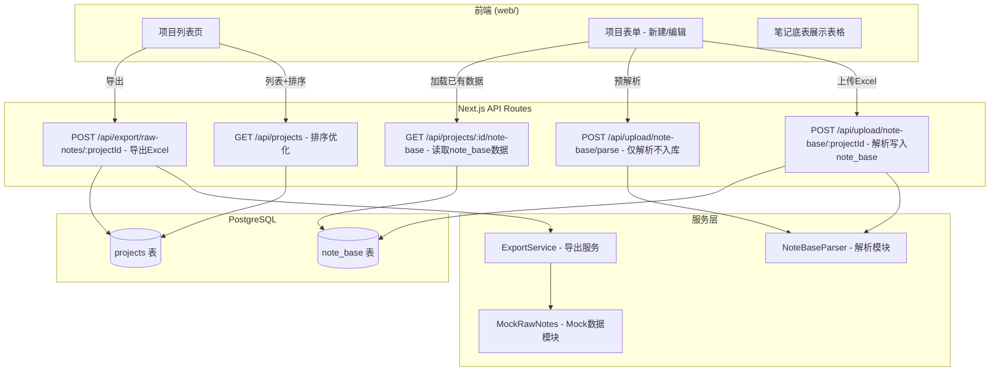

# 技术设计文档：项目管理和笔记底表管理

## 概述

本功能覆盖项目列表排序优化、笔记底表（业务底表）Excel 上传解析与入库至 `note_base` 表、前端显示优化、项目导出操作、项目唯一性约束与历史数据清理。

核心设计思路：
- **解析层**：修正现有 `/api/upload/note-base/[projectId]` 路由，使其正确写入 `note_base` 表（而非 `notes` 表）
- **显示层**：新建/编辑项目表单中增加笔记底表预览表格，支持全字段展示与横向滚动
- **导出层**：新增导出 API，调用 `fetchRawNotes`（开发期使用 mock）生成 Excel 下载
- **约束层**：数据库添加唯一索引，API 层捕获违反约束错误并返回友好提示

## 架构



### 关键设计决策

1. **写入目标改为 note_base 表**：现有 `route.ts` 错误地写入 `notes` 表，需修正为写入 `note_base` 表。`notes` 表仅由蒲公英 API 数据填充。
2. **新增"仅解析"端点**：新建项目时项目尚未创建，无法直接写入数据库，需要一个只做解析返回结果的端点。前端暂存解析结果，项目保存后再调用写入端点。
3. **导出使用 Mock**：`fetchRawNotes` 接口由其他同事开发，开发期间使用 mock 数据模块完成自测。
4. **唯一约束放最后实现**：先完成功能开发，最后添加数据库唯一索引和 API 层校验。

## 组件和接口

### 1. NoteBaseParser（解析模块）

**位置**：`web/src/lib/note-base-parser.ts`

现有解析逻辑在 `web/src/app/api/upload/note-base/[projectId]/route.ts` 中，需要提取为独立模块以支持复用（仅解析端点 + 写入端点都需要）。

```typescript
// ParsedNoteBaseRow 字段与 note_base 表对齐，kolNickName/kolFanNum 与 notes 表同名字段一致
interface ParsedNoteBaseRow {
  noteId: string;                    // 笔记ID（从链接提取）
  noteLink: string;                  // 笔记链接
  kolNickName: string | null;        // 博主昵称（与 notes 表字段名一致）
  kolFanNum: number;                 // 博主粉丝量（与 notes 表字段名一致）
  cooperationForm: string | null;    // 合作形式（note_base 表字段）
  isRegistered: boolean;             // 是否报备（note_base 表字段）
  contentDirection: string | null;   // 内容方向（note_base 表字段）
  kolType: string | null;            // 达人类型（note_base 表字段）
  spuName: string | null;            // 对应SPU（与 notes 表字段名一致）
  contentCost: number;               // 内容实际消耗金额（note_base 表字段）
  contentSettlement: number;         // 内容实际结算金额（note_base 表字段）
  adSpend: number;                   // 投流实际消耗（note_base 表字段）
  totalCost: number;                 // 总费用（note_base 表字段）
}

interface ParseResult {
  records: ParsedNoteBaseRow[];
  warnings: string[];
  skippedRows: number;
}

// 核心解析函数（纯函数，不涉及数据库）
function parseNoteBaseExcel(buffer: Buffer): ParseResult;

// 从笔记链接提取笔记ID
function extractNoteIdFromLink(link: string, rowIndex: number): { noteId: string; warning?: string };

// 列名标准化（去emoji、去括号后缀）
function normalizeHeader(header: string): string;
```

### 2. 上传写入端点（修正）

**位置**：`web/src/app/api/upload/note-base/[projectId]/route.ts`

修正现有实现：
- 写入目标改为 `prisma.noteBase`（而非 `prisma.note`）
- 使用提取的 `NoteBaseParser` 模块
- 过滤条件改为：跳过 noteLink 为空的行（而非 kolNickName 为空）
- 事务中先删除该项目旧数据再插入新数据

### 3. 仅解析端点（新增）

**位置**：`web/src/app/api/upload/note-base/parse/route.ts`

```typescript
// POST /api/upload/note-base/parse
// 请求：multipart/form-data（file 字段）
// 响应：{ success: true, records: ParsedNoteBaseRow[], warnings: string[], skippedRows: number }
```

用于新建项目时，上传即解析展示，但不写入数据库。

### 4. 读取端点（新增）

**位置**：`web/src/app/api/projects/[id]/note-base/route.ts`

```typescript
// GET /api/projects/:id/note-base
// 响应：{ records: NoteBaseRecord[], count: number }
```

编辑项目时加载已存储的 note_base 数据。

### 5. 导出端点（新增）

**位置**：`web/src/app/api/export/raw-notes/[projectId]/route.ts`

```typescript
// POST /api/export/raw-notes/:projectId
// 响应：Excel 文件流（Content-Disposition: attachment）
// 文件名：{projectName}_{YYYYMMDD_HHmmss}.xlsx
```

### 6. ExportService

**位置**：`web/src/lib/export-raw-notes.ts`

```typescript
interface ExportRawNotesOptions {
  projectId: string;
  projectName: string;
  noteIds: string[];
}

// 获取原始数据（开发期使用mock）
async function fetchRawNotesData(noteIds: string[]): Promise<RawPugongyingNote[]>;

// 将原始数据转为 Excel Buffer
function rawNotesToExcelBuffer(data: RawPugongyingNote[]): Buffer;

// 生成导出文件名
function generateExportFilename(projectName: string, date: Date): string;
```

### 7. Mock 数据模块

**位置**：`web/src/lib/mock-raw-notes.ts`

```typescript
// 模拟 fetchRawNotes 返回的数据结构
function getMockRawNotes(noteIds: string[]): RawPugongyingNote[];
```

### 8. 项目列表排序优化

**修改位置**：`web/src/app/api/projects/route.ts` GET 方法

```typescript
// 修改 orderBy 为 endDate desc
orderBy: { endDate: 'desc' }
```

### 9. 唯一约束

**数据库迁移**：

```sql
CREATE UNIQUE INDEX "projects_category_brand_business_line_project_name_key"
ON "projects"("category", "brand", "business_line", "project_name");
```

**API 修改**：在 POST/PUT `/api/projects` 中捕获 Prisma UniqueConstraintViolation 错误并返回友好提示。

## 数据模型

### NoteBase 表

当前 `note_base` 表 schema 包含运营标注与费用字段，需新增 `kolNickName` 和 `kolFanNum` 字段以与 `notes` 表同含义字段保持一致命名。

完整字段列表（含新增字段）：

| 字段 | 类型 | DB列名 | 说明 | 与 notes 表关系 |
|------|------|--------|------|----------------|
| id | UUID | id | 主键 | — |
| projectId | UUID | project_id | 关联项目 | 同名同义 |
| noteId | VARCHAR(100) | note_id | 笔记ID（从链接提取） | 同名同义 |
| noteLink | TEXT | note_link | 原始笔记链接 | 同名同义 |
| **kolNickName** | VARCHAR(200) | kol_nick_name | 博主昵称（**新增**） | 同名同义 |
| **kolFanNum** | INTEGER | kol_fan_num | 博主粉丝量（**新增**） | 同名同义 |
| cooperationForm | VARCHAR(50) | cooperation_form | 合作形式 | note_base 独有 |
| isRegistered | BOOLEAN | is_registered | 是否报备 | note_base 独有 |
| contentDirection | VARCHAR(100) | content_direction | 内容方向 | note_base 独有 |
| kolType | VARCHAR(100) | kol_type | 达人类型 | note_base 独有 |
| spuName | VARCHAR(200) | spu_name | 对应SPU | 同名同义 |
| contentCost | DECIMAL(12,2) | content_cost | 内容实际消耗金额 | note_base 独有 |
| contentSettlement | DECIMAL(12,2) | content_settlement | 内容实际结算金额 | note_base 独有 |
| adSpend | DECIMAL(12,2) | ad_spend | 投流实际消耗 | note_base 独有 |
| totalCost | DECIMAL(12,2) | total_cost | 总费用 | note_base 独有 |
| createdAt | TIMESTAMPTZ | created_at | 创建时间 | — |

**已有约束**：`@@unique([projectId, noteId])` — 同一项目中 noteId 唯一。

**注意**：Excel 中的数据指标列（曝光量、阅读量、互动量、点赞量、收藏量、评论量、分享量、关注量等）**不**存储到 `note_base` 表。这些数据来自蒲公英 API，存储在 `notes` 表中。`note_base` 仅存储运营标注与费用字段。但前端显示时，如果 Excel 中包含这些数据指标列，也应作为额外展示列显示出来（仅展示不入库）。

### NoteBase 表新增字段

为支持前端展示博主信息，需增加 `kolNickName` 和 `kolFanNum` 字段：

```prisma
model NoteBase {
  // ... existing fields ...
  kolNickName  String?  @map("kol_nick_name") @db.VarChar(200)  // 博主昵称（与 notes 表字段名一致）
  kolFanNum    Int?     @map("kol_fan_num")                      // 粉丝量（与 notes 表字段名一致）
}
```

**迁移 SQL**：

```sql
ALTER TABLE "note_base" ADD COLUMN IF NOT EXISTS "kol_nick_name" VARCHAR(200);
ALTER TABLE "note_base" ADD COLUMN IF NOT EXISTS "kol_fan_num" INTEGER;
```

### Project 表新增唯一索引

```sql
-- 需要先清理重复数据，再添加唯一约束
CREATE UNIQUE INDEX "projects_category_brand_business_line_project_name_key"
ON "projects"("category", "brand", "business_line", "project_name");
```

### NOTE_BASE_COLUMN_MAP（解析模块字段映射）

针对 `note_base` 表的字段映射。**关键区别**：现有 `route.ts` 中的 `COLUMN_MAP` 使用的是 `notes` 表的字段名（如 `noteType`、`isUnderwater`、`kolPrice`、`serviceFee`、`underwaterPrice`、`totalPlatformPrice`），这些映射对 `note_base` 表是错误的。新的 `NOTE_BASE_COLUMN_MAP` 使用 `note_base` 表的正确字段名：

```typescript
/**
 * NOTE_BASE_COLUMN_MAP: Excel 中文列名 → note_base 表字段名
 *
 * 与 notes 表字段名的对应关系：
 * - kolNickName → 同名（notes 表也用 kolNickName）
 * - kolFanNum → 同名（notes 表也用 kolFanNum）
 * - noteLink → 同名（notes 表也用 noteLink）
 * - spuName → 同名（notes 表也用 spuName）
 * - cooperationForm → note_base 独有（notes 表用 noteType，含义不同）
 * - isRegistered → note_base 独有（notes 表用 isUnderwater，含义不同）
 * - contentCost → note_base 独有（notes 表用 kolPrice，含义不同）
 * - contentSettlement → note_base 独有（notes 表无此字段）
 * - adSpend → note_base 独有（notes 表用 underwaterPrice，含义不同）
 * - totalCost → note_base 独有（notes 表用 totalPlatformPrice，含义不同）
 */
const NOTE_BASE_COLUMN_MAP: Record<string, string> = {
  // ─── 忽略列 ───
  '序号': '_index',

  // ─── 博主信息（与 notes 表字段名一致）───
  '博主昵称': 'kolNickName',
  '博主粉丝量': 'kolFanNum',

  // ─── 笔记链接（与 notes 表字段名一致）───
  '笔记链接': 'noteLink',
  '笔记连接': 'noteLink',       // 常见错别字

  // ─── 运营标注字段（note_base 独有）───
  '合作形式': 'cooperationForm',
  '内容形式': 'cooperationForm', // 别名
  '是否报备': 'isRegistered',
  '内容方向': 'contentDirection',
  '达人类型': 'kolType',
  '对应SPU': 'spuName',

  // ─── 费用字段（note_base 独有）───
  '内容实际消耗金额': 'contentCost',
  '达人金额': 'contentCost',           // 别名
  '内容实际结算金额': 'contentSettlement',
  '投流实际消耗': 'adSpend',
  '投流金额': 'adSpend',               // 别名
  '总费用': 'totalCost',
  '总消耗': 'totalCost',               // 别名
};

/**
 * 数据指标列映射（仅用于前端展示，不写入 note_base 表）
 * 这些数据来自蒲公英 API，存储在 notes 表中
 */
const DISPLAY_ONLY_COLUMN_MAP: Record<string, string> = {
  '曝光量': 'impNum',
  '阅读量': 'readNum',
  '互动量': 'engageNum',
  '点赞量': 'likeNum',
  '收藏量': 'favNum',
  '评论量': 'cmtNum',
  '分享量': 'shareNum',
  '关注量': 'followNum',
};
```

**与现有 `route.ts` 中错误映射的对比**：

| Excel 列名 | 现有错误映射（notes 表字段） | 正确映射（note_base 表字段） |
|---|---|---|
| 合作形式/内容形式 | `noteType` ❌ | `cooperationForm` ✅ |
| 是否报备 | `isUnderwater` ❌ | `isRegistered` ✅ |
| 内容实际消耗金额/达人金额 | `kolPrice` ❌ | `contentCost` ✅ |
| 内容实际结算金额 | `serviceFee` ❌ | `contentSettlement` ✅ |
| 投流实际消耗/投流金额 | `underwaterPrice` ❌ | `adSpend` ✅ |
| 总费用/总消耗 | `totalPlatformPrice` ❌ | `totalCost` ✅ |

## 正确性属性

*属性（Property）是一种在系统所有有效执行中都应成立的特征或行为——本质上是对系统应该做什么的形式化声明。属性是人类可读规范与机器可验证正确性保证之间的桥梁。*

### Property 1: 项目列表按 endDate 降序排列

*For any* 项目列表，应用默认排序后，列表中相邻两个项目 `projects[i]` 和 `projects[i+1]`，必有 `projects[i].endDate >= projects[i+1].endDate`（null 值视为最小）。

**Validates: Requirements 1.2**

### Property 2: 无笔记链接的行被过滤

*For any* Excel 解析输入行数组，解析结果中的每条记录都必须具有非空的 `noteLink` 字段；原始数据中 `noteLink` 为空的行不应出现在输出中。

**Validates: Requirements 4.1, 4.2**

### Property 3: 笔记ID从链接中正确提取

*For any* 符合 `https://www.xiaohongshu.com/explore/{noteId}?...` 格式的 URL，`extractNoteIdFromLink` 函数应返回 URL path 中 `explore/` 后、`?` 前的部分作为 noteId。

**Validates: Requirements 5.1**

### Property 4: 列名标准化去除装饰字符

*For any* 包含 emoji 前缀和/或中文括号后缀的列名字符串，`normalizeHeader` 函数应返回去除这些装饰后的纯文本列名。对于不含装饰的列名，`normalizeHeader` 应返回原值（幂等性）。

**Validates: Requirements 6.1**

### Property 5: 字段映射完整性

*For any* NOTE_BASE_COLUMN_MAP 中的映射键值对 `(chineseHeader, fieldName)`，当输入行中存在该中文列名且单元格值非空时，解析结果中对应的 `fieldName` 字段必须包含该值（经适当类型转换后）。

**Validates: Requirements 6.3, 7.2**

### Property 6: 笔记底表按项目覆盖（幂等性）

*For any* 项目已有的 note_base 数据和新上传的数据，执行覆盖操作后，最终状态应仅包含新数据（按 noteId 去重，最后出现的胜出），旧数据完全清除。

**Validates: Requirements 3.7, 8.1, 8.2**

### Property 7: Excel 导出数据完整性（Round-Trip）

*For any* 有效的 `RawPugongyingNote[]` 数据数组，将其转换为 Excel Buffer 后再解析回结构化数据，应与原始数据在关键字段上一致。

**Validates: Requirements 9.3**

### Property 8: 导出文件名格式正确

*For any* 项目名称和日期时间，`generateExportFilename` 应产出满足 `{projectName}_{YYYYMMDD_HHmmss}.xlsx` 格式的字符串。

**Validates: Requirements 9.4**

### Property 9: 项目唯一性约束拒绝重复组合

*For any* 已存在的项目，尝试创建具有相同 `(category, brand, businessLine, projectName)` 组合的新项目时，系统应返回包含重复错误信息的失败响应。

**Validates: Requirements 11.2, 11.3**

## 错误处理

| 场景 | 处理方式 |
|------|----------|
| 上传文件非 .xlsx 格式 | 400 + 错误消息"仅支持.xlsx格式文件" |
| Excel 中无有效工作表 | 400 + "未找到名为【已发布达人】的工作表" |
| 所有行均无笔记链接 | 400 + "没有有效的数据行"（附跳过行数） |
| 笔记链接格式异常 | 使用 `row_{行号}` 作为备用 noteId，记录 warning |
| 项目不存在（写入时） | 404 + "项目不存在" |
| 数据库写入失败 | 500 + "上传失败，请稍后重试"，事务回滚 |
| 唯一约束违反（创建/编辑项目） | 409 + "该品类+品牌+业务线+项目名称组合已存在" |
| 导出时 fetchRawNotes 失败 | 500 + "导出失败：数据获取异常" |
| 导出时 Excel 生成失败 | 500 + "导出失败：文件生成异常" |

## 测试策略

### 属性测试（Property-Based Testing）

使用 `fast-check` 库，每个属性测试运行至少 100 次迭代。

| Property | 测试文件 | 说明 |
|----------|----------|------|
| Property 1 | `web/src/lib/project-sort.property.test.ts` | 排序降序验证 |
| Property 2 | `web/src/lib/note-base-parser.property.test.ts` | 空链接过滤 |
| Property 3 | `web/src/lib/note-base-parser.property.test.ts` | noteId 提取 |
| Property 4 | `web/src/lib/note-base-parser.property.test.ts` | 列名标准化 |
| Property 5 | `web/src/lib/note-base-parser.property.test.ts` | 字段映射 |
| Property 6 | `web/src/lib/note-overwrite.property.test.ts` | 覆盖幂等性（已存在） |
| Property 7 | `web/src/lib/export-raw-notes.property.test.ts` | Excel round-trip |
| Property 8 | `web/src/lib/export-raw-notes.property.test.ts` | 文件名格式 |
| Property 9 | `web/src/lib/project-uniqueness.property.test.ts` | 唯一约束 |

**标签格式**：`Feature: project-note-base-management, Property {N}: {描述}`

### 单元测试

- `extractNoteIdFromLink` 具体 URL 示例测试
- `normalizeHeader` 边界用例（无装饰、仅 emoji、仅括号）
- `parseNoteBaseExcel` 集成示例（小型 Excel 文件）
- `generateExportFilename` 格式验证
- Mock 数据结构完整性验证

### 集成测试

- 笔记底表上传 → note_base 表写入 → 读取验证
- 项目创建唯一约束冲突场景
- 导出流程（mock 模式）端到端测试
- 事务回滚验证（写入中途失败）

### 配置要求

- Property-based tests 使用 `fast-check`
- 最少 100 iterations per property
- 测试命令：`vitest --run`
