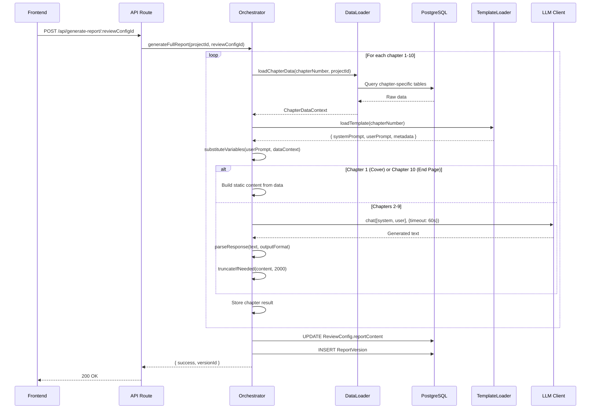

# Design Document: Report Generation Pipeline

## Overview

本设计文档描述复盘报告生成管线（Report Generation Pipeline）的技术架构。该管线解决当前系统中 `ReviewConfig.reportContent` 始终为 null 的核心问题，通过构建完整的 **数据加载 → Prompt 模板渲染 → LLM 生成 → 结构化存储** 的端到端流程，使审校台能够展示、编辑和逐章再生成复盘报告内容。

管线覆盖 10 个章节（封面、项目回顾、数据总览、项目亮点、综合分析、内容分析、投流分析、人群资产、优化建议、尾页），每章有独立的数据加载器和 Prompt 模板。封面和尾页为纯数据拼装（不调用 LLM），其余章节通过 LLM 生成叙事内容。

**核心设计决策：**
- 复用现有 `src/report/llm-client.ts` 的 OpenAI 兼容客户端，而非引入新的 LLM 调用方式
- Prompt 模板从 YAML 格式改为 Markdown + YAML front-matter 格式，提升可读性和可维护性
- 章节数据加载器采用统一接口 + 按章节分发的策略模式
- 生成结果同时写入 `ReviewConfig.reportContent` 和 `ReportVersion`，保证审校台消费和版本历史

## Architecture

### 系统架构图

```mermaid
graph TB
    subgraph "API Layer"
        A[POST /api/generate-report/:reviewConfigId]
        B[POST /api/generate-report/:reviewConfigId/chapter/:chapterNumber]
    end

    subgraph "Pipeline Orchestrator"
        C[ReportPipelineOrchestrator]
        C1[generateFullReport]
        C2[regenerateChapter]
    end

    subgraph "Chapter Data Loaders"
        D[ChapterDataLoaderRegistry]
        D1[CoverDataLoader]
        D2[ProjectReviewDataLoader]
        D3[DataOverviewDataLoader]
        D4[HighlightsDataLoader]
        D5[QuadrantDataLoader]
        D6[ContentAnalysisDataLoader]
        D7[TrafficAnalysisDataLoader]
        D8[AudienceAssetsDataLoader]
        D9[OptimizationDataLoader]
        D10[EndPageDataLoader]
    end

    subgraph "Template Engine"
        E[PromptTemplateLoader]
        E1[parseYAMLFrontMatter]
        E2[substituteVariables]
    end

    subgraph "LLM Layer"
        F[LLMClient - OpenAI Compatible]
    end

    subgraph "Storage Layer"
        G[ReviewConfig.reportContent]
        H[ReportVersion.content]
    end

    subgraph "Frontend"
        I[Proofread Page - TipTap Editor]
        J[AI Chat Panel - Presenton Chat API]
    end

    A --> C1
    B --> C2
    C1 --> D
    C2 --> D
    D --> D1 & D2 & D3 & D4 & D5 & D6 & D7 & D8 & D9 & D10
    C1 --> E
    C2 --> E
    E --> E1
    E --> E2
    C1 --> F
    C2 --> F
    C1 --> G & H
    C2 --> G
    I --> G
    J --> I
```



### 数据流图



## Components and Interfaces

### 1. Pipeline Orchestrator

```typescript
// src/pipeline/orchestrator.ts

interface PipelineConfig {
  projectId: string;
  reviewConfigId: string;
  timeout?: number; // per-chapter LLM timeout, default 60s
}

interface ChapterResult {
  chapterNumber: number;
  title: string;
  content: string; // HTML-compatible Markdown
  status: 'generated' | 'error';
  generatedAt: string; // ISO 8601
  errorMessage?: string;
}

interface PipelineResult {
  chapters: ChapterResult[];
  versionId: string;
  versionNumber: number;
}

class ReportPipelineOrchestrator {
  constructor(
    private loaderRegistry: ChapterDataLoaderRegistry,
    private templateLoader: PromptTemplateLoader,
    private llmClient: LLMClient,
  ) {}

  async generateFullReport(config: PipelineConfig): Promise<PipelineResult>;
  async regenerateChapter(
    config: PipelineConfig,
    chapterNumber: number,
    existingContent: ChapterResult[],
  ): Promise<ChapterResult>;
}
```

### 2. Chapter Data Loader Interface

```typescript
// src/pipeline/loaders/types.ts

interface ChapterDataContext {
  variables: Record<string, string>; // Template variable values
  missingFields: string[];           // Fields that couldn't be loaded
}

interface ChapterDataLoader {
  chapterNumber: number;
  chapterName: string;
  requiredDataSources: string[]; // e.g., ['projects', 'notes', 'kpi_targets']
  
  load(projectId: string): Promise<ChapterDataContext>;
}

class ChapterDataLoaderRegistry {
  private loaders: Map<number, ChapterDataLoader>;
  
  register(loader: ChapterDataLoader): void;
  getLoader(chapterNumber: number): ChapterDataLoader;
  loadChapterData(chapterNumber: number, projectId: string): Promise<ChapterDataContext>;
}
```

### 3. Prompt Template Loader

```typescript
// src/pipeline/template-loader.ts

interface PromptTemplateMetadata {
  chapter_number: number;
  chapter_name: string;
  required_data_sources: string[];
  output_format: 'paragraphs' | 'bullets' | 'table' | 'structured';
  system_prompt?: string;
  fallback_text: string;
}

interface LoadedTemplate {
  metadata: PromptTemplateMetadata;
  systemPrompt: string;
  userPromptTemplate: string; // Contains {{variable}} placeholders
}

class PromptTemplateLoader {
  constructor(private templatesDir: string) {}
  
  loadTemplate(chapterNumber: number): LoadedTemplate;
  substituteVariables(template: string, variables: Record<string, string>): string;
  parseYAMLFrontMatter(content: string): { metadata: PromptTemplateMetadata; body: string };
}
```

### 4. API Route Handlers

```typescript
// web/src/app/api/generate-report/[reviewConfigId]/route.ts
// POST - Generate full report

// web/src/app/api/generate-report/[reviewConfigId]/chapter/[chapterNumber]/route.ts
// POST - Regenerate single chapter
```

### 5. Response Parser

```typescript
// src/pipeline/response-parser.ts

interface ParsedContent {
  html: string; // HTML-compatible Markdown content
}

function parseResponse(
  rawText: string,
  outputFormat: 'paragraphs' | 'bullets' | 'table' | 'structured',
): ParsedContent;

function truncateAtParagraphBoundary(content: string, maxLength: number): string;
```

## Data Models

### ReportContent Storage Schema

`ReviewConfig.reportContent` 存储为 JSON 数组：

```typescript
type ReportContent = ChapterResult[];

// Example:
[
  {
    "chapterNumber": 1,
    "title": "封面",
    "content": "<h1>品牌名 项目名称</h1><p>小红书种草项目复盘</p><p>2025/01/01—2025/03/31</p>",
    "status": "generated",
    "generatedAt": "2025-05-26T10:00:00.000Z"
  },
  {
    "chapterNumber": 2,
    "title": "项目回顾",
    "content": "## 项目背景\n\n本次项目旨在...\n\n## 传播目的\n\n...",
    "status": "generated",
    "generatedAt": "2025-05-26T10:00:05.000Z"
  },
  // ... chapters 3-10
]
```

### Prompt Template File Format

每个 Prompt 文件采用 Markdown + YAML front-matter 格式：

```markdown
---
chapter_number: 3
chapter_name: "数据总览"
required_data_sources:
  - notes
  - kpi_targets
  - juguang_data
  - review_configs
output_format: paragraphs
system_prompt: |
  你是一位资深的小红书营销复盘专家。请基于提供的数据生成专业的数据总览解读。
  要求：语言简洁专业，必须引用具体数据，使用量化对比。
fallback_text: "数据总览内容生成失败，请重试。"
---

基于以下数据生成数据总览解读：
- 项目名称：{{project_name}}，品牌：{{brand}}
- 总笔记{{note_count}}篇，总费用{{total_cost}}元
- 总曝光{{total_impressions}}，KPI完成率{{impression_completion}}%
- 总阅读{{total_reads}}，KPI完成率{{read_completion}}%
- 总互动{{total_engagement}}，KPI完成率{{engagement_completion}}%
- CPM={{cpm}}，CPC={{cpc}}，CPE={{cpe}}，CTR={{ctr}}%
- 爆文{{viral_count}}篇，爆文率{{viral_rate}}%

请输出：
1. 整体数据表现概述（50字内）
2. 核心亮点指标（完成率>100%的指标）
3. 需关注指标（完成率<100%的指标）
4. 综合评价（30字内）
```

### Prompt File Directory Structure

```
src/prompts/chapters/
├── chapter-01-cover.md
├── chapter-02-project-review.md
├── chapter-03-data-overview.md
├── chapter-04-highlights.md
├── chapter-05-quadrant-analysis.md
├── chapter-06-content-analysis.md
├── chapter-07-traffic-analysis.md
├── chapter-08-audience-assets.md
├── chapter-09-optimization-suggestions.md
└── chapter-10-end-page.md
```

### Seed Script Data Model

种子脚本创建以下数据结构：

```typescript
// prisma/seeds/report-pipeline-seed.ts

interface SeedConfig {
  projectName: string;       // "测试品牌_日常种草_2025Q1"
  brand: string;             // "测试品牌"
  category: string;          // "美妆护肤"
  projectType: string;       // "日常种草"
  noteCount: number;         // 35
  juguangCoverage: number;   // 0.6 (60% of notes have juguang data)
  kpiMetrics: string[];      // ['impression', 'read', 'engagement', ...]
}
```

## Correctness Properties

*A property is a characteristic or behavior that should hold true across all valid executions of a system—essentially, a formal statement about what the system should do. Properties serve as the bridge between human-readable specifications and machine-verifiable correctness guarantees.*

### Property 1: Template variable substitution completeness

*For any* prompt template string containing `{{variable_name}}` placeholders and *for any* data context record, after substitution: (a) all variables present in the data context are replaced with their corresponding values, (b) all variables NOT present in the data context are replaced with empty strings, and (c) no `{{...}}` placeholders remain in the output.

**Validates: Requirements 2.2, 2.5**

### Property 2: YAML front-matter round-trip parsing

*For any* valid Markdown file with a YAML front-matter block (delimited by `---`), parsing the front-matter SHALL produce an object containing all key-value pairs from the YAML, and the remaining body SHALL equal the content after the closing `---` delimiter.

**Validates: Requirements 2.4**

### Property 3: Data loader graceful degradation

*For any* chapter number (1-10) and *for any* subset of available data in the database, the Chapter_Data_Loader SHALL return a `ChapterDataContext` where `variables` contains all loadable fields and `missingFields` lists all fields that could not be loaded, with `variables` keys and `missingFields` being disjoint and their union equaling the full set of required fields for that chapter.

**Validates: Requirements 3.8**

### Property 4: Pipeline resilience on LLM failure

*For any* chapter index N (2-9) where the LLM call fails or times out, the pipeline SHALL still produce a complete 10-chapter report where chapter N has `status: 'error'` with fallback content, and all other chapters have their independently generated content unaffected.

**Validates: Requirements 4.5**

### Property 5: LLM response parsing preserves content structure

*For any* non-empty LLM response string and *for any* valid `output_format` specification, the `parseResponse` function SHALL produce a non-empty HTML string that preserves all textual content from the input (no data loss), with appropriate HTML/Markdown structural elements matching the specified format.

**Validates: Requirements 5.3**

### Property 6: Content truncation at paragraph boundary

*For any* string longer than 2000 characters that contains at least one paragraph break (`\n\n`), `truncateAtParagraphBoundary(content, 2000)` SHALL return a string that: (a) ends at a paragraph boundary, (b) has length ≤ 2000 characters OR is the first complete paragraph if that paragraph alone exceeds 2000 characters, and (c) is a prefix of the original content.

**Validates: Requirements 5.7**

### Property 7: Report content structural invariant

*For any* successfully generated report, `reportContent` SHALL be a JSON array of exactly 10 elements where each element has: `chapterNumber` (integer 1-10, unique, sequential), `title` (non-empty string), `content` (string), `status` ('generated' | 'error'), and `generatedAt` (valid ISO 8601 timestamp).

**Validates: Requirements 4.3, 6.1**

### Property 8: Single chapter regeneration isolation

*For any* chapter index N (1-10) and *for any* existing `reportContent` array of 10 chapters, after regenerating chapter N: (a) only the element at index N-1 is modified, (b) all other 9 elements remain byte-for-byte identical, (c) the regenerated chapter has a `generatedAt` timestamp newer than its previous value, and (d) the regenerated chapter has `status: 'generated'`.

**Validates: Requirements 8.1, 8.2, 8.3**

### Property 9: Seed script idempotence

*For any* number of consecutive executions of the seed script (≥ 2), the database state after the Nth execution SHALL be identical to the state after the first execution — specifically, record counts in all seeded tables remain constant.

**Validates: Requirements 1.9**

## Error Handling

### LLM Failures

| 场景 | 处理策略 |
|------|---------|
| LLM 超时 (>60s) | 使用 Prompt 模板中的 `fallback_text`，章节标记为 `status: 'error'` |
| LLM 返回空内容 | 同超时处理 |
| LLM API 不可达 | 同超时处理，pipeline 继续后续章节 |
| LLM 返回超长内容 | 在最近段落边界截断至 2000 字符 |

### Data Loading Failures

| 场景 | 处理策略 |
|------|---------|
| 数据库查询失败 | 返回 partial result，`missingFields` 列出缺失字段 |
| 必需数据完全缺失 | 模板中缺失变量替换为空字符串，生成可能质量较低但不中断 |
| ReviewConfig 不存在 | API 返回 404 |
| Project 不存在 | API 返回 404 |

### Frontend Error States

| 场景 | 处理策略 |
|------|---------|
| reportContent 为 null | 显示 "生成报告" 按钮 |
| 章节 status='error' | 显示错误信息 + "重新生成" 按钮 |
| Presenton Chat API 不可用 | 显示 "AI 服务暂时不可用，请稍后重试"，禁用发送按钮 |
| 单章再生成失败 | 保留原内容，显示错误提示 |

## Testing Strategy

### Property-Based Tests (fast-check)

项目已安装 `fast-check@3.23.2`，使用 `vitest` 作为测试运行器。

每个 correctness property 对应一个 property-based test，最少 100 次迭代：

| Property | 测试文件 | 生成器策略 |
|----------|---------|-----------|
| Property 1: Variable substitution | `tests/pipeline/template-substitution.property.test.ts` | 生成随机模板字符串（含 `{{var}}` 占位符）和随机 data context |
| Property 2: Front-matter parsing | `tests/pipeline/frontmatter-parsing.property.test.ts` | 生成随机 YAML key-value 对和 Markdown body |
| Property 3: Graceful degradation | `tests/pipeline/data-loader-degradation.property.test.ts` | 生成随机章节号和随机数据子集 |
| Property 4: Pipeline resilience | `tests/pipeline/pipeline-resilience.property.test.ts` | 随机选择失败章节，mock LLM |
| Property 5: Response parsing | `tests/pipeline/response-parsing.property.test.ts` | 生成随机多段文本和 output_format |
| Property 6: Truncation | `tests/pipeline/truncation.property.test.ts` | 生成随机长字符串（>2000 chars）含段落分隔 |
| Property 7: Structural invariant | `tests/pipeline/report-structure.property.test.ts` | 生成随机 10 章节数据，验证结构 |
| Property 8: Regeneration isolation | `tests/pipeline/regeneration-isolation.property.test.ts` | 生成随机 reportContent + 随机章节号 |
| Property 9: Seed idempotence | `tests/pipeline/seed-idempotence.property.test.ts` | 运行 seed 多次，验证计数不变 |

**Property test 配置：**
- 最少 100 次迭代
- 每个 test 标注对应的 design property
- Tag 格式: `Feature: report-generation-pipeline, Property {N}: {title}`

### Unit Tests (Example-Based)

| 测试目标 | 测试文件 |
|---------|---------|
| Chapter 1 (Cover) 不调用 LLM | `tests/pipeline/cover-generation.test.ts` |
| Chapter 10 (End Page) 不调用 LLM | `tests/pipeline/endpage-generation.test.ts` |
| Chapter 3 包含 KPI 表格 | `tests/pipeline/data-overview.test.ts` |
| LLM timeout 配置为 60s | `tests/pipeline/llm-timeout.test.ts` |
| API endpoint 响应正确 | `tests/pipeline/api-routes.test.ts` |

### Integration Tests

| 测试目标 | 测试文件 |
|---------|---------|
| 完整 pipeline 端到端（mock LLM） | `tests/pipeline/full-pipeline.integration.test.ts` |
| 各章节 DataLoader 正确查询 | `tests/pipeline/data-loaders.integration.test.ts` |
| ReviewConfig.reportContent 写入 | `tests/pipeline/storage.integration.test.ts` |
| AI Chat 上下文传递 | `tests/pipeline/chat-context.integration.test.ts` |
