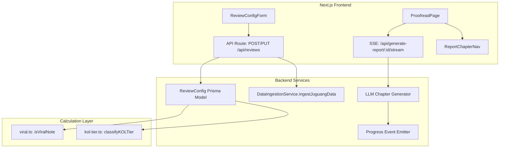
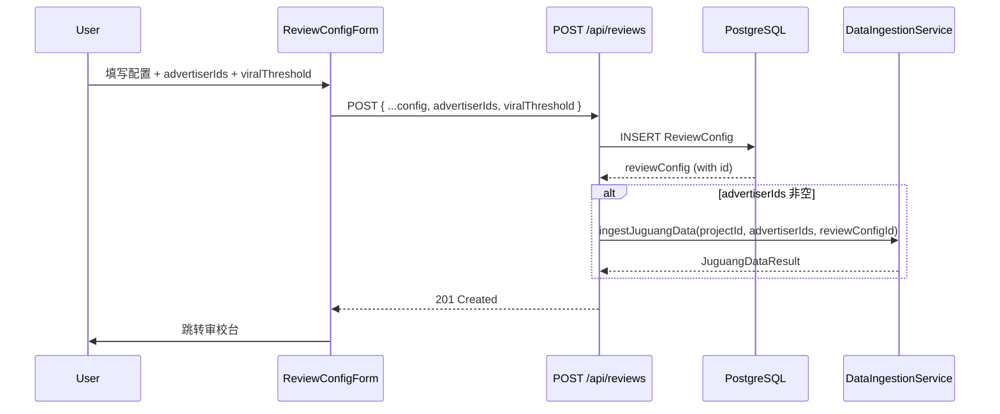

# Design Document: Review Config Optimization

## Overview

本设计文档覆盖复盘配置（ReviewConfig）页面的 8 项优化需求，涉及前端 UI 调整、后端计算逻辑重构、数据模型扩展以及 SSE 实时进度事件。

核心变更：
1. **UI 修正与裁剪** — 标签修正、金额口径重组、移除废弃模块
2. **爆文阈值配置化** — 从硬编码 1000 改为用户可配置的 `viralThreshold`
3. **广告主 ID + 自动拉取** — 新增字段、保存时触发聚光数据采集
4. **KOL 层级按曝光率分类** — 替换基于粉丝数的硬编码分类逻辑
5. **章节生成进度实时展示** — 新增 SSE progress 事件 + 前端状态渲染

## Architecture



### 设计决策

| 决策 | 选择 | 理由 |
|------|------|------|
| 爆文阈值存储 | ReviewConfig.viralThreshold (Int, nullable) | 与复盘配置关联，null 时回退默认值 1000 |
| 广告主 ID 存储 | ReviewConfig.advertiserIds (Json, 默认 []) | 最多 5 个 ID，JSON 数组足够灵活 |
| 聚光数据触发时机 | API Route POST/PUT handler 中同步调用 | 避免引入消息队列复杂度，ingestion 本身已是异步 fetch |
| KOL 分类策略 | 函数接受 tier config 参数，计算曝光率后匹配范围 | 保持纯函数可测试性，配置从 ReviewConfig 传入 |
| SSE progress 事件 | 在 LLM streaming 回调中累计 token 并周期性发送 | 不需要额外基础设施，复用现有 SSE stream |

## Components and Interfaces

### 1. Frontend Components

#### ReviewConfigForm（`web/src/app/review/new/page.tsx`）

**变更点：**
- KPI 区域：将 `viralPosts1k` 对应的 label 或新增的爆文率字段 label 改为 `"爆文率(%)"`
- 金额口径区域：移除 `costCaliberType` 单选切换，改为同时展示两个独立 section
- 移除 "总费用（实时计算）" 整个区块
- Section title 从 "金额口径与总费用" 改为 "金额口径"
- REPORT_MODULES 常量：移除 `audienceAnalysis`、`projectManagement`、`endPage`
- 爆文口径区域：新增 `viralThreshold` 数字输入框
- 投流分析启用时：新增"广告主ID"输入区域（支持最多 5 个 ID）

**新增 state：**
```typescript
const [viralThreshold, setViralThreshold] = useState<string>('1000');
const [advertiserIds, setAdvertiserIds] = useState<string[]>([]);
```

**提交 payload 扩展：**
```typescript
createReview.mutate({
  // ...existing fields
  viralThreshold: viralThreshold ? parseInt(viralThreshold) : null,
  advertiserIds: advertiserIds.filter(Boolean),
});
```

#### ReportChapterNav（`web/src/components/proofread/report-chapter-nav.tsx`）

**接口变更：**
```typescript
interface ChapterStatus {
  id: string;
  title: string;
  number: number;
  status: 'pending' | 'generating' | 'completed' | 'error';
  tokensUsed?: number;
}

export interface ReportChapterNavProps {
  chapterStatuses: ChapterStatus[];
  chapters: ChapterData[];
  activeChapterId: string | null;
  onSelectChapter: (id: string) => void;
}
```

**渲染逻辑：**
- `pending`: 灰色圆圈 + 章节标题
- `generating`: 旋转 Loader2 icon + token 计数文本（如 "128 tokens"）
- `completed`: 绿色 ✓ checkmark + 章节标题
- `error`: 红色 × icon

#### ProofreadPage（`web/src/app/review/[id]/proofread/page.tsx`）

**变更点：**
- 新增 `chapterStatuses` state，从 CHAPTER_DEFS 初始化所有章节为 `pending`
- SSE `onmessage` 处理新增 `progress` 事件类型
- 点击 `generating` 状态章节时，主内容区展示 loading 占位

**SSE 事件处理：**
```typescript
if (data.type === 'progress') {
  setChapterStatuses(prev => prev.map(cs =>
    cs.id === data.chapterId
      ? { ...cs, status: 'generating', tokensUsed: data.tokensUsed }
      : cs
  ));
}
```

### 2. Backend API Routes

#### POST /api/reviews（创建复盘）

**变更：**
- 从 body 提取 `viralThreshold` 和 `advertiserIds`
- 写入 ReviewConfig
- 如果 `advertiserIds` 非空，在 create 成功后调用 `DataIngestionService.ingestJuguangData(projectId, advertiserIds, reviewConfig.id)`

#### PUT /api/reviews/[id]（更新复盘）

**变更：**
- 从 body 提取 `advertiserIds`
- 比较新旧 `advertiserIds`（JSON.stringify 比较）
- 如果变化，触发 `DataIngestionService.ingestJuguangData`

#### GET /api/generate-report/[reviewConfigId]/stream（SSE 报告生成）

**变更：**
- 在 `processChapter` 中使用 streaming callback 追踪 token 消耗
- 周期性（每 50 tokens 或每 2 秒）发送 progress 事件：
  ```json
  { "type": "progress", "chapterId": "contentAnalysis", "tokensUsed": 256 }
  ```
- 使用 `llmClient.chat` 的 streaming 模式（如支持）或 response 后一次性报告 token 数

### 3. Calculation Layer

#### `src/calculation/viral.ts`

**变更前：**
```typescript
const VIRAL_THRESHOLD = 1000;
export function isViralNote(note: NoteMetrics): boolean {
  return note.likeNum + note.favNum + note.cmtNum >= VIRAL_THRESHOLD;
}
```

**变更后：**
```typescript
const DEFAULT_VIRAL_THRESHOLD = 1000;

export function isViralNote(note: NoteMetrics, threshold?: number): boolean {
  const effectiveThreshold = threshold ?? DEFAULT_VIRAL_THRESHOLD;
  return note.likeNum + note.favNum + note.cmtNum >= effectiveThreshold;
}
```

关键变化：
- 判定口径保持不变：`likeNum + favNum + cmtNum >= threshold`
- 阈值从硬编码 1000 改为参数传入，默认 1000

#### `src/calculation/kol-tier.ts`

**新增接口：**
```typescript
interface ExposureRateTierConfig {
  name: string;
  lowerBound: number; // inclusive
  upperBound: number; // exclusive
}

export function classifyKOLByExposureRate(
  impressions: number,
  fanCount: number,
  tierConfig: ExposureRateTierConfig[]
): string {
  if (fanCount <= 0) return '未分类';
  const exposureRate = impressions / fanCount;
  for (const tier of tierConfig) {
    if (exposureRate >= tier.lowerBound && exposureRate < tier.upperBound) {
      return tier.name;
    }
  }
  return '未分类';
}
```

保留原有 `classifyKOLTier(fanCount)` 函数以兼容其他调用方。

### 4. Module Toggle（`web/src/lib/module-toggle.ts`）

**变更：**
```typescript
export const REPORT_MODULE_KEYS = [
  'projectReview',
  'dataOverview',
  'highlights',
  'comprehensiveAnalysis',
  'contentAnalysis',
  // 'audienceAnalysis' — removed
  'launchAnalysis',
  'competitorAnalysis',
  'optimization',
  // 'projectManagement' — removed
  // 'endPage' — removed
] as const;
```

## Data Models

### ReviewConfig Schema 变更

```prisma
model ReviewConfig {
  // ...existing fields...
  
  // New fields
  viralThreshold  Int?    @map("viral_threshold")         // 爆文阈值（点赞数），null 时使用默认值 1000
  advertiserIds   Json    @default("[]") @map("advertiser_ids") // 广告主 ID 数组，最多 5 个
}
```

### Migration SQL

```sql
ALTER TABLE review_configs
  ADD COLUMN viral_threshold INTEGER,
  ADD COLUMN advertiser_ids JSONB NOT NULL DEFAULT '[]'::jsonb;
```

### 数据流



## Correctness Properties

*A property is a characteristic or behavior that should hold true across all valid executions of a system — essentially, a formal statement about what the system should do. Properties serve as the bridge between human-readable specifications and machine-verifiable correctness guarantees.*

### Property 1: Viral threshold classification correctness

*For any* note with non-negative engagement metrics (likeNum, favNum, cmtNum) and *for any* positive integer threshold, `isViralNote(note, threshold)` SHALL return `true` if and only if `note.likeNum + note.favNum + note.cmtNum >= threshold`. When threshold is not provided (undefined/null), the function SHALL behave as if threshold is 1000.

**Validates: Requirements 4.3, 4.4, 4.5**

### Property 2: Ingestion trigger change detection

*For any* two arrays of advertiser IDs (oldIds and newIds), the system SHALL trigger juguang data ingestion if and only if the arrays differ in content (order-insensitive set comparison or strict JSON equality). When both arrays are empty, no trigger occurs. When creating a new config (oldIds is undefined/empty) and newIds is non-empty, trigger always occurs.

**Validates: Requirements 6.1, 6.2, 6.3**

### Property 3: KOL tier classification via exposure rate

*For any* note with non-negative impression count, *for any* KOL with a positive fan count, and *for any* non-overlapping tier configuration (list of {name, lowerBound, upperBound}), `classifyKOLByExposureRate(impressions, fanCount, tierConfig)` SHALL return the tier name whose range `[lowerBound, upperBound)` contains `impressions / fanCount`, or "未分类" if no range matches.

**Validates: Requirements 7.2, 7.3, 7.4**

## Error Handling

| 场景 | 处理策略 |
|------|----------|
| viralThreshold 为 null/undefined | 回退默认值 1000 |
| viralThreshold 为负数或 0 | 前端校验拦截（min=1），后端 clamp 到 1 |
| advertiserIds 超过 5 个 | 前端校验阻止提交，后端 slice(0, 5) 防御性截断 |
| advertiserIds 包含非数字字符串 | 前端 pattern 校验 (`/^\d+$/`)，后端过滤无效值 |
| fanCount 为 0 | `classifyKOLByExposureRate` 返回 "未分类"，避免除零 |
| ingestJuguangData 失败 | 不阻塞 ReviewConfig 保存，记录错误日志，前端可后续手动重试 |
| SSE progress 事件发送失败 | 静默跳过，不影响章节生成主流程 |
| LLM 不支持 streaming token 回调 | 章节完成后一次性发送最终 token 数作为 progress 事件 |

## Testing Strategy

### Property-Based Tests（使用 fast-check）

每个 property test 至少运行 100 次迭代。

- **Property 1**: 生成随机 `NoteMetrics`（likeNum: 0-100000）和随机 threshold（1-50000），验证 `isViralNote` 返回值等价于 `likeNum >= threshold`
  - Tag: `Feature: review-config-optimization, Property 1: Viral threshold classification correctness`
- **Property 2**: 生成随机广告主 ID 数组对（0-10 个元素），验证 trigger 决策与数组内容比较一致
  - Tag: `Feature: review-config-optimization, Property 2: Ingestion trigger change detection`
- **Property 3**: 生成随机 tier 配置（1-5 个不重叠区间）+ 随机 (impressions, fanCount) 对，验证分类结果
  - Tag: `Feature: review-config-optimization, Property 3: KOL tier classification via exposure rate`

### Unit Tests（example-based）

- UI 渲染测试：标签文本、组件可见性、模块列表内容
- API route 测试：创建/更新 ReviewConfig 时字段正确持久化
- SSE 事件格式测试：progress 事件 JSON 结构验证
- Edge cases：空 advertiserIds、fanCount=0、threshold=null

### Integration Tests

- 创建 ReviewConfig 后验证 `ingestJuguangData` 被正确调用
- 更新 ReviewConfig（advertiserIds 变化）验证触发 ingestion
- 更新 ReviewConfig（advertiserIds 未变化）验证跳过 ingestion
- E2E SSE stream 测试：验证 progress + chapter + done 事件顺序

### 测试工具

- **PBT library**: `fast-check`（已在项目依赖中或需添加）
- **Unit/Integration**: `vitest`（与项目现有配置一致）
- **Component tests**: `@testing-library/react` + `vitest`
