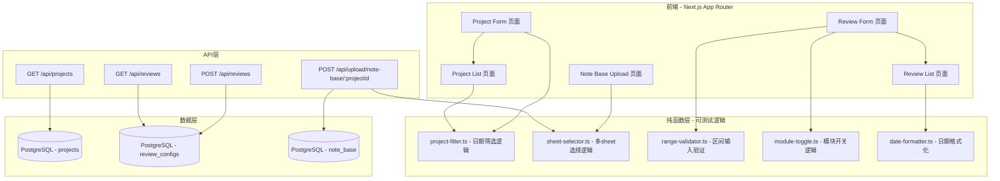

# 设计文档：复盘页面改版V2

## 概述

本设计文档描述复盘系统页面改版V2的技术实现方案。改版涵盖8个需求模块：项目日期字段精简、业务底表多sheet上传识别、复盘表单项目信息只读展示、字段删除与合并、大盘数据区间输入、KPI指标精简与重命名、报告模块配置优化、以及复盘列表页字段顺序调整。

技术栈：Next.js 14 (App Router) + React 18 + TanStack Query + Prisma + PostgreSQL + xlsx 库 + Tailwind CSS。

### 设计决策

1. **前端优先改动**：大部分需求为前端UI调整，后端数据模型（ReviewConfig的JSON字段）已足够灵活，无需新增数据库迁移。
2. **向后兼容**：移除的前端字段在后端保留数据，已有复盘记录不受影响。
3. **纯函数抽取**：将可测试的业务逻辑（sheet选择、区间验证、模块操作、日期过滤）抽取为纯函数，便于属性测试。

## 架构



## 组件与接口

### 1. 项目日期字段精简

**涉及文件：**
- `web/src/app/projects/new/page.tsx` — 移除"立项开始日期"(startDate)字段，保留 executionStartDate 和 endDate
- `web/src/app/projects/[id]/edit/page.tsx` — 同上
- `web/src/lib/project-filter.ts` — 修改过滤逻辑，使用 executionStartDate 和 endDate
- `web/src/lib/project-filter.property.test.ts` — 更新属性测试

**接口变更：**
```typescript
// project-filter.ts 修改后
export interface ProjectRecord {
  projectName: string;
  brand: string;
  category: string;
  businessLine: string | null;
  executionStartDate: Date | null;  // 原 startDate → executionStartDate
  endDate: Date | null;             // 新增
}

export interface ProjectFilters {
  category?: string;
  brand?: string;
  businessLine?: string;
  executionStartDateFrom?: string;  // 原 dateFrom
  executionStartDateTo?: string;    // 原 dateTo（改为筛选 executionStartDate 范围）
  endDateFrom?: string;             // 新增：项目结束日期范围
  endDateTo?: string;               // 新增
  search?: string;
}
```

### 2. 业务底表多sheet上传识别

**涉及文件：**
- `web/src/app/api/upload/note-base/[projectId]/route.ts` — 修改sheet选择逻辑
- `web/src/lib/sheet-selector.ts` — 新建纯函数，封装sheet选择逻辑

**新增纯函数接口：**
```typescript
// sheet-selector.ts
export interface SheetSelectionResult {
  success: boolean;
  sheetName: string | null;
  error: string | null;
}

/**
 * 根据工作簿的sheet列表选择目标sheet。
 * - 单sheet文件：直接返回该sheet名
 * - 多sheet文件：查找名为"已发布达人"的sheet
 * - 多sheet但无目标sheet：返回错误
 */
export function selectTargetSheet(sheetNames: string[]): SheetSelectionResult;
```

**API路由修改逻辑：**
```typescript
// route.ts 中替换原有的 sheetName = workbook.SheetNames[0] 逻辑
const result = selectTargetSheet(workbook.SheetNames);
if (!result.success) {
  return NextResponse.json(
    { error: result.error, code: 'SHEET_NOT_FOUND' },
    { status: 400 }
  );
}
const sheet = workbook.Sheets[result.sheetName!];
```

### 3. 复盘表单-项目信息只读展示

**涉及文件：**
- `web/src/app/review/new/page.tsx` — 重构项目信息区域

**设计方案：**
- 移除品类/品牌/业务线下拉选择器和"选择项目"搜索框
- 复盘表单必须通过 `?projectId=xxx` 参数进入（从项目列表页点击"复盘"按钮）
- 项目信息区域改为只读展示卡片，显示：项目名称、品类、品牌、业务线
- 编辑模式下从已有 ReviewConfig 关联的 project 获取信息

```typescript
// 只读项目信息展示组件
interface ReadOnlyProjectInfoProps {
  projectName: string;
  category: string;
  brand: string;
  businessLine: string | null;
}
```

### 4. 复盘表单-字段删除与合并

**涉及文件：**
- `web/src/app/review/new/page.tsx`

**变更清单：**
| 操作 | 字段/区域 | 说明 |
|------|-----------|------|
| 移除 | "项目执行配置"整个section中的"项目执行周期" | 后端保留，前端不再展示 |
| 移除 | "历史项目拉新成本基准值"输入框 | 完全删除 |
| 移动 | "是否有（非官方）合作" | 从"项目执行配置"移入"复盘目标（KPI）"板块 |

**状态变更：**
- 移除 `executionPeriodStart`、`executionPeriodEnd` 状态
- 移除 `historicalAcquisitionCost` 状态
- `hasUnofficialCooperation` 保留，但渲染位置移至KPI section

### 5. 复盘表单-大盘数据改为区间输入

**涉及文件：**
- `web/src/app/review/new/page.tsx` — 修改大盘数据section
- `web/src/lib/range-validator.ts` — 新建区间输入验证纯函数

**数据模型变更：**
```typescript
// 原 BenchmarkData（单值）
interface BenchmarkData {
  ctr: string;
  cpm: string;
  cpc: string;
  cpe: string;
  engagementRate: string;
}

// 新 BenchmarkData（区间）
interface BenchmarkRangeData {
  ctr: { min: string; max: string };
  cpm: { min: string; max: string };
  cpc: { min: string; max: string };
  cpe: { min: string; max: string };
  engagementRate: { min: string; max: string };
}
```

**区间验证纯函数：**
```typescript
// range-validator.ts
export interface RangeValidationResult {
  valid: boolean;
  sanitizedValue: string;
  error: string | null;
}

/**
 * 验证区间输入值，确保最多两位小数。
 * - 空值视为有效（非必填）
 * - 超过两位小数时截断到两位
 */
export function validateRangeInput(value: string): RangeValidationResult;

/**
 * 验证一对区间值（min ≤ max）。
 */
export function validateRange(min: string, max: string): {
  valid: boolean;
  error: string | null;
};
```

**UI组件：**
```typescript
// RangeInput 组件
interface RangeInputProps {
  label: string;
  minValue: string;
  maxValue: string;
  onMinChange: (value: string) => void;
  onMaxChange: (value: string) => void;
}
```

**后端存储：** ReviewConfig.benchmark JSON字段结构从 `{ ctr: number }` 变为 `{ ctr: { min: number, max: number } }`。向后兼容：读取时检测旧格式（单值）自动转换为 `{ min: value, max: value }`。

### 6. 复盘表单-KPI目标指标精简与重命名

**涉及文件：**
- `web/src/app/review/new/page.tsx` — 修改KPI section

**变更清单：**
| 操作 | 原字段key | 原标签 | 新标签 |
|------|-----------|--------|--------|
| 移除 | searchIndex | 搜索指数 | - |
| 移除 | socSov | SOC/SOV | - |
| 移除 | audienceSpuTotal | 人群资产-总-SPU | - |
| 移除 | audienceSpuTi | 人群资产-TI-SPU | - |
| 重命名 | viralPosts1k | 千爆文数 | 爆文数 |
| 重命名 | viralPosts10k | 万爆文数 | 爆文率 |

**KpiTargets 类型精简：**
```typescript
interface KpiTargets {
  totalImpression: string;
  totalRead: string;
  totalEngagement: string;
  viralPosts1k: string;   // 标签改为"爆文数"
  viralPosts10k: string;  // 标签改为"爆文率"
  cpm: string;
  cpc: string;
  cpe: string;
  ctr: string;
  audienceBrandTotal: string;  // 保留
  audienceBrandTi: string;     // 保留
  // 移除: searchIndex, socSov, audienceSpuTotal, audienceSpuTi
}
```

### 7. 复盘表单-报告模块配置优化

**涉及文件：**
- `web/src/lib/module-toggle.ts` — 修改模块列表，新增 selectAll/deselectAll
- `web/src/lib/module-toggle.property.test.ts` — 更新属性测试
- `web/src/app/review/new/page.tsx` — 修改模块配置section UI

**模块列表变更：**
```typescript
// module-toggle.ts 修改后
export const REPORT_MODULE_KEYS = [
  'projectReview',
  'dataOverview',
  'highlights',
  'comprehensiveAnalysis',
  'contentAnalysis',
  // 移除: 'audienceAnalysis'
  'launchAnalysis',
  // 移除: 'competitorAnalysis'
  'optimization',
] as const;

/**
 * 全选：将所有模块设置为选中状态。
 */
export function selectAllModules(state: ModuleState): ModuleState;

/**
 * 取消全选：将所有模块设置为未选中状态。
 */
export function deselectAllModules(state: ModuleState): ModuleState;
```

**UI变更：** 在模块列表上方添加"全选"和"取消全选"按钮。

### 8. 复盘列表页字段顺序调整

**涉及文件：**
- `web/src/app/review/page.tsx` — 调整表格列顺序
- `web/src/lib/project-meta.ts` — 修改 formatDate 函数支持时分秒

**列顺序变更：**
```
原顺序：项目名称 → 复盘者 → 更新时间 → 状态 → 操作
新顺序：项目名称 → 更新时间 → 创建者 → 操作
```

**日期格式化变更：**
```typescript
// project-meta.ts 中新增/修改
export function formatDateTime(dateStr: string): string {
  // 输出格式：2025-01-15 14:30:25
  const date = new Date(dateStr);
  return `${date.getFullYear()}-${pad(date.getMonth()+1)}-${pad(date.getDate())} ${pad(date.getHours())}:${pad(date.getMinutes())}:${pad(date.getSeconds())}`;
}
```

## 数据模型

### 现有模型（无需迁移）

本次改版主要为前端调整，后端数据模型已满足需求：

- **Project 表**：已有 `executionStartDate`、`endDate` 字段
- **ReviewConfig 表**：`benchmark`（JSON）、`kpiTargets`（JSON）、`modules`（JSON）字段足够灵活
- **NoteBase 表**：数据结构不变，仅解析逻辑变更

### 数据格式变更（JSON字段内部）

**ReviewConfig.benchmark 新格式：**
```json
{
  "ctr": { "min": 1.5, "max": 3.2 },
  "cpm": { "min": 10, "max": 25 },
  "cpc": { "min": 0.5, "max": 1.8 },
  "cpe": { "min": 2.0, "max": 5.5 },
  "engagementRate": { "min": 3.0, "max": 8.0 }
}
```

**ReviewConfig.kpiTargets 精简后：**
```json
{
  "totalImpression": 1000000,
  "totalRead": 500000,
  "totalEngagement": 50000,
  "viralPosts1k": 10,
  "viralPosts10k": 5,
  "cpm": 15,
  "cpc": 1.2,
  "cpe": 3.5,
  "ctr": 2.5,
  "audienceBrandTotal": 100000,
  "audienceBrandTi": 50000
}
```

**ReviewConfig.modules 精简后：**
```json
{
  "projectReview": true,
  "dataOverview": true,
  "highlights": true,
  "comprehensiveAnalysis": true,
  "contentAnalysis": true,
  "launchAnalysis": true,
  "optimization": true,
  "contentCostCaliber": "consumption",
  "trafficCostCaliber": "consumption"
}
```

## 正确性属性

*属性是在系统所有有效执行中都应成立的特征或行为——本质上是关于系统应该做什么的形式化陈述。属性是人类可读规范与机器可验证正确性保证之间的桥梁。*

### Property 1: 项目日期筛选正确性

*For any* 项目集合和日期范围筛选条件，筛选结果中的每个项目的 `executionStartDate` 都应满足 `>= dateFrom` 条件，且 `endDate` 都应满足 `<= dateTo` 条件（当对应筛选条件非空时）。

**Validates: Requirements 1.4, 1.5, 1.6**

### Property 2: 多sheet文件目标sheet选择

*For any* 包含多个sheet名称的列表（其中恰好有一个名为"已发布达人"），`selectTargetSheet` 函数应返回 `{ success: true, sheetName: "已发布达人" }`。

**Validates: Requirements 2.2**

### Property 3: 单sheet文件直接解析

*For any* 仅包含单个sheet名称的列表（无论sheet名称是什么），`selectTargetSheet` 函数应返回 `{ success: true, sheetName: <该sheet名> }`。

**Validates: Requirements 2.3**

### Property 4: 多sheet缺失目标sheet错误

*For any* 包含多个sheet名称的列表（其中没有名为"已发布达人"的sheet），`selectTargetSheet` 函数应返回 `{ success: false, error: "未找到名为【已发布达人】的工作表，请检查文件格式" }`。

**Validates: Requirements 2.4**

### Property 5: 区间输入小数位验证

*For any* 数值字符串输入，`validateRangeInput` 函数应满足：若输入小数位数 ≤ 2 则返回 `valid: true` 且 `sanitizedValue` 等于原值；若输入小数位数 > 2 则返回截断到两位小数的 `sanitizedValue`。

**Validates: Requirements 5.2, 5.3**

### Property 6: 模块列表排除已移除模块

*For any* 通过 `REPORT_MODULE_KEYS` 创建的默认模块状态，该状态不应包含 `audienceAnalysis` 和 `competitorAnalysis` 键。

**Validates: Requirements 7.1, 7.2**

### Property 7: 全选操作完备性

*For any* 模块状态（部分选中、全部未选中等任意状态），执行 `selectAllModules` 后，所有 `REPORT_MODULE_KEYS` 中的模块值都应为 `true`。

**Validates: Requirements 7.3, 7.6**

### Property 8: 取消全选操作完备性

*For any* 模块状态（部分选中、全部选中等任意状态），执行 `deselectAllModules` 后，所有 `REPORT_MODULE_KEYS` 中的模块值都应为 `false`。

**Validates: Requirements 7.4, 7.7**

### Property 9: 日期时间格式化精度

*For any* 有效的 ISO 日期时间字符串，`formatDateTime` 函数的输出应匹配 `YYYY-MM-DD HH:mm:ss` 格式，且解析回 Date 对象后与原始时间在秒级精度内一致。

**Validates: Requirements 8.2**

## 错误处理

| 场景 | 处理方式 |
|------|----------|
| 多sheet文件缺少"已发布达人"sheet | 返回 400 错误，提示"未找到名为【已发布达人】的工作表，请检查文件格式" |
| 区间输入超过两位小数 | 自动截断到两位小数，不阻断输入 |
| 区间输入 min > max | 前端提示"最小值不能大于最大值"，不阻断提交（允许用户修正） |
| 复盘表单缺少 projectId 参数 | 重定向到项目列表页，提示"请从项目列表选择项目进行复盘" |
| 编辑模式加载旧格式 benchmark 数据 | 自动将单值格式 `{ ctr: 1.5 }` 转换为区间格式 `{ ctr: { min: 1.5, max: 1.5 } }` |
| 编辑模式加载含已移除KPI字段的数据 | 忽略已移除字段，仅展示保留字段 |
| 编辑模式加载含已移除模块的数据 | 忽略已移除模块，仅展示保留模块 |

## 测试策略

### 属性测试（Property-Based Testing）

使用 `fast-check` 库（已在 devDependencies 中），每个属性测试最少运行 100 次迭代。

**测试文件规划：**
- `web/src/lib/project-filter.property.test.ts` — Property 1（更新现有测试）
- `web/src/lib/sheet-selector.property.test.ts` — Property 2, 3, 4
- `web/src/lib/range-validator.property.test.ts` — Property 5
- `web/src/lib/module-toggle.property.test.ts` — Property 6, 7, 8（更新现有测试）
- `web/src/lib/date-formatter.property.test.ts` — Property 9

**标签格式：** 每个属性测试用注释标注对应的设计属性：
```typescript
// Feature: review-page-redesign-v2, Property 2: 多sheet文件目标sheet选择
```

### 单元测试（Example-Based）

针对 UI 渲染和具体示例场景：
- 项目表单字段存在性验证（Requirements 1.1-1.3）
- 复盘表单只读展示验证（Requirements 3.1-3.5）
- KPI字段移除和重命名验证（Requirements 6.1-6.6）
- 列表页列顺序验证（Requirements 8.1, 8.3）

### 集成测试

- Note Base Upload API 端到端测试：上传多sheet文件验证正确解析
- Review API 创建/编辑测试：验证新格式 benchmark 和 kpiTargets 正确存储和读取
