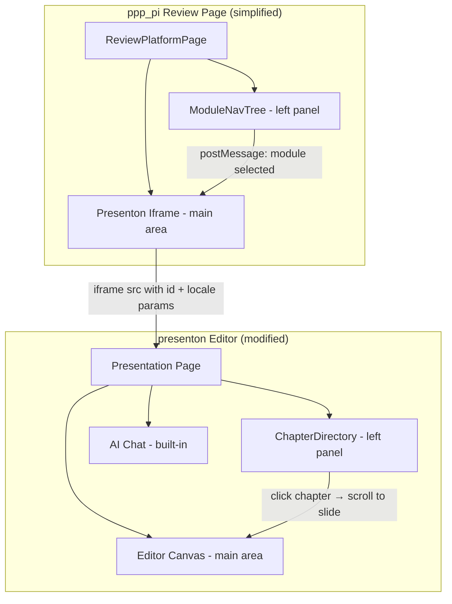

# Design Document: Review Page Redesign

## Overview

本次重设计将审校页面从三栏布局（左侧模块导航 + 中间内容编辑 + 右侧 AI/PPT 面板）简化为两栏布局（左侧模块导航 + presenton iframe 全屏显示）。同时改造 presenton 编辑器的左侧面板，将幻灯片缩略图替换为章节目录导航，并实现中文本地化。

**设计决策要点：**
- ppp_pi 审校页面移除 `ReviewToolbar`、`AIChatPanel`、右侧面板，直接全屏加载 presenton iframe
- `PptPanel` 组件简化为仅渲染 iframe（移除 fullWidth toolbar）
- presenton 编辑器新增 `ChapterDirectory` 组件替换 slide thumbnails
- presenton 编辑器实现中文 locale

## Architecture



**数据流：**
1. ppp_pi 审校页面加载时，根据 `presentationId` 构建 iframe URL（附带 `locale=zh` 参数）
2. 左侧 `ModuleNavTree` 选中模块时，通过 `postMessage` 通知 iframe 跳转到对应章节
3. presenton 内部 `ChapterDirectory` 维护章节-幻灯片映射，点击章节滚动到对应 slide

## Components and Interfaces

### ppp_pi 侧改动

#### 1. ReviewPlatformPage (简化)

移除的组件/功能：
- `ReviewToolbar` — 整个顶部工具栏
- `AIChatPanel` — 右侧 AI 助手面板
- `PptPanel` sidebar mode — 右侧 PPT tab
- 右侧面板容器及 tab 切换逻辑
- `CenterPanel` — 中间内容编辑区（不再需要）
- `rightPanelOpen`、`rightPanelTab` 等相关 state

保留的组件/功能：
- `ModuleNavTree` — 左侧模块导航（可折叠）
- `leftPanelOpen` state

新增逻辑：
- 直接在 main 区域渲染 iframe（不经过 PptPanel 的 fullWidth toolbar）
- 无 `presentationId` 时显示"生成 PPT"提示

```typescript
// 简化后的页面结构
<div className="flex h-screen flex-col">
  <div className="flex flex-1 overflow-hidden">
    {/* Left: ModuleNavTree (collapsible) */}
    <aside>{/* ModuleNavTree */}</aside>

    {/* Main: Presenton iframe or generate prompt */}
    <main className="flex-1">
      {presentationId ? (
        <iframe
          src={`${PRESENTON_BASE_URL}/presentation?id=${presentationId}&locale=zh`}
          className="h-full w-full border-0"
        />
      ) : (
        <GeneratePptPrompt onGenerate={handleGenerate} />
      )}
    </main>
  </div>
</div>
```

#### 2. PptPanel (简化)

当前 `PptPanel` 在 `fullWidth` 模式下渲染一个 toolbar + iframe。改造后：
- 移除 `fullWidth` 模式的 toolbar（含"下载 PPTX"和"重新生成"按钮）
- 组件仅负责渲染 iframe
- 实际上，审校页面可以直接内联 iframe 而不再使用 `PptPanel`，但保留组件用于封装 URL 构建和无 PPT 时的提示逻辑

```typescript
interface PptPanelProps {
  presentationId?: string;
  onGenerate?: () => void;
  isGenerating?: boolean;
}
```

### presenton 侧改动

#### 3. ChapterDirectory 组件 (新增)

位置：`presenton/servers/nextjs/app/(presentation-generator)/presentation/components/ChapterDirectory.tsx`

```typescript
interface Chapter {
  id: string;
  name: string;           // 中文章节名
  slideIndices: number[]; // 该章节对应的 slide 索引
  children?: Chapter[];   // 子章节
}

interface ChapterDirectoryProps {
  chapters: Chapter[];
  currentSlideIndex: number;
  onChapterClick: (firstSlideIndex: number) => void;
}
```

功能：
- 显示固定顺序的章节列表（见 Requirement 6）
- 支持层级展开/折叠（父章节点击展开子章节）
- 高亮当前 slide 所属章节
- 点击章节跳转到该章节第一张 slide

#### 4. 章节-幻灯片映射

章节顺序和名称为固定配置：

```typescript
const CHAPTER_CONFIG: Chapter[] = [
  {
    id: 'bg',
    name: '项目背景',
    slideIndices: [],
    children: [
      { id: 'bg-purpose', name: '传播目的', slideIndices: [] },
      { id: 'bg-strategy', name: '策略回顾', slideIndices: [] },
    ],
  },
  { id: 'data-overview', name: '数据总揽', slideIndices: [] },
  { id: 'highlights', name: '项目亮点', slideIndices: [] },
  { id: 'comprehensive', name: '综合分析', slideIndices: [] },
  { id: 'content-analysis', name: '内容分析', slideIndices: [] },
  { id: 'audience', name: '人群资产分析', slideIndices: [] },
  { id: 'ad-flow', name: '投流分析', slideIndices: [] },
  { id: 'competitor', name: '竞品分析', slideIndices: [] },
  { id: 'suggestions', name: '优化建议', slideIndices: [] },
];
```

映射策略：每张 slide 的 metadata 中包含 `chapterId` 字段，presenton 在加载 presentation 数据后，根据 slide metadata 填充各章节的 `slideIndices`。

#### 5. SidePanel 改造

当前 presenton 的 `SidePanel` 显示 slide thumbnails。改造为：
- 默认显示 `ChapterDirectory`（替换 thumbnails）
- 保留 "添加幻灯片" 按钮（label 改为中文）

#### 6. 中文本地化

presenton 新增 locale 支持：
- 通过 URL 参数 `locale=zh` 传入
- 创建 `locales/zh.ts` 文件，包含所有 UI 字符串
- 使用 React Context 提供 locale 给所有组件

```typescript
// locales/zh.ts
export const zh = {
  addSlide: '添加幻灯片',
  loading: '加载中...',
  error: '加载失败',
  retry: '重试',
  // ... 其他 UI 字符串
};
```

## Data Models

### 章节映射数据结构

```typescript
// Slide metadata (presenton 侧)
interface SlideMetadata {
  chapterId: string;  // 对应 CHAPTER_CONFIG 中的 id
  // ... 其他 metadata
}

// 从 presentation data 构建映射
function buildChapterSlideMap(slides: Slide[]): Map<string, number[]> {
  const map = new Map<string, number[]>();
  slides.forEach((slide, index) => {
    const chapterId = slide.metadata?.chapterId;
    if (chapterId) {
      const indices = map.get(chapterId) || [];
      indices.push(index);
      map.set(chapterId, indices);
    }
  });
  return map;
}
```

### postMessage 通信协议

```typescript
// ppp_pi → presenton iframe
interface NavigateToChapterMessage {
  type: 'NAVIGATE_TO_CHAPTER';
  moduleId: string;  // ppp_pi 的模块 ID (M1, M2, ...)
}

// presenton → ppp_pi (可选，用于同步当前位置)
interface ChapterChangedMessage {
  type: 'CHAPTER_CHANGED';
  chapterId: string;
}
```

模块 ID 到章节 ID 的映射在 ppp_pi 侧维护：

```typescript
const MODULE_TO_CHAPTER: Record<string, string> = {
  M1: 'data-overview',
  M2: 'bg',
  M3: 'highlights',
  M4: 'comprehensive',
  M5: 'content-analysis',
  M6: 'competitor',
  M7: 'ad-flow',
  M8: 'suggestions',
};
```

## Error Handling

| 场景 | 处理方式 |
|------|----------|
| 无 `presentationId` | 显示"生成 PPT"提示按钮 |
| iframe 加载失败 | 显示错误提示 + 重试按钮 |
| postMessage 目标不可达 | 静默忽略（不影响主流程） |
| 章节无对应 slide | ChapterDirectory 中该章节显示为灰色/禁用 |
| locale 参数缺失 | presenton 默认使用英文（向后兼容） |

## Testing Strategy

**PBT 不适用说明：** 本特性主要涉及 UI 布局重构和组件渲染变更，属于 UI rendering/layout 类别，不适合 property-based testing。

**测试方法：**

1. **Example-based unit tests (ppp_pi)**
   - 验证简化后的 ReviewPlatformPage 不渲染 ReviewToolbar
   - 验证不渲染右侧面板（AIChatPanel、PptPanel sidebar）
   - 验证有 presentationId 时渲染 iframe
   - 验证无 presentationId 时渲染生成提示
   - 验证 ModuleNavTree 仍正常渲染

2. **Example-based unit tests (presenton)**
   - ChapterDirectory 按固定顺序渲染章节
   - 点击章节触发 onChapterClick 回调
   - 当前 slide 对应章节高亮
   - 子章节展开/折叠
   - 中文 locale 正确应用

3. **Integration tests**
   - postMessage 通信：ppp_pi 发送 NAVIGATE_TO_CHAPTER，presenton 响应跳转
   - iframe URL 正确包含 presentationId 和 locale 参数

4. **Manual/visual testing**
   - 布局在不同屏幕尺寸下正常显示
   - 左侧面板折叠/展开动画流畅
   - iframe 占满剩余空间
