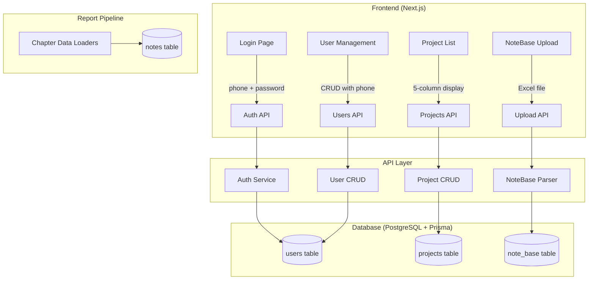

# Design Document: Schema Restructure

## Overview

本设计文档描述PPP复盘报告系统三大核心数据模型的表头/字段重构方案。变更涉及：

1. **用户模型**：增加 `phone` 字段，支持手机号登录，兼容旧 username 登录
2. **项目底表**：精简为5列核心展示字段（projectName、brand、businessLine、category、createdBy），保留旧字段但标记 deprecated
3. **笔记底表（NoteBase）**：更新为18列新表头映射，新增 `发布链接`/`资源含税成本价`/`资源含税售价`/`总消耗` 等列名别名，向后兼容旧表头
4. **报告生成适配**：使用 NoteBase metrics JSON 中的新字段名进行效率指标计算

### 设计原则

- **向后兼容**：旧版 Excel 仍可正确解析；旧 username 登录降级兼容
- **渐进式迁移**：数据库字段只增不删，通过标记 deprecated 和移除前端展示实现"逻辑删除"
- **唯一约束适配**：支持 businessLine 为空时的项目去重（使用数据库层 nullable unique）

## Architecture



### 变更范围

| 层级 | 受影响模块 | 变更类型 |
|------|-----------|---------|
| Database | `prisma/schema.prisma` - User, Project, Note models | Schema migration |
| Auth | `web/src/lib/auth.ts`, `api/auth/login/route.ts` | Logic change |
| Import | `api/admin/import/users/route.ts`, `api/admin/import/project-base/route.ts` | Column mapping |
| Parser | `web/src/lib/note-base-parser.ts` | Header mapping + header row detection |
| Ingestion | `src/ingestion/persistence-service.ts`, `src/ingestion/index.ts` | fillNotesFromNoteBase 两步逻辑 |
| Report | `src/pipeline/loaders/chapter-03-data-overview.ts`, `chapter-05-quadrant-analysis.ts`, `chapter-06-content-analysis.ts` | 简化为只读 notes 表 |
| Frontend | User list, Project list, Login form components | UI change |

## Components and Interfaces

### 1. Auth Service 变更

**文件**: `web/src/lib/auth.ts`, `web/src/app/api/auth/login/route.ts`

```typescript
// JWT Payload 扩展
export interface JWTPayload {
  sub: string;       // user id
  username: string;  // 保留花名
  phone?: string;    // 新增手机号
  role: string;
  mustChangePassword: boolean;
}
```

**Login Route 逻辑变更**:
1. 请求体接受 `{ phone, password, rememberMe }` 或 `{ username, password, rememberMe }`（兼容）
2. 优先按 `phone` 查询用户；若请求中无 phone 但有 username，则降级按 username 查询
3. JWT payload 中增加 `phone` 字段

### 2. User Import Service 变更

**文件**: `web/src/app/api/admin/import/users/route.ts`

新增列映射:
```typescript
const COLUMN_MAP: Record<string, string> = {
  '花名': 'username',
  '用户名': 'username',
  '真名': 'realName',
  '真实姓名': 'realName',
  '显示名': 'displayName',
  '角色': 'role',
  '手机号': 'phone',    // 新增
  'phone': 'phone',     // 新增
};
```

新增校验逻辑:
- 手机号格式验证：`/^1[3-9]\d{9}$/`
- 手机号唯一性检查：`prisma.user.findUnique({ where: { phone } })`

### 3. Project Import Service 变更

**文件**: `web/src/app/api/admin/import/project-base/route.ts`

变更点:
- `businessLine` 从 REQUIRED_FIELDS 中移除（允许为空）
- `createdBy` 列：按 realName 匹配 User 表，写入 UUID
- upsert 使用新的唯一约束（category + brand + businessLine + projectName），其中 businessLine 可为 null

```typescript
const REQUIRED_FIELDS = ['category', 'brand', 'projectName']; // businessLine 不再必填

// createdBy 解析逻辑
async function resolveCreatedBy(realName: string): Promise<{ userId: string | null; warning?: string }> {
  const users = await prisma.user.findMany({
    where: { realName },
    select: { id: true },
  });
  if (users.length === 1) return { userId: users[0].id };
  if (users.length > 1) return { userId: null, warning: `姓名"${realName}"重复，请手动指定创建者` };
  return { userId: null, warning: `未找到用户"${realName}"` };
}
```

### 4. NoteBase Parser 变更

**文件**: `web/src/lib/note-base-parser.ts`

#### 4.1 新表头列名映射追加

**必带字段（所有笔记必须有）：**
```typescript
// Required columns - 所有笔记都必须填写
'发布链接': 'noteLink',           // 必填
'内容方向': 'contentDirection',    // 必填
'笔记类型': 'kolType',            // 必填
'资源含税成本价': 'contentCost',   // 必填
'资源含税售价': 'contentSettlement', // 必填
```

**非官方合作才需要填写的字段（可选列）：**
```typescript
// Optional columns - 仅非官方合作笔记填写（官方合作数据来自蒲公英爬取）
'内容形式': 'cooperationForm',     // 可选
'总消耗': 'totalCost',             // 可选
// metrics 列（可选，存入 metrics JSON）：
// 曝光量、阅读量、点赞量、收藏量、评论量、转发量、互动量、CPM、CPC、CPE、CTR
```

在 `DISPLAY_ONLY_COLUMN_MAP` 中新增:
```typescript
'转发量': 'shareNum',   // 新表头名（原有"分享量"映射同一字段）
```

#### 4.2 必填列校验

在 `parseNoteBaseExcel` 函数中增加对必填列的检查：
```typescript
const REQUIRED_COLUMNS = ['发布链接', '内容方向', '笔记类型', '资源含税成本价', '资源含税售价'];
// 解析时校验表头是否包含所有必填列，缺失则返回解析错误
```

#### 4.3 表头行自动识别

在 `parseNoteBaseExcel` 函数中增加逻辑：与 project-base import 类似，检查第1行是否包含已知列名，若不包含则尝试将第2行作为表头。

#### 4.4 向后兼容

旧表头（"博主昵称"、"博主粉丝量"、"合作形式"、"是否报备"等）保留在 COLUMN_MAP 中不做删除。新版底表缺少这些列时，对应字段使用默认值：
- `kolNickName` → null
- `kolFanNum` → 0
- `isRegistered` → false
- `spuName` → null
- `adSpend` → 0

### 5. Report Generation 适配

**文件**: `src/pipeline/loaders/chapter-03-data-overview.ts`, `src/pipeline/loaders/chapter-05-quadrant-analysis.ts`, `src/pipeline/loaders/chapter-06-content-analysis.ts`

变更逻辑:
1. **报告仅从 notes 表读取笔记维度数据** — 不直接读取 note_base 表
2. notes 表已包含所有笔记的统一数据：官方合作（来自蒲公英爬取）+ 非官方合作（来自 NoteBase 回填）
3. 无需区分数据来源 — 直接从 notes 表计算所有指标
4. 效率指标（CPM/CPC/CPE/CTR）基于 notes 表中的 totalCost 和曝光/阅读/互动量字段自行计算
5. 内容分析章节使用 notes 表中的 `contentDirection`（内容方向）和 `cooperationForm`（内容形式）进行分组
6. 单篇成本使用 notes 表中的 `kolPrice`（资源含税成本价）字段
7. 单篇售价使用 notes 表中的 `serviceFee`（资源含税售价）字段

**各章节具体变更：**

| 章节 | 当前读取 note_base 的字段 | 改为从 notes 表读取 |
|------|--------------------------|-------------------|
| Ch3 数据总览 | COUNT(\*), SUM(content_settlement), SUM(ad_spend) | COUNT(\*) from notes, SUM(serviceFee), ⚠️ adSpend 见已知限制 |
| Ch5 四象限分析 | content_cost, content_direction (per note) | kolPrice, contentDirection (from notes) |
| Ch6 内容分析 | content_direction, kol_type, content_cost (per note) | contentDirection, noteType, kolPrice (from notes) |

**⚠️ 已知限制（ISSUE-007）：**

Ch3 数据总览中投流费用的计算：
```typescript
if (trafficCostCaliber === 'settlement') {
  trafficCost = adSpendSettlement; // 原来自 SUM(note_base.ad_spend)，新版底表无此列
} else {
  trafficCost = jgFee;             // 来自聚光数据，不受影响
}
```

新版18列底表中没有「投流实际消耗」列，`adSpend` 字段新导入数据默认为 0。因此当 `trafficCostCaliber = 'settlement'` 时投流费用将为 0，影响 totalCost 和自然流 CPX 计算。消耗口径（从聚光数据取值）不受影响。

**临时方案**：对新导入的项目，投流费用强制使用消耗口径（juguang_data.fee）。

**简化说明**：当前设计中 metrics priority 逻辑（优先从 note_base.metrics JSON 读取预计算值）不再需要。报告直接从 notes 表统一读取，由 fillNotesFromNoteBase 负责确保 notes 表数据完整。

### 5.1 fillNotesFromNoteBase 逻辑重构

**文件**: `src/ingestion/persistence-service.ts`

现有函数 `fillNotesFromNoteBase` 需要改为两步逻辑：

```typescript
async fillNotesFromNoteBase(projectId: string, allNoteIds: string[], missingNoteIds: string[]): Promise<void> {
  // allNoteIds: 该项目所有 noteId（来自 note_base）
  // missingNoteIds: 蒲公英未返回数据的 noteId（非官方合作笔记）

  // Step 1: 所有笔记 — 拷贝必带字段
  // 对 allNoteIds 中的每条笔记，从 note_base 拷贝：
  //   noteLink, contentDirection, kolType, contentCost→kolPrice, contentSettlement→serviceFee
  // 使用 upsert，update 时仅更新这5个字段，不覆盖已有的指标数据

  // Step 2: 仅非官方合作笔记 — 额外拷贝 metrics 数据
  // 对 missingNoteIds 中的笔记，额外从 note_base 拷贝：
  //   totalCost, cooperationForm, impNum, readNum, engageNum, likeNum, favNum, cmtNum, shareNum
  //   标记 dataSource = 'note_base'
}
```

**字段映射关系（note_base → notes）：**
| note_base 字段 | notes 字段 | Step | 说明 |
|---|---|---|---|
| noteLink | noteLink | 1 | 必带 |
| contentDirection | contentDirection | 1 | 必带（需要在 notes 表新增此字段） |
| kolType | noteType | 1 | 必带 |
| contentCost | kolPrice | 1 | 必带，资源含税成本价 |
| contentSettlement | serviceFee | 1 | 必带，资源含税售价 |
| cooperationForm | cooperationForm | 2 | 非官方（需要在 notes 表新增此字段） |
| totalCost | totalCost | 2 | 非官方（需要在 notes 表新增此字段） |
| metrics.impNum | impNum | 2 | 非官方 |
| metrics.readNum | readNum | 2 | 非官方 |
| metrics.engageNum | engageNum | 2 | 非官方 |
| metrics.likeNum | likeNum | 2 | 非官方 |
| metrics.favNum | favNum | 2 | 非官方 |
| metrics.cmtNum | cmtNum | 2 | 非官方 |
| metrics.shareNum | shareNum | 2 | 非官方 |

**调用方式变更（`src/ingestion/index.ts`）：**
```typescript
// 旧逻辑：仅对蒲公英未爬取的笔记调用
// 新逻辑：Step 1 对所有笔记执行，Step 2 仅对蒲公英未爬取的笔记执行
const allNoteIds = ctx.noteIds;
const fetchedNoteIds = new Set(pugongyingNotes.map((n) => n.noteId));
const missingNoteIds = allNoteIds.filter((id) => !fetchedNoteIds.has(id));
await this.persistenceService.fillNotesFromNoteBase(projectId, allNoteIds, missingNoteIds);
```

### 6. Frontend 变更

#### 6.1 Login Page
- 输入框 label 从"用户名"改为"手机号"
- 输入框增加手机号格式提示
- 提交字段从 `username` 改为 `phone`

#### 6.2 User Management
- 列表表格增加"手机号"列
- 新建/编辑表单增加"手机号"字段（必填，11位数字校验）

#### 6.3 Project List
- 表头调整为：项目名称 | 品牌名称 | 品牌业务线 | 品牌行业类目 | 创建者
- 移除列：笔记数量、项目结束日期、参与者
- `createdBy` 列显示 realName（通过 UUID 关联）

## Data Models

### User Model 变更

```prisma
model User {
  id                 String    @id @default(dbgenerated("gen_random_uuid()")) @db.Uuid
  username           String    @unique @db.VarChar(50)
  phone              String?   @unique @db.VarChar(20)  // 新增：手机号，唯一，可空
  passwordHash       String    @map("password_hash") @db.VarChar(200)
  displayName        String?   @map("display_name") @db.VarChar(100)
  realName           String?   @map("real_name") @db.VarChar(100)
  role               String    @default("AE") @db.VarChar(20)
  permissionLevel    Int       @default(5) @map("permission_level")
  reportsTo          String?   @map("reports_to") @db.Uuid
  mustChangePassword Boolean   @default(true) @map("must_change_password")
  isActive           Boolean   @default(true) @map("is_active")
  lastLoginAt        DateTime? @map("last_login_at") @db.Timestamptz()
  createdAt          DateTime  @default(now()) @map("created_at") @db.Timestamptz()
  updatedAt          DateTime  @default(now()) @map("updated_at") @db.Timestamptz()

  @@map("users")
}
```

### Project Model 变更

无新字段增加。变更在行为层面：
- `businessLine` 允许为 null（已有 `String?`）
- 唯一约束 `@@unique([category, brand, businessLine, projectName])` 中 businessLine 为 null 时由 PostgreSQL 正确处理（NULL != NULL）
- `createdBy` 字段在导入时通过 realName 解析 UUID

### NoteBase Model

无 Schema 变更。`metrics` JSON 字段已支持存储所有新列数据。变更仅在 Parser 的列名映射层。

### Note Model 变更

为支持 fillNotesFromNoteBase 两步回填和报告从 notes 表统一读取，需新增以下字段：

```prisma
model Note {
  // ... 现有字段 ...
  contentDirection  String?   @map("content_direction") @db.VarChar(100)  // 新增：内容方向
  cooperationForm   String?   @map("cooperation_form") @db.VarChar(100)   // 新增：内容形式
  totalCost         Decimal?  @map("total_cost") @db.Decimal(12, 2)       // 新增：总消耗
  // kolPrice 已存在：对应 contentCost（资源含税成本价）
  // serviceFee 已存在：对应 contentSettlement（资源含税售价）
}
```

**字段复用说明：**
- `kolPrice` ← contentCost（资源含税成本价），已有字段，无需新增
- `serviceFee` ← contentSettlement（资源含税售价），已有字段，无需新增
- `noteType` ← kolType（笔记类型），已有字段，无需新增

### Database Migration

```sql
-- Migration 1: Add phone column to users table
ALTER TABLE users ADD COLUMN phone VARCHAR(20) UNIQUE;

-- Create index for phone-based login lookup
CREATE UNIQUE INDEX users_phone_key ON users(phone) WHERE phone IS NOT NULL;

-- Migration 2: Add content fields to notes table (for fillNotesFromNoteBase two-step logic)
ALTER TABLE notes ADD COLUMN content_direction VARCHAR(100);
ALTER TABLE notes ADD COLUMN cooperation_form VARCHAR(100);
ALTER TABLE notes ADD COLUMN total_cost DECIMAL(12, 2);
```

Prisma migrations:
- `npx prisma migrate dev --name add_user_phone`
- `npx prisma migrate dev --name add_note_content_fields`

## Correctness Properties

*A property is a characteristic or behavior that should hold true across all valid executions of a system—essentially, a formal statement about what the system should do. Properties serve as the bridge between human-readable specifications and machine-verifiable correctness guarantees.*

### Property 1: Phone login authentication

*For any* active user with a non-null phone and a known password, submitting a login request with that phone and correct password SHALL return a successful authentication response containing the user's id, username, and role.

**Validates: Requirements 2.1**

### Property 2: JWT payload contains phone and username

*For any* successful login (via phone), decoding the resulting JWT token SHALL yield a payload containing both the user's `phone` and `username` fields.

**Validates: Requirements 2.3**

### Property 3: Legacy username login backward compatibility

*For any* active user with a known password, submitting a login request with `username` (legacy format) and correct password SHALL return a successful authentication response identical in structure to phone-based login.

**Validates: Requirements 2.4**

### Property 4: Phone number format validation

*For any* string input, the phone validation function SHALL return `true` if and only if the string matches the pattern of an 11-digit Chinese mobile number (starting with 1, followed by 10 digits where the second digit is 3-9). All other strings SHALL be rejected.

**Validates: Requirements 3.3, 4.4**

### Property 5: User import phone column mapping

*For any* Excel row containing a column named "手机号" or "phone" with a valid 11-digit phone number value, the User Import Service SHALL map that value to the `phone` field of the created user record.

**Validates: Requirements 3.2**

### Property 6: Project import new column mapping

*For any* project base Excel row with headers "品牌简称", "品牌行业类目", "品牌业务线", "项目名称", "创建者", the Project Import Service SHALL correctly map these to `brand`, `category`, `businessLine`, `projectName`, `createdBy` respectively.

**Validates: Requirements 5.4**

### Property 7: CreatedBy realName resolution

*For any* realName string provided in the "创建者" column during project import: if exactly one user in the system has that realName, the project's `createdBy` SHALL be set to that user's UUID; if zero or more than one user matches, `createdBy` SHALL be null and a warning SHALL be recorded.

**Validates: Requirements 6.1, 6.2, 6.3, 6.4**

### Property 8: NoteBase new 18-column header mapping with required vs optional distinction

*For any* NoteBase Excel row with the new header set, the parser SHALL:
- Require the 5 mandatory columns (发布链接, 内容方向, 笔记类型, 资源含税成本价, 资源含税售价) and correctly map them to noteLink, contentDirection, kolType, contentCost, contentSettlement
- Optionally accept the remaining 13 columns (内容形式, 总消耗, 曝光量, 阅读量, 点赞量, 收藏量, 评论量, 转发量, 互动量, CPM, CPC, CPE, CTR) and map them to cooperationForm, totalCost, and the `displayMetrics` object
- Return a parse error when any of the 5 mandatory columns are missing from the header row

**Validates: Requirements 8.1, 8.2, 8.3, 8.4, 8.5, 8.6, 8.7, 8.8, 8.9**

### Property 9: NoteBase backward compatibility and default values

*For any* NoteBase Excel using old-format headers (博主昵称, 博主粉丝量, 合作形式, 是否报备, 达人类型, 对应SPU, 内容实际消耗金额, 投流实际消耗), the parser SHALL still correctly map these columns. When these old columns are absent from a new-format Excel, the parser SHALL use default values: kolNickName=null, kolFanNum=0, isRegistered=false, spuName=null, adSpend=0.

**Validates: Requirements 9.1, 9.2, 9.3, 9.4, 9.5**

### Property 10: Header row auto-detection

*For any* Excel file, the NoteBase parser SHALL correctly identify the header row: if row 1 contains known column names, use row 1 as header; if row 1 does not but row 2 does, skip row 1 and use row 2; if neither row 1 nor row 2 contains known column names, return a parse error.

**Validates: Requirements 10.1, 10.2, 10.3**

### Property 11: Report reads exclusively from notes table

*For any* report generation invocation, the report data loaders (Ch3, Ch5, Ch6) SHALL read all note-level metrics (impNum, readNum, engageNum, likeNum, favNum, cmtNum, shareNum, totalCost, kolPrice, serviceFee, contentDirection, cooperationForm, noteType) exclusively from the `notes` table. The loaders SHALL NOT directly query the `note_base` table for per-note data. Efficiency metrics (CPM, CPC, CPE, CTR) SHALL be computed from notes table fields (totalCost / volume metrics). Note count SHALL use COUNT(*) from notes table.

**Validates: Requirements 11.1, 11.2, 11.3, 11.4, 11.5, 11.6, 11.7, 11.8, 11.9**

### Property 12: Project upsert on import conflict

*For any* project import where the combination (category, brand, businessLine, projectName) already exists in the database, the import service SHALL perform an update of the existing record rather than creating a duplicate or returning an error.

**Validates: Requirements 12.3**

### Property 13: fillNotesFromNoteBase two-step data flow

*For any* project with note_base records:
- **Step 1 invariant**: After fillNotesFromNoteBase executes, ALL notes in the project's notes table SHALL have noteLink, contentDirection, noteType, kolPrice, and serviceFee populated from their corresponding note_base records (regardless of whether 蒲公英 crawled them).
- **Step 2 invariant**: For notes where 蒲公英 did NOT return data (missingNoteIds), the notes table SHALL additionally have impNum, readNum, engageNum, likeNum, favNum, cmtNum, shareNum, totalCost, and cooperationForm populated from note_base, with dataSource='note_base'.
- **Non-overwrite invariant**: For notes where 蒲公英 DID return data, the existing metric values (impNum, readNum, etc.) SHALL NOT be overwritten by Step 1.

**Validates: Requirements 13.1, 13.2, 13.3, 13.4, 13.5, 13.6, 13.7**


## Error Handling

### Auth Service Errors

| 场景 | HTTP Status | Error Message | 处理方式 |
|------|-------------|---------------|---------|
| phone 和 username 都未提供 | 400 | "请输入手机号和密码" | 前端校验 + API校验 |
| 手机号不存在 | 401 | "手机号或密码错误" | 统一错误信息防枚举 |
| 账号已禁用 | 401 | "手机号或密码错误" | 同上 |
| 密码错误 | 401 | "手机号或密码错误" | 同上 |
| Legacy username 不存在 | 401 | "手机号或密码错误" | 降级查询失败同样返回通用错误 |

### User Import Errors

| 场景 | 处理方式 |
|------|---------|
| 手机号格式无效 | 记录行错误 `第X行: 手机号格式不正确`，跳过该行 |
| 手机号已存在 | 记录行错误 `第X行: 手机号"1xx"已存在`，跳过该行 |
| username 已存在 | 保留现有逻辑不变 |

### Project Import Errors

| 场景 | 处理方式 |
|------|---------|
| 缺少 category/brand/projectName | 记录行错误，跳过（businessLine 不再必填） |
| createdBy realName 匹配多人 | 记录警告，createdBy 置空，继续导入 |
| createdBy realName 无匹配 | 记录警告，createdBy 置空，继续导入 |
| 唯一约束冲突 | 执行 upsert 更新，不报错 |

### NoteBase Parser Errors

| 场景 | 处理方式 |
|------|---------|
| 前两行都不含已知列名 | 返回 `ParseResult` 带 warning "未识别到有效表头" |
| noteLink 为空 | 跳过该行，计入 skippedRows |
| noteLink 格式异常 | 生成备用ID `row_{index}`，记录 warning |
| 数值字段无法解析 | 默认为 0（现有逻辑不变） |

### Report Generation Errors

| 场景 | 处理方式 |
|------|---------|
| notes 表中无数据 | 各指标为 0，报告正常生成但显示无数据提示 |
| contentDirection/cooperationForm 为 null | 归入"未分类"分组 |
| totalCost 为 0 或 null | 效率指标（CPM/CPC/CPE/CTR）显示为 0 或 N/A |
| trafficCostCaliber='settlement' 且 adSpend=0 | 投流费用回退为消耗口径（juguang_data.fee），记录 warning |

## Testing Strategy

### 测试框架选择

- **单元测试**: Vitest（项目已使用）
- **属性测试**: `fast-check` (TypeScript property-based testing library)
- **集成测试**: Vitest + Prisma test utilities

### Property-Based Tests（属性测试）

每个属性测试配置最少 **100 次迭代**。使用 `fast-check` 库生成随机输入。

| Property | 测试文件 | 生成器 |
|----------|---------|--------|
| P1: Phone login | `web/src/lib/__tests__/auth-login.property.test.ts` | arbitrary user + phone + password |
| P2: JWT payload | 同上 | 同上 |
| P3: Legacy login | 同上 | arbitrary user + username + password |
| P4: Phone validation | `web/src/lib/__tests__/phone-validation.property.test.ts` | arbitrary string |
| P5: User import phone | `web/src/app/api/admin/import/__tests__/users-import.property.test.ts` | arbitrary Excel rows |
| P6: Project import mapping | `web/src/app/api/admin/import/__tests__/project-import.property.test.ts` | arbitrary Excel rows |
| P7: CreatedBy resolution | 同上 | arbitrary realName + user DB state |
| P8: NoteBase new headers | `web/src/lib/__tests__/note-base-parser.property.test.ts` | arbitrary 18-column rows |
| P9: NoteBase backward compat | 同上 | arbitrary old-format rows |
| P10: Header detection | 同上 | arbitrary Excel structure (header in row 1 or 2) |
| P11: Report from notes table | `src/pipeline/loaders/__tests__/data-overview.property.test.ts` | arbitrary notes table records |
| P12: Project upsert | `web/src/app/api/admin/import/__tests__/project-import.property.test.ts` | arbitrary duplicate projects |
| P13: fillNotesFromNoteBase two-step | `src/ingestion/__tests__/fill-notes.property.test.ts` | arbitrary note_base records + pugongying fetch results |

每个属性测试需包含注释标签：
```typescript
// Feature: schema-restructure, Property 8: NoteBase new 18-column header mapping
```

### Unit Tests（单元测试）

| 模块 | 测试要点 |
|------|---------|
| Auth login route | 手机号登录成功/失败、username降级兼容、禁用账号拒绝 |
| User import | 手机号列识别、格式错误跳过、重复手机号跳过 |
| Project import | businessLine 可空、createdBy 解析、upsert 行为 |
| NoteBase parser | 新旧表头混合解析、必填列校验、表头行检测、数值解析边界 |
| Phone validator | 有效/无效手机号格式 |
| fillNotesFromNoteBase | Step1 必带字段写入、Step2 非官方指标写入、不覆盖蒲公英数据、混合场景 |
| Report loaders | 仅从 notes 表读取、CPM/CPC/CPE/CTR 计算、contentDirection/cooperationForm 分组 |

### Integration Tests（集成测试）

| 场景 | 测试要点 |
|------|---------|
| 数据库迁移 | phone 字段唯一约束、NULL 索引行为、Note 表新增字段 |
| fillNotesFromNoteBase 完整流程 | Step 1 + Step 2 正确回填、蒲公英数据不被覆盖 |
| 报告生成 | 报告仅从 notes 表读取数据、contentDirection/cooperationForm 分组 |
| 项目唯一约束 | businessLine=null 时 upsert 行为（PostgreSQL NULL 语义） |
| 端到端 | Excel上传 → 解析 → 入库 → fillNotesFromNoteBase → 报告生成完整流程 |

### Migration Testing

1. 在 staging 环境执行 `prisma migrate deploy`，验证 phone 字段添加无报错
2. 验证现有用户数据不受影响（phone 初始为 NULL）
3. 验证现有项目唯一约束在 businessLine 为 NULL 时的行为
4. 回滚测试：确认 migration 可安全回滚
